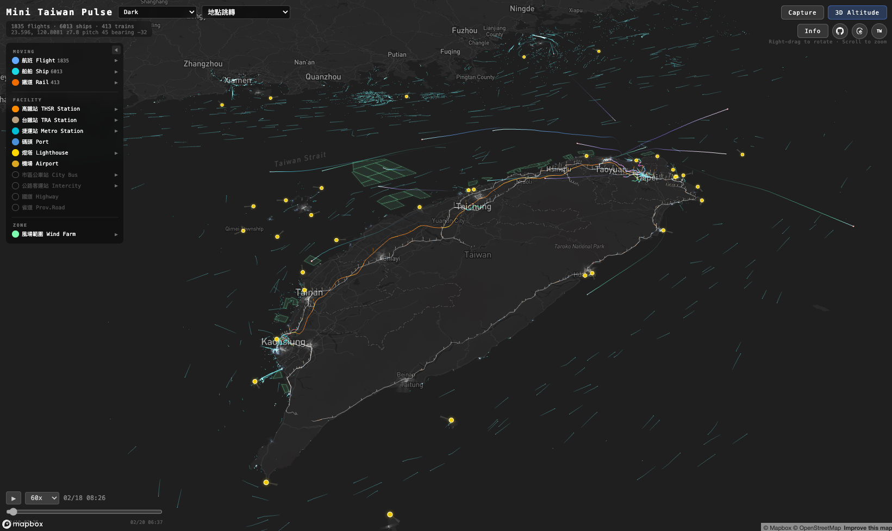

# Mini Taiwan Pulse

用開放資料，感受台灣的脈動。

天空中的航班劃出弧線、海面上的船舶穿梭往返、軌道上的列車準時奔馳 — 這座島嶼每一刻都在呼吸。Mini Taiwan Pulse 將這些交通運輸的即時動態，以 3D 光球、光軌、拖尾線呈現在同一張地圖上，讓你看見台灣的脈搏。

## Screenshots




## 三種脈動

| 脈動 | 視覺呈現 | 開放資料來源 |
|------|---------|------------|
| 天空 — 航班 | 3D 弧線 + 光球 + 彗尾光軌 | FlightRadar24 API |
| 海洋 — 船舶 | InstancedMesh 光球 + 拖尾線 | AIS 船舶位置資料 |
| 大地 — 軌道列車 | 3D 軌道線 + 列車光球 + 拖尾線 | 公開時刻表 + OSM 軌道 |

### 天空的脈動 — 航班

- **光軌**：彗尾狀漸層光軌，additive blending 疊加自然增亮
- **光球**：多層發光球體標示當前位置，呼吸動畫 + 紅色防撞閃爍燈
- **靜態軌跡**：暗色主題依高度著色（暖橘→冷藍），亮色主題隨機配色
- 涵蓋全台 14 座機場、1,500+ 航班

### 海洋的脈動 — 船舶

- **光球**：青藍色 InstancedMesh，視口剔除，呼吸動畫
- **拖尾線**：per-vertex color gradient（30 分鐘遞延）
- **資料過濾**：台灣周邊海域 bounding box、GPS 異常跳躍點排除、無效 MMSI 過濾

### 大地的脈動 — 軌道列車

6 個軌道系統同步運行：

| 系統 | 說明 |
|------|------|
| 台鐵（TRA） | 265 條 OD 軌道、333 列火車，依車種 6 色分類 |
| 高鐵（THSR） | 南北主線 + 支線 |
| 台北捷運（TRTC） | 8 條路線 |
| 高雄捷運（KRTC） | 紅 / 橘線 |
| 高雄輕軌（KLRT） | 環狀輕軌 |
| 台中捷運（TMRT） | 綠 / 藍線 |

- **列車光球**：per-instance color，各系統不同顏色
- **拖尾線**：台鐵 + 高鐵專屬（3 分鐘遞延）
- **台鐵專用引擎**：處理 OD 軌道、golden track、彰化三角線等複雜路線

## 地標與基礎設施

| 標記 | 渲染方式 | 來源 |
|------|---------|------|
| 機場邊界（14 座） | fill + line + glow | OSM Overpass API |
| 大站 Polygon | fill + glow | OSM Overpass API |
| 小站 + 捷運站（491 站） | circle glow 圓環 | 車站 GeoJSON |
| 車站光柱（535 站） | Three.js 3D 光柱（高度 = 停靠次數正規化） | 預計算靜態 JSON |
| 港口邊界 | fill + line + glow | OSM Overpass API |
| 燈塔（36 座） | circle dot + 3D 旋轉錐形光束 | 交通部航港局 |
| 市區公車站 | circle dot | TDX 公共運輸資料 |
| 公路客運站 | circle dot | TDX 公共運輸資料 |
| 國道路網 | line（紅色，zoom 自適應寬度） | 交通部公路局 |
| 省道路網 | line（橘色，zoom 自適應寬度） | 交通部公路局 |
| 離岸風場範圍 | fill + line + glow | 經濟部能源局 |

## 功能

### 圖層面板（LayerSidebar）

三分類側邊欄，每個圖層可獨立 toggle 開關，面板可收合為側邊窄條（點擊 ◀ 收合、點窄條展開）：

| 分類 | 圖層 |
|------|------|
| **MOVING** | 航班 Flight、船舶 Ship、鐵道 Rail（可展開參數面板） |
| **FACILITY** | 車站（THSR/TRA/Metro 各自獨立）、碼頭 Port、燈塔 Lighthouse、機場 Airport、市區公車站 City Bus、公路客運站 Intercity、國道 Highway、省道 Prov.Road |
| **ZONE** | 風場範圍 Wind Farm（可展開參數面板） |

- MOVING 展開面板含 Live Status / Trails 模式切換（航班專用）+ 視覺參數 slider
- 鐵道面板含 Train 列車開關 + Track 2D/3D 切換（互斥：2D 平面軌道 / 3D 立體軌道）
- 車站面板含 Pillar 光柱開關 + Height 光柱高度調整
- 運具按鈕顯示活躍數量（航班數、船舶數、列車數）
- 收合狀態以彩色小點顯示各圖層啟用狀態

### 檢視模式

| 模式 | 說明 |
|------|------|
| All Taiwan | 全台所有航班（預設） |
| ±12h Window | 當前時間前後 12 小時 |

### 即時參數調整

| 控制項 | 說明 |
|--------|------|
| Alt ×1.0~5.0 | 航班高度誇張倍率 |
| Z +0~200m | 基準高度偏移 |
| Opacity | 靜態軌跡不透明度 |
| Orb / Ship Orb / Rail Orb | 各交通工具光球大小 |
| Train ON/OFF | 鐵道列車光球顯示開關 |
| Track 2D/3D | 軌道線模式（2D 平面 Mapbox / 3D 立體 Three.js） |
| Rail Z | 軌道 Z 軸偏移 |
| Rail Trk / Ship Trail | 軌道線 / 船舶拖尾線透明度 |
| APT / Glow | 機場填充不透明度 / 光暈強度 |
| Stn | 車站圓環縮放 |
| Pillar ON/OFF | 車站光柱顯示開關（THSR/TRA/Metro 各自獨立） |
| Height | 車站光柱高度倍率 |
| Beam ON/OFF | 燈塔光束開關 |
| Dist / Opa | 燈塔光束距離 / 不透明度 |

### 其他

- 6 種 Mapbox 底圖樣式（Dark / Light / Satellite / Navigation Night 等）
- 開場全台總覽視角（23.43°N, 121.12°E, z7.9, pitch 48°）
- 14 座台灣機場預設視角
- 時間軸播放控制（30x~600x 加速）
- Capture 拍攝模式（暗角 vignette + 機場名稱 + 時間標記）
- 顯示模式切換：Live Status（即時位置）/ Trails（軌跡線）
- 地點跳轉：快速飛行到各機場預設視角
- 768px 以下自動切換手機版 UI

## 技術棧

| 層級 | 技術 | 用途 |
|------|------|------|
| 框架 | React 19 + TypeScript + Vite | 應用骨架 |
| 地圖 | Mapbox GL JS v3 | 3D terrain、底圖、相機控制 |
| 3D 渲染 | Three.js r172 | 光軌、光球、InstancedMesh |
| Shader | GLSL | 光軌漸層材質 |
| 雲端 | AWS S3 | 資料增量同步 |
| 容器 | Docker + Nginx | 生產部署 |

## 架構

### Overlay Registry 模式

所有 Mapbox GL 靜態圖層（機場、車站、港口、燈塔、道路、風場）透過**配置驅動**的 Overlay Registry 統一管理：

```
overlayRegistry.ts  — 宣告式 config 陣列（sourceUrl + paint 函式）
overlayManager.ts   — 通用 CRUD（addOverlay / updateTheme / setVisible）
MapView.tsx         — 一個 useEffect 控制所有 overlay 可見性 + 主題
```

**新增一個 overlay 只需改 2 個檔案：**
1. `src/types/index.ts` — `LayerVisibility` 加一個 key
2. `src/map/overlayRegistry.ts` — 加一筆 `OverlayConfig`
3. `src/components/LayerSidebar.tsx` — 在對應 section 加一列

### Three.js CustomLayer 架構

透過 Mapbox `CustomLayer` 在同一個 WebGL context 中嵌入 Three.js 場景，四個獨立 CustomLayer 各自管理動態渲染，常駐地圖、由 `getIsVisible` 控制渲染開關：

```
Mapbox GL JS（底圖 + 3D terrain + 相機控制）
  ├── CustomLayer: flight-3d     ← FlightScene（GLSL 光軌 + 光球 + 閃爍燈）
  ├── CustomLayer: ship-3d       ← ShipScene（InstancedMesh + 拖尾線）
  ├── CustomLayer: rail-3d       ← RailScene（靜態軌道 + 列車光球 + 拖尾）
  ├── CustomLayer: lighthouse-3d ← LighthouseScene（旋轉錐形光束）
  ├── CustomLayer: station-pillar-3d ← StationPillarScene（車站 3D 光柱）
  └── Overlay Registry（Mapbox GL Layers）
        ├── 機場邊界（fill + glow）
        ├── 車站標記（polygon + circle glow）
        ├── 港口邊界（fill + glow）
        ├── 燈塔（circle + glow）
        ├── 市區公車站 / 公路客運站（circle）
        ├── 國道路網（line）
        ├── 省道路網（line）
        └── 離岸風場（fill + line + glow）
```

### 專案結構

```
mini-taiwan-pulse/
├── public/
│   ├── aviation_data.json          # 航班軌跡（gitignored）
│   ├── ship_data.json              # 船舶軌跡（gitignored）
│   ├── airports.geojson            # 台灣 14 座機場邊界
│   ├── station_polygons.geojson    # 大站 Polygon
│   ├── station_points.geojson      # 小站 + 捷運站 Point（491 站）
│   ├── station_pillars.json        # 車站光柱預計算資料（535 站）
│   ├── bus_stations_city.geojson   # 市區公車站
│   ├── bus_stations_intercity.geojson # 公路客運站
│   ├── port_polygons.geojson       # 港口邊界
│   ├── lighthouse.geojson          # 燈塔位置（36 座）
│   ├── national_highway.geojson    # 國道路網
│   ├── provincial_road.geojson     # 省道路網
│   ├── wind_plan.geojson           # 離岸風場範圍
│   └── rail/                       # 軌道時刻表 + GeoJSON（gitignored）
│       ├── tra/                    # 台鐵
│       ├── thsr/                   # 高鐵
│       ├── trtc/                   # 台北捷運
│       ├── krtc/                   # 高雄捷運
│       ├── klrt/                   # 高雄輕軌
│       └── tmrt/                   # 台中捷運
├── scripts/                        # 資料準備腳本（Python + TypeScript）
├── src/
│   ├── App.tsx                     # 主應用 + 狀態協調
│   ├── types/index.ts              # 型別定義（含 OverlayConfig）
│   ├── components/
│   │   ├── LayerSidebar.tsx        # 三分類圖層面板（MOVING / FACILITY / ZONE）
│   │   ├── TimelineControls.tsx    # 時間軸播放控制
│   │   ├── AirportSelector.tsx     # 地點跳轉
│   │   ├── StyleSelector.tsx       # 底圖樣式選擇
│   │   └── MobileBottomSheet.tsx   # 手機版底部面板
│   ├── map/
│   │   ├── MapView.tsx             # Mapbox 地圖容器（overlay 生命週期管理）
│   │   ├── overlayRegistry.ts      # Overlay 配置陣列（宣告式）
│   │   ├── overlayManager.ts       # Overlay CRUD 通用函式
│   │   ├── customLayer.ts          # Three.js CustomLayer 橋接（flight/ship/rail）
│   │   ├── lighthouseCustomLayer.ts # 燈塔 3D 光束 CustomLayer
│   │   ├── stationPillarCustomLayer.ts # 車站光柱 CustomLayer
│   │   ├── staticTrails.ts         # 2D 靜態航線軌跡
│   │   ├── railTracks.ts           # Mapbox native 軌道線
│   │   └── cameraPresets.ts        # 機場預設視角
│   ├── three/                      # Three.js 3D 場景
│   │   ├── FlightScene.ts          # 航班光軌 + 光球 + GLSL shader
│   │   ├── ShipScene.ts            # 船舶 InstancedMesh + 拖尾線
│   │   ├── RailScene.ts            # 軌道列車光球 + 拖尾 + 靜態軌道
│   │   ├── StationPillarScene.ts   # 車站 3D 光柱（InstancedMesh）
│   │   ├── LighthouseScene.ts      # 燈塔旋轉錐形光束
│   │   ├── LightOrb.ts             # 光球共用元件
│   │   ├── LightTrail.ts           # 光軌 GLSL 材質
│   │   └── BlinkingLight.ts        # 防撞閃爍燈
│   ├── engines/                    # 列車運動插值引擎
│   │   ├── RailEngine.ts           # 通用軌道引擎（THSR/MRT）
│   │   ├── TraTrainEngine.ts       # 台鐵專用引擎（OD 軌道）
│   │   └── railUtils.ts            # 軌道工具函式
│   ├── hooks/                      # React Custom Hooks
│   │   ├── useTransportParams.ts   # 運具視覺參數 state + refs + sliders
│   │   ├── useRailEngine.ts        # 軌道引擎 + rAF tick loop
│   │   ├── useLayerVisibility.ts   # 圖層可見性 state + toggle
│   │   ├── useThreeJsLayers.ts     # Three.js CustomLayer 建立與管理
│   │   ├── useMapInteraction.ts    # 飛機點擊、雙擊追蹤
│   │   ├── useFlightData.ts        # 航班資料載入
│   │   ├── useShipData.ts          # 船舶資料載入
│   │   ├── useRailData.ts          # 軌道資料載入
│   │   ├── useTimeline.ts          # 時間軸播放邏輯
│   │   └── useIsMobile.ts          # 響應式斷點偵測
│   ├── data/                       # 資料載入器
│   │   ├── flightLoader.ts         # 航班 JSON 解析 + 時間窗過濾
│   │   ├── shipLoader.ts           # 船舶 JSON 解析
│   │   ├── railLoader.ts           # 軌道時刻表 + GeoJSON 載入
│   │   └── s3Loader.ts             # S3 增量同步
│   ├── constants/                  # 常數定義
│   └── utils/                      # 座標轉換、軌跡插值
├── Dockerfile                      # Multi-stage build
├── docker-compose.yml              # Port 3721
└── nginx.conf
```

## 資料準備

所有資料皆來自開放資料源，透過腳本擷取與轉換：

### 航班資料

來源：[FlightRadar24 API](https://fr24api.flightradar24.com/)

```bash
npm run fetch:flights              # 取得航班清單
npm run fetch:tracks -- --date 2026-02-18   # 擷取飛行軌跡
```

### 船舶資料

來源：AIS 船舶位置資料（經 ship-gis SQLite 匯出）

```bash
python3 scripts/export-ship-data.py                     # 預設日期
python3 scripts/export-ship-data.py 2026-02-18 2026-02-19  # 指定日期範圍
```

### 軌道資料

來源：公開時刻表 + OSM 軌道 GeoJSON

```bash
python3 scripts/export-rail-data.py          # 匯出 6 個系統的時刻表 + 軌道
python3 scripts/build-station-points.py      # 合併 491 站 Point GeoJSON
python3 scripts/fetch-station-polygons.py    # 下載大站 OSM Polygon
npm run pillars:generate                     # 預計算車站光柱資料（停靠次數 → 高度）
```

### S3 上傳

```bash
npm run s3:upload          # 航班資料
npm run s3:upload:ships    # 船舶資料
npm run s3:upload:rail     # 軌道資料
```

## 開發

```bash
npm install
cp .env.example .env       # 填入 VITE_MAPBOX_TOKEN
npm run dev                # 開發模式
npm run build              # 正式建置
```

### Docker 部署

```bash
docker-compose up -d       # http://localhost:3721
```

### 環境需求

- Node.js 22+
- Python 3（資料匯出腳本）
- Mapbox Access Token

## 開放資料來源

| 資料 | 來源 |
|------|------|
| 航班軌跡 | [FlightRadar24](https://www.flightradar24.com/) |
| 船舶位置 | AIS（Automatic Identification System） |
| 軌道時刻表 | 台鐵、高鐵、各捷運公開時刻表 |
| 機場 / 車站 / 港口邊界 | [OpenStreetMap](https://www.openstreetmap.org/) via Overpass API |
| 燈塔位置 | 交通部航港局 |
| 公車站位 | [TDX 公共運輸資料](https://tdx.transportdata.tw/) |
| 國道 / 省道路網 | 交通部公路局 |
| 離岸風場範圍 | 經濟部能源局 |

## License

MIT License. 詳見 [LICENSE](LICENSE)。
