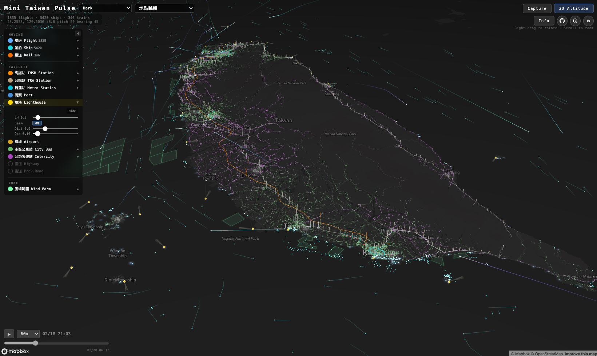
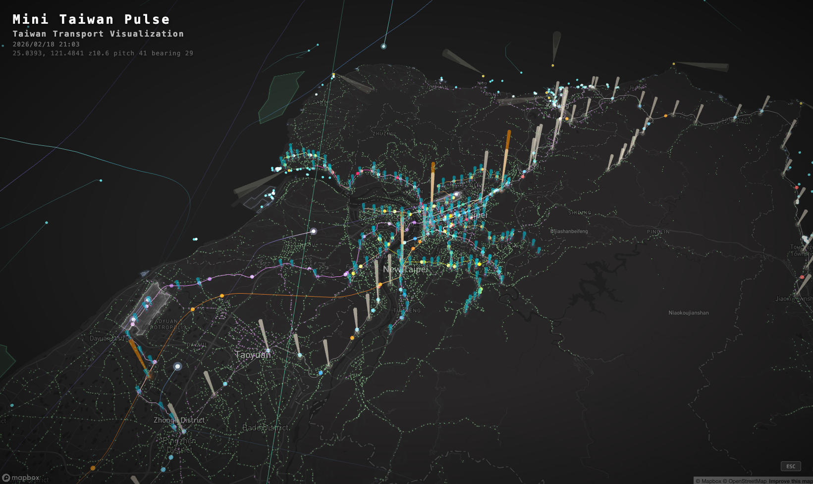
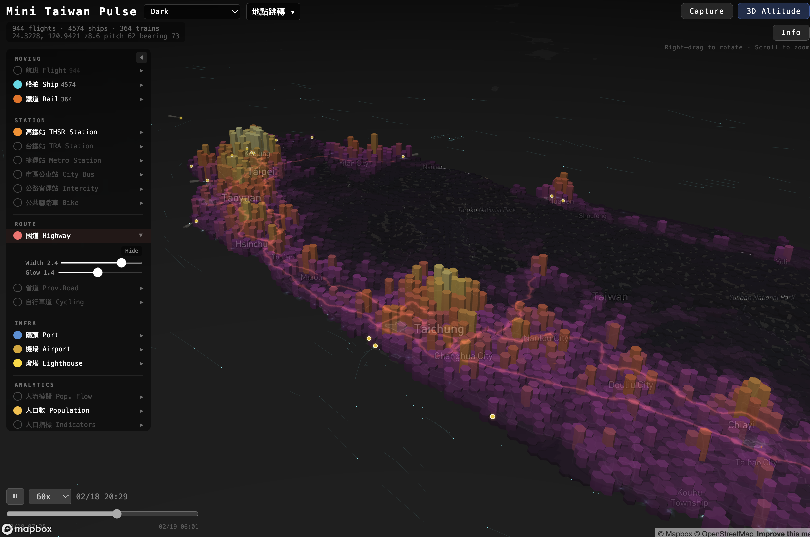

# Mini Taiwan Pulse

用開放資料，感受台灣的脈動。

天空中的航班劃出弧線、海面上的船舶穿梭往返、軌道上的列車準時奔馳 — 這座島嶼每一刻都在呼吸。Mini Taiwan Pulse 將這些交通運輸的即時動態，以 3D 光球、光軌、拖尾線呈現在同一張地圖上，讓你看見台灣的脈搏。

## Screenshots







## 三種脈動

| 脈動 | 視覺呈現 | 開放資料來源 |
|------|---------|------------|
| 天空 — 航班 | 3D 弧線 + 光球 + 彗尾光軌 | FlightRadar24 API |
| 海洋 — 船舶 | InstancedMesh 光球 + 拖尾線 | AIS 船舶位置資料 |
| 大地 — 軌道列車 | 3D 軌道線 + 列車光球 + 拖尾線 | 公開時刻表 + OSM 軌道 |

### 天空的脈動 — 航班

- **光軌**：彗尾狀漸層光軌，additive blending 疊加自然增亮
- **光球**：多層發光球體標示當前位置，呼吸動畫 + 紅色防撞閃爍燈
- **靜態軌跡**：暗色主題依高度著色（暖橘→冷藍），亮色主題隨機配色
- 涵蓋全台 14 座機場、1,500+ 航班

### 海洋的脈動 — 船舶

- **光球**：青藍色 InstancedMesh，視口剔除，呼吸動畫
- **拖尾線**：per-vertex color gradient（30 分鐘遞延）
- **資料過濾**：台灣周邊海域 bounding box、GPS 異常跳躍點排除、無效 MMSI 過濾

### 大地的脈動 — 軌道列車

6 個軌道系統同步運行：

| 系統 | 說明 |
|------|------|
| 台鐵（TRA） | 265 條 OD 軌道、333 列火車，依車種 6 色分類 |
| 高鐵（THSR） | 南北主線 + 支線 |
| 台北捷運（TRTC） | 8 條路線 |
| 高雄捷運（KRTC） | 紅 / 橘線 |
| 高雄輕軌（KLRT） | 環狀輕軌 |
| 台中捷運（TMRT） | 綠 / 藍線 |

- **列車光球**：per-instance color，各系統不同顏色
- **拖尾線**：台鐵 + 高鐵專屬（3 分鐘遞延）
- **台鐵專用引擎**：處理 OD 軌道、golden track、彰化三角線等複雜路線

## 地標與基礎設施

| 標記 | 渲染方式 | 來源 |
|------|---------|------|
| 機場邊界（14 座） | fill + line + glow | OSM Overpass API |
| 大站 Polygon | fill + glow | OSM Overpass API |
| 小站 + 捷運站（491 站） | circle glow 圓環 | 車站 GeoJSON |
| 車站光柱（535 站） | Three.js 3D 光柱（高度 = 停靠次數正規化） | 預計算靜態 JSON |
| 港口邊界 | fill + line + glow | OSM Overpass API |
| 燈塔（36 座） | circle dot + 3D 旋轉錐形光束 | 交通部航港局 |
| 市區公車站 | circle dot + glow | TDX 公共運輸資料 |
| 公路客運站 | circle dot + glow | TDX 公共運輸資料 |
| 公共腳踏車站 | circle dot + glow | TDX 公共運輸資料 |
| 國道路網 | line（紅色，zoom 自適應寬度） | 交通部公路局 |
| 省道路網 | line（橘色，zoom 自適應寬度） | 交通部公路局 |
| 自行車道 | line（綠色，zoom 自適應寬度） | 交通部 |
| 國道壅塞 | line（色彩編碼壅塞程度） | 交通部公路局 |
| 氣象觀測站 | circle dot + glow | 中央氣象署 |
| 離岸風場範圍 | fill + line + glow | 經濟部能源局 |
| 人流模擬六角格 | Mapbox fill / fill-extrusion（Plasma / Viridis 色階） | 內政部最小統計區人流 |
| 人口數六角格 | Mapbox fill / fill-extrusion（Inferno 色階） | SEGIS 村里人口統計 |
| 人口指標六角格 | Mapbox fill / fill-extrusion（Inferno 色階，9 項指標） | SEGIS 村里人口統計 |
| 溫度波浪曲面 | Three.js BufferGeometry（RdBu 發散色盤，vertex lerp 動畫） | 中央氣象署 0.03° 格點 |

## 功能

### 圖層面板（LayerSidebar）

七分類側邊欄，共 22 個圖層可獨立 toggle 開關，面板可收合為側邊窄條（點擊 ◀ 收合、點窄條展開），固定高度並支援捲動：

| 分類 | 圖層 |
|------|------|
| **MOVING** | 航班 Flight、船舶 Ship、鐵道 Rail（可展開參數面板） |
| **STATION** | 高鐵站 THSR · 台鐵站 TRA · 捷運站 Metro · 市區公車站 City Bus · 公路客運站 Intercity · 公共腳踏車 Bike（可展開） |
| **ROUTE** | 國道 Highway · 省道 Prov.Road · 自行車道 Cycling（可展開） |
| **INFRA** | 碼頭 Port · 機場 Airport · 燈塔 Lighthouse（可展開） |
| **ANALYTICS** | 人流模擬 Pop. Flow · 人口數 Population · 人口指標 Indicators（可展開） |
| **MONITOR** | 國道壅塞 Congestion（可展開） |
| **ENVIRON** | 氣象站 Weather（可展開）· 風場範圍 Wind Farm · 溫度波 Temperature（可展開） |

- MOVING 展開面板含 Live Status / Trails 模式切換（航班專用）+ 視覺參數 slider
- 鐵道面板含 Train 列車開關 + Track 2D/3D 切換（互斥：2D 平面軌道 / 3D 立體軌道）
- 車站面板含 Pillar 光柱開關 + Height 光柱高度調整
- 運具按鈕顯示活躍數量（航班數、船舶數、列車數）
- 收合狀態以彩色小點顯示各圖層啟用狀態

### 即時參數調整

#### 航班（Flights）

| 控制項 | 範圍 | 說明 |
|--------|------|------|
| Alt × | 1~5 | 高度誇張倍率，數值越大弧線越高聳 |
| Z offset | 0~200m | 基準高度偏移，避免低空航線貼地 |
| Opacity | 0.02~0.5 | 靜態軌跡線不透明度 |
| Orb | — | 飛行光球大小 |
| APT | 0~0.3 | 機場區域填充不透明度 |
| Glow | 0~2 | 機場光暈強度 |

#### 船舶（Ships）

| 控制項 | 範圍 | 說明 |
|--------|------|------|
| Ship Orb | — | 船舶光球大小 |
| Ship Trail | 0.05~1 | 船舶拖尾線透明度 |

#### 鐵道（Rail）

| 控制項 | 類型 | 說明 |
|--------|------|------|
| Train | toggle | 列車光球顯示開關 |
| Track | select | 軌道渲染模式（2D 平面 / 3D 立體） |
| Rail Z | 0~500m | 軌道 Z 軸偏移高度 |
| Rail Orb | — | 列車光球大小 |
| Rail Trk | 0.05~1 | 軌道線透明度 |

#### 車站（THSR / TRA / Metro 各自獨立）

| 控制項 | 範圍 | 說明 |
|--------|------|------|
| Stn | 0.3~3x | 車站圓環大小縮放 |
| Pillar | toggle | 3D 光柱顯示開關 |
| Height | 0.2~3x | 光柱高度倍率 |

#### 燈塔（Lighthouses）

| 控制項 | 範圍 | 說明 |
|--------|------|------|
| LH | 0.3~3x | 燈塔標記大小 |
| Beam | toggle | 3D 旋轉光束開關 |
| Dist | 0.2~3 | 光束投射距離 |
| Opa | 0.05~0.8 | 光束透明度 |

#### 人流模擬（Population Flow Simulation）

| 控制項 | 範圍 | 說明 |
|--------|------|------|
| Opacity | 0.1~1 | 六角格填充不透明度 |
| Contrast | 0.5~4 | Gamma 對比度（越大高人流越突出、低人流越暗） |
| 3D | toggle | 2D 平面填充 / 3D 柱狀高度切換 |
| Height | 10~200 | 3D 柱狀高度倍率 |
| Metric | Day / Night | 日間人流 / 夜間人流切換（共用高度基準） |

- 色階：日間 = Plasma（深靛→桃紅→亮黃），夜間 = Viridis（深紫→青綠→亮黃）
- 正規化：log1p + gamma，感知均勻、色盲友善
- Zoom 自動切換網格精度
- 渲染：Mapbox 原生 fill / fill-extrusion layer（正確跟隨相機 pitch/bearing）

#### 人口數（Population Count）

| 控制項 | 範圍 | 說明 |
|--------|------|------|
| Opacity | 0.1~1 | 六角格填充不透明度 |
| Contrast | 0.5~4 | Gamma 對比度 |
| 3D | toggle | 2D 平面 / 3D 柱狀切換 |
| Height | 10~200 | 3D 柱狀高度倍率 |

- 資料：SEGIS 村里人口統計（114 年 6 月），7,748 村里
- 色階：Inferno（深黑→紫紅→橘黃→亮黃白）
- 正規化：log1p + gamma（總人口重尾分布適用）
- Pipeline：`taipei-gis-analytics/pipelines/demographics/population/08_h3_village_demographics.py`
- 解析度：res7（~8K cells）+ res8（~56K cells），不產 res9（村里 polygon 較大，res9 無意義）

#### 人口指標（Population Indicators）

| 控制項 | 範圍 | 說明 |
|--------|------|------|
| Category | Count / Struct / Burden | 指標分類選擇 |
| Metric | 動態切換 | 依 Category 顯示對應指標 |
| Opacity | 0.1~1 | 六角格填充不透明度 |
| Contrast | 0.5~4 | Gamma 對比度 |
| 3D | toggle | 2D 平面 / 3D 柱狀切換 |
| Height | 10~200 | 3D 柱狀高度倍率 |

**Category → Metric 對應**：

| Category | Metric |
|----------|--------|
| 數量 Count | 戶數 HH · 男 M · 女 F |
| 結構 Struct | 性別比 Sex · 每戶 PPH |
| 負擔 Burden | 扶養 Dep · 扶幼 Child · 扶老 Elder · 老化 Aging |

- 數量指標（hh/m/f）：log1p + gamma 正規化
- 比率指標（sr/pph/dr/cd/ed/ai）：linear + gamma 正規化
- 比率欄位 H3 聚合方式：人口加權平均（非簡單平均）

#### 其他圖層

| 圖層 | 控制項 | 範圍 | 說明 |
|------|--------|------|------|
| 公車站（City / Intercity） | Bus | 0.3~3x | 圓點大小 |
| 公共腳踏車 | Bike | 0.3~3x | 圓點大小 |
| 自行車道 | Cycling | 0.3~3x | 線條寬度倍率 |
| 國道壅塞 | Freeway | 0.3~3x | 線條寬度倍率 |
| 氣象站 | Weather | 0.3~3x | 標記大小 |

#### 溫度波浪（Temperature Wave）

| 控制項 | 類型 | 範圍 | 說明 |
|--------|------|------|------|
| 3D | toggle | — | 3D 波浪曲面 / 2D 平面色圖切換 |
| Height | slider | 0~400 | 溫度造成的高低起伏振幅 |
| Z Offset | slider | 0~1000 | 整塊曲面的 Z 軸抬升高度 |
| Opacity | slider | 0.1~1 | 曲面透明度 |
| Grid | toggle | — | 網格線覆蓋開關 |

- 資料：中央氣象署小時溫度觀測分析格點（O-A0038-003），0.03° 解析度（~3.3km），120×67 格網
- 色盤：RdBu 發散（深藍 → 白 → 深紅），正規化使用實際資料 tempMin/tempMax
- 動畫：binary search 找兩個 bracketing frames，vertex lerp 平滑過渡
- 時間同步：直接使用 timeline unix timestamp，與航班/船舶/列車完全同步

### 載入畫面（LoadingScreen）

首頁載入時同步等待 4 項資料完成，並以獨立進度列顯示各項狀態：

| 資料項 | 大小 | 完成顯示 |
|--------|------|---------|
| 航班 Flights | ~84MB | 航班數量 |
| 船舶 Ships | ~54MB | 船舶數量 |
| 鐵道 Rail | ~53MB | 系統數量 |
| 溫度場 Temperature | ~941KB | — |

- 各項獨立打勾：✓ 完成（藍色 + 數量）、⟳ 進行中（旋轉動畫）、○ 等待中（灰色）
- 底部真實進度條（done/total），非假動畫
- 全部完成後才顯示地圖 UI 並自動播放時間軸，確保「一打開就是可使用狀態」

### 其他功能

- 6 種 Mapbox 底圖樣式（Dark / Light / Satellite / Satellite Streets / Navigation Night / Streets）
- 開場全台總覽視角（23.43°N, 121.12°E, z7.9, pitch 48°）
- 14 座台灣機場預設視角 + 飛行動畫跳轉（2 秒）
- 時間軸播放控制（30x / 60x / 120x / 300x / 600x 加速）
- Capture 拍攝模式（暗角 vignette + 標題 + 時間標記，按 ESC 退出）
- 顯示模式切換：Live Status（即時位置）/ Trails（軌跡線）
- 點擊飛機 / 列車光球顯示浮動資訊卡
- 768px 以下自動切換手機版 UI（底部拖曳面板）
- 底部資訊列：即時運具計數 + 相機 pitch / bearing / zoom 參數
- Info Modal：5 頁多分頁說明面板（操作指南 · 功能圖例 · 資料來源 · 關於 · 個人）

## 技術棧

| 層級 | 技術 | 用途 |
|------|------|------|
| 框架 | React 19 + TypeScript + Vite | 應用骨架 |
| 地圖 | Mapbox GL JS v3 | 3D terrain、底圖、相機控制 |
| 空間索引 | H3 (h3-js) | 六角形網格（人流模擬 + 村里人口指標） |
| 3D 渲染 | Three.js r172 | 光軌、光球、InstancedMesh |
| Shader | GLSL | 光軌漸層材質 |
| 雲端 | AWS S3 | 資料增量同步 |
| 容器 | Docker + Nginx | 生產部署 |

## 架構

### Overlay Registry 模式

所有 Mapbox GL 靜態圖層（機場、車站、港口、燈塔、道路、風場等）透過**配置驅動**的 Overlay Registry 統一管理：

```
overlayRegistry.ts  — 宣告式 config 陣列（sourceUrl + paint 函式）
overlayManager.ts   — 通用 CRUD（addOverlay / updateTheme / setVisible）
MapView.tsx         — 一個 useEffect 控制所有 overlay 可見性 + 主題
```

**新增一個 overlay 只需改 3 個檔案：**
1. `src/types/index.ts` — `LayerVisibility` 加一個 key
2. `src/map/overlayRegistry.ts` — 加一筆 `OverlayConfig`
3. `src/components/LayerSidebar.tsx` — 在對應 section 加一列

### Three.js CustomLayer 架構

透過 Mapbox `CustomLayer` 在同一個 WebGL context 中嵌入 Three.js 場景，六個獨立 CustomLayer 各自管理動態渲染，常駐地圖、由 `getIsVisible` 控制渲染開關：

```
Mapbox GL JS（底圖 + 3D terrain + 相機控制）
  ├── CustomLayer: flight-3d     ← FlightScene（GLSL 光軌 + 光球 + 閃爍燈）
  ├── CustomLayer: ship-3d       ← ShipScene（InstancedMesh + 拖尾線）
  ├── CustomLayer: rail-3d       ← RailScene（靜態軌道 + 列車光球 + 拖尾）
  ├── CustomLayer: lighthouse-3d ← LighthouseScene（旋轉錐形光束）
  ├── CustomLayer: station-pillar-3d ← StationPillarScene（車站 3D 光柱）
  ├── CustomLayer: temperature-wave-3d ← TemperatureWaveScene（溫度 3D 波浪曲面）
  ├── Population Flow Layer（Mapbox native fill / fill-extrusion）
  ├── Demographics Layers（人口數 + 人口指標，Mapbox native fill / fill-extrusion）
  └── Overlay Registry（Mapbox GL Layers）
        ├── 機場邊界（fill + glow）
        ├── 車站標記（polygon + circle glow）
        ├── 港口邊界（fill + glow）
        ├── 燈塔（circle + glow）
        ├── 市區公車站 / 公路客運站 / 腳踏車站（circle + glow）
        ├── 國道 / 省道 / 自行車道（line）
        ├── 國道壅塞（line，色彩編碼）
        ├── 氣象站（circle + glow）
        └── 離岸風場（fill + line + glow）
```

### 專案結構

```
mini-taiwan-pulse/
├── public/
│   ├── aviation_data.json          # 航班軌跡（gitignored）
│   ├── ship_data.json              # 船舶軌跡（gitignored）
│   ├── airports.geojson            # 台灣 14 座機場邊界
│   ├── station_polygons.geojson    # 大站 Polygon
│   ├── station_points.geojson      # 小站 + 捷運站 Point（491 站）
│   ├── station_pillars.json        # 車站光柱預計算資料（535 站）
│   ├── station_daily_stops.json    # 站點每日停靠次數
│   ├── bus_stations_city.geojson   # 市區公車站
│   ├── bus_stations_intercity.geojson # 公路客運站
│   ├── bike_stations.geojson       # 公共腳踏車站（gitignored）
│   ├── cycling_routes.geojson      # 自行車道（gitignored）
│   ├── freeway_congestion.geojson  # 國道壅塞（gitignored）
│   ├── weather_stations.geojson    # 氣象站（gitignored）
│   ├── port_polygons.geojson       # 港口邊界
│   ├── lighthouse.geojson          # 燈塔位置（36 座）
│   ├── national_highway.geojson    # 國道路網（gitignored）
│   ├── provincial_road.geojson     # 省道路網（gitignored）
│   ├── wind_plan.geojson           # 離岸風場範圍
│   ├── h3_population_res7.json    # 人流模擬 res7（~8K cells）
│   ├── h3_population_res8.json    # 人流模擬 res8（~56K cells）
│   ├── h3_demographics_res7.json  # 村里人口指標 res7（~8K cells）
│   ├── h3_demographics_res8.json  # 村里人口指標 res8（~56K cells）
│   ├── temperature_grid.json      # 溫度格點時序（S3 逐時快照，~941KB）
│   └── rail/                       # 軌道時刻表 + GeoJSON（gitignored）
│       ├── tra/                    # 台鐵
│       ├── thsr/                   # 高鐵
│       ├── trtc/                   # 台北捷運
│       ├── krtc/                   # 高雄捷運
│       ├── klrt/                   # 高雄輕軌
│       └── tmrt/                   # 台中捷運
├── scripts/                        # 資料準備腳本（Python + TypeScript）
├── src/
│   ├── App.tsx                     # 主應用 + 狀態協調
│   ├── types/index.ts              # 型別定義（含 OverlayConfig）
│   ├── components/
│   │   ├── LoadingScreen.tsx       # 全資料預載進度畫面（4 項獨立打勾 + 真實進度條）
│   │   ├── InfoModal.tsx           # 多分頁 Info Modal（5 頁）
│   │   ├── LayerSidebar.tsx        # 七分類圖層面板（MOVING / STATION / ROUTE / INFRA / ANALYTICS / MONITOR / ENVIRON）
│   │   ├── TimelineControls.tsx    # 時間軸播放控制
│   │   ├── AirportSelector.tsx     # 地點跳轉
│   │   ├── StyleSelector.tsx       # 底圖樣式選擇
│   │   └── MobileBottomSheet.tsx   # 手機版底部面板
│   ├── map/
│   │   ├── MapView.tsx             # Mapbox 地圖容器（overlay 生命週期管理）
│   │   ├── overlayRegistry.ts      # Overlay 配置陣列（宣告式）
│   │   ├── overlayManager.ts       # Overlay CRUD 通用函式
│   │   ├── customLayer.ts          # Three.js CustomLayer 橋接（flight/ship/rail）
│   │   ├── lighthouseCustomLayer.ts # 燈塔 3D 光束 CustomLayer
│   │   ├── stationPillarCustomLayer.ts # 車站光柱 CustomLayer
│   │   ├── temperatureWaveCustomLayer.ts # 溫度波浪 CustomLayer
│   │   ├── staticTrails.ts         # 2D 靜態航線軌跡
│   │   ├── railTracks.ts           # Mapbox native 軌道線
│   │   ├── h3LayerFactory.ts       # 人流六角格 Mapbox fill/fill-extrusion 工廠
│   │   ├── demographicsLayerFactory.ts # 人口數/指標六角格工廠（Inferno 色階）
│   │   └── cameraPresets.ts        # 機場預設視角
│   ├── three/                      # Three.js 3D 場景
│   │   ├── FlightScene.ts          # 航班光軌 + 光球 + GLSL shader
│   │   ├── ShipScene.ts            # 船舶 InstancedMesh + 拖尾線
│   │   ├── RailScene.ts            # 軌道列車光球 + 拖尾 + 靜態軌道
│   │   ├── StationPillarScene.ts   # 車站 3D 光柱（InstancedMesh）
│   │   ├── LighthouseScene.ts      # 燈塔旋轉錐形光束
│   │   ├── TemperatureWaveScene.ts # 溫度 3D 波浪曲面（RdBu 色盤 + vertex lerp）
│   │   ├── LightOrb.ts             # 光球共用元件
│   │   ├── LightTrail.ts           # 光軌 GLSL 材質
│   │   └── BlinkingLight.ts        # 防撞閃爍燈
│   ├── engines/                    # 列車運動插值引擎
│   │   ├── RailEngine.ts           # 通用軌道引擎（THSR/MRT）
│   │   ├── TraTrainEngine.ts       # 台鐵專用引擎（OD 軌道）
│   │   └── railUtils.ts            # 軌道工具函式
│   ├── hooks/                      # React Custom Hooks
│   │   ├── useTransportParams.ts   # 運具視覺參數 state + refs + sliders
│   │   ├── useRailEngine.ts        # 軌道引擎 + rAF tick loop
│   │   ├── useLayerVisibility.ts   # 圖層可見性 state + toggle
│   │   ├── useThreeJsLayers.ts     # Three.js CustomLayer 建立與管理
│   │   ├── useMapInteraction.ts    # 飛機/列車點擊互動
│   │   ├── useFlightData.ts        # 航班資料載入
│   │   ├── useShipData.ts          # 船舶資料載入
│   │   ├── useRailData.ts          # 軌道資料載入
│   │   ├── useTemperatureData.ts    # 溫度格點資料載入
│   │   ├── useH3Data.ts            # 人流資料載入 + 快取
│   │   ├── useDemographicsH3.ts    # 村里人口指標資料載入 + 快取
│   │   ├── useTimeline.ts          # 時間軸播放邏輯
│   │   └── useIsMobile.ts          # 響應式斷點偵測
│   ├── data/                       # 資料載入器
│   │   ├── flightLoader.ts         # 航班 JSON 解析 + 時間窗過濾
│   │   ├── shipLoader.ts           # 船舶 JSON 解析
│   │   ├── railLoader.ts           # 軌道時刻表 + GeoJSON 載入
│   │   ├── temperatureLoader.ts     # 溫度格點 JSON 載入
│   │   ├── h3Loader.ts             # 人流 JSON 載入（local + S3 fallback）
│   │   └── s3Loader.ts             # S3 增量同步
│   ├── constants/                  # 常數定義
│   └── utils/                      # 座標轉換、軌跡插值
├── Dockerfile                      # Multi-stage build
├── docker-compose.yml              # Port 3721
└── nginx.conf
```

## 資料準備

所有資料皆來自開放資料源，透過腳本擷取與轉換：

### 航班資料

來源：[FlightRadar24 API](https://fr24api.flightradar24.com/)

```bash
npm run fetch:flights              # 取得航班清單
npm run fetch:tracks -- --date 2026-02-18   # 擷取飛行軌跡
```

### 船舶資料

來源：AIS 船舶位置資料（經 ship-gis SQLite 匯出）

```bash
python3 scripts/export-ship-data.py                     # 預設日期
python3 scripts/export-ship-data.py 2026-02-18 2026-02-19  # 指定日期範圍
```

### 軌道資料

來源：公開時刻表 + OSM 軌道 GeoJSON

```bash
python3 scripts/export-rail-data.py          # 匯出 6 個系統的時刻表 + 軌道
python3 scripts/build-station-points.py      # 合併 491 站 Point GeoJSON
python3 scripts/fetch-station-polygons.py    # 下載大站 OSM Polygon
npm run pillars:generate                     # 預計算車站光柱資料（停靠次數 → 高度）
```

### 溫度格點資料

來源：[中央氣象署](https://www.cwa.gov.tw/) 小時溫度觀測分析格點（O-A0038-003），經 data-collectors 每小時收集存入 S3

```bash
# 從 S3 下載（自動偵測航班時間範圍）
python3 scripts/fetch-temperature-s3.py

# 指定日期範圍
python3 scripts/fetch-temperature-s3.py 2026-02-17 2026-02-20
```

### S3 上傳

```bash
npm run s3:upload          # 航班資料
npm run s3:upload:ships    # 船舶資料
npm run s3:upload:rail     # 軌道資料
```

## 開發

```bash
npm install
cp .env.example .env       # 填入 VITE_MAPBOX_TOKEN
npm run dev                # 開發模式
npm run build              # 正式建置
```

### Docker 本地部署

```bash
docker-compose up -d       # http://localhost:3721
```

大檔案透過 `docker-compose.yml` volumes 掛載到 `/data/`，nginx 會從該路徑讀取。

### Zeabur 部署

```
1. Zeabur Dashboard → 建立服務 → 選 GitHub repo
2. 設定環境變數：
   - VITE_MAPBOX_TOKEN（build time，Vite 嵌入靜態檔）
   - S3_ACCESS_KEY（runtime，pull 腳本用）
   - S3_SECRET_KEY
   - S3_REGION=ap-southeast-2
   - S3_BUCKET=migu-gis-data-collector
3. 建立 Volume → Mount path: /data
4. 部署完成後，進 Web Terminal 執行：
   sh /usr/local/bin/pull-deploy-assets.sh
5. 確認輸出包含所有檔案 + "rail/ extracted to /data/rail/"
```

> **注意**：每次重新部署後 Volume 資料仍在，但新 container 啟動時不會自動拉取。
> 若資料有更新，需手動再跑一次 pull 腳本。

### 資料管理（S3 deploy-assets）

大檔案（~200MB）不進 git，統一託管到 S3 `deploy-assets/` prefix，**私密存取**（需認證）：

| S3 檔案 | 大小 | 說明 | 對應 /data/ 路徑 |
|---------|------|------|-----------------|
| `aviation_data.json` | 44MB | 航班軌跡 | `/data/aviation_data.json` |
| `ship_data.json` | 54MB | 船舶軌跡 | `/data/ship_data.json` |
| `rail.tar.gz` | ~8MB | 軌道資料（6 系統個別檔案打包） | `/data/rail/` 解壓 |
| `provincial_road.geojson` | 44MB | 省道路網 | `/data/provincial_road.geojson` |
| `national_highway.geojson` | 7.9MB | 國道路網 | `/data/national_highway.geojson` |
| `bus_stations_city.geojson` | 19MB | 市區公車站 | `/data/bus_stations_city.geojson` |
| `bus_stations_intercity.geojson` | 5.8MB | 公路客運站 | `/data/bus_stations_intercity.geojson` |
| `bike_stations.geojson` | 4.4MB | 公共腳踏車站 | `/data/bike_stations.geojson` |
| `cycling_routes.geojson` | — | 自行車道 | `/data/cycling_routes.geojson` |
| `freeway_congestion.geojson` | — | 國道壅塞 | `/data/freeway_congestion.geojson` |
| `weather_stations.geojson` | — | 氣象站 | `/data/weather_stations.geojson` |
| `temperature_grid.json` | ~941KB | 溫度格點時序 | `/data/temperature_grid.json` |

```bash
# 本地 → S3（需 .env 中的 S3 credentials）
bash scripts/upload-deploy-assets.sh

# Container 內 S3 → /data/（需環境變數 S3_ACCESS_KEY 等）
sh /usr/local/bin/pull-deploy-assets.sh
```

### 資料更新完整流程

```bash
# 1. 本地產生/更新資料（視需要）
python3 scripts/export-rail-data.py       # 軌道

# 2. 上傳到 S3 deploy-assets/（統一用這個腳本！）
bash scripts/upload-deploy-assets.sh

# 3. Zeabur Web Terminal 拉取
sh /usr/local/bin/pull-deploy-assets.sh
```

> **⚠️ 易錯提醒**：
> - `npm run s3:upload:rail` 上傳到的是 `rail-data/` 路徑（前端 fallback 用），**不是** deploy-assets
> - 部署用的上傳一律用 `upload-deploy-assets.sh`，不要混用
> - pull 腳本路徑是 `/usr/local/bin/`，不是 `/usr/share/nginx/html/`
> - 前端請求的是 `/rail/krtc/krtc_schedules.json` 等個別檔案，不是 `rail_bundle.json`

### 環境需求

- Node.js 22+
- Python 3（資料匯出腳本）
- Mapbox Access Token

## 開放資料來源

| 資料 | 來源 |
|------|------|
| 航班軌跡 | [FlightRadar24](https://www.flightradar24.com/) |
| 船舶位置 | AIS（Automatic Identification System） |
| 軌道時刻表 | 台鐵、高鐵、各捷運公開時刻表（[TDX](https://tdx.transportdata.tw/)） |
| 機場 / 車站 / 港口邊界 | [OpenStreetMap](https://www.openstreetmap.org/) via Overpass API |
| 燈塔位置 | 交通部航港局 |
| 公車站位 / 腳踏車站 | [TDX 公共運輸資料](https://tdx.transportdata.tw/) |
| 國道 / 省道 / 自行車道 | 交通部公路局 |
| 國道壅塞 | 交通部公路局 |
| 氣象觀測站 | [中央氣象署](https://www.cwa.gov.tw/) |
| 溫度格點（0.03° 網格） | [中央氣象署](https://www.cwa.gov.tw/) O-A0038-003 |
| 離岸風場範圍 | 經濟部能源局 |
| 日夜間人流 | 內政部最小統計區人流統計（六角形網格化） |
| 村里人口指標 | [社會經濟統計地理資訊網 (SEGIS)](https://segis.moi.gov.tw/)，114 年 6 月 |
| 地圖底圖 | [Mapbox](https://www.mapbox.com/) |

## H3 統計圖層開發注意事項

新增 H3 六角格統計圖層時，以下是已踩過的 pitfall，務必避免重蹈覆轍：

### 1. `map.isStyleLoaded()` 不可用於 useEffect 條件判斷

**問題**：`isStyleLoaded()` 在 Mapbox 載入 tiles 期間也會回傳 `false`（不只是初始 style parse），導致在時間軸播放、底圖切換等場景下，useEffect 永遠跳過更新。

**解法**：改用 `map.getSource("source-id")` 檢查 source 是否已存在。Source 在 `style.load` / `load` 事件中由 `ensureXxxLayers()` 建立後就持續存在，不受 tile loading 影響。

```typescript
// BAD — 會在 tile loading 時持續 skip
if (!map.isStyleLoaded()) return;

// GOOD — source 存在就可以操作
if (!map.getSource("h3-pop-count-src")) return;
```

### 2. useEffect deps 中的物件必須 useMemo

**問題**：`{ opacity, contrast, extruded, elevationScale }` 每次 render 都是新物件，導致 useEffect 每幀都觸發，搭配上面的 isStyleLoaded skip 造成無限 console spam。

**解法**：所有傳入 useEffect dependency 的 params 物件用 `useMemo` 包裝。

### 3. Pipeline：GeoDataFrame 含 MultiPolygon 時需 explode

**問題**：`polyfill_and_distribute()` 內部使用 `polygon.exterior.coords`，但 MultiPolygon 沒有 `.exterior` 屬性。

**解法**：在呼叫前先 `gdf.explode(index_parts=False).reset_index(drop=True)`。

### 4. 比率欄位 H3 聚合必須人口加權

**問題**：簡單平均會讓小村里（人口 10）與大村里（人口 10,000）的比率權重相同。

**解法**：`weighted_ratio = population × ratio` → distribute → `ratio = sum(weighted) / sum(population)`。

### 5. 共用資料、分開 Source

兩個圖層（人口數 + 人口指標）共用同一份 JSON 但使用**獨立的 Mapbox source + layer**，才能各自控制 visibility、opacity、metric。不要試圖讓兩個圖層共享同一個 source — 會造成 GeoJSON 互相覆蓋。

## License

MIT License. 詳見 [LICENSE](LICENSE)。
