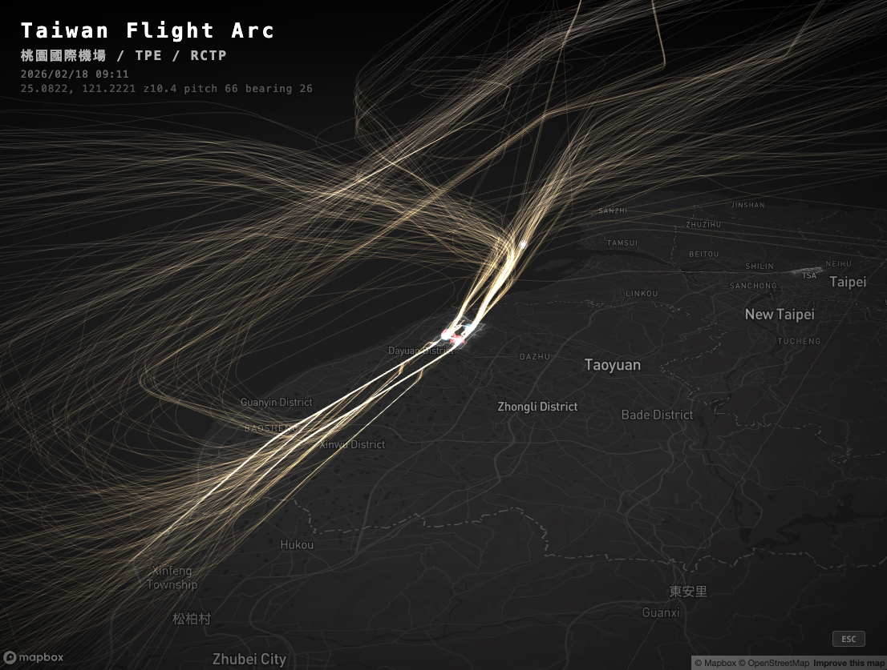
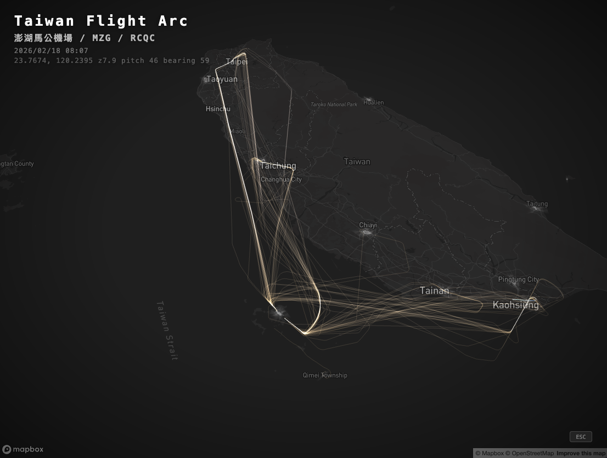
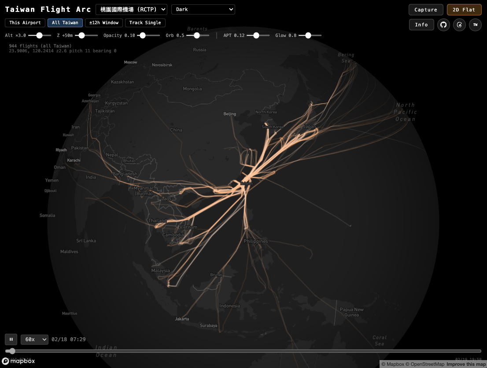

# Mini Taiwan Pulse

用開放資料，感受台灣的脈動。

天空中的航班劃出弧線、海面上的船舶穿梭往返、軌道上的列車準時奔馳 — 這座島嶼每一刻都在呼吸。Mini Taiwan Pulse 將這些交通運輸的即時動態，以 3D 光球、光軌、拖尾線呈現在同一張地圖上，讓你看見台灣的脈搏。

## Screenshots





## 三種脈動

| 脈動 | 視覺呈現 | 開放資料來源 |
|------|---------|------------|
| 天空 — 航班 | 3D 弧線 + 光球 + 彗尾光軌 | FlightRadar24 API |
| 海洋 — 船舶 | InstancedMesh 光球 + 拖尾線 | AIS 船舶位置資料 |
| 大地 — 軌道列車 | 3D 軌道線 + 列車光球 + 拖尾線 | 公開時刻表 + OSM 軌道 |

### 天空的脈動 — 航班

- **光軌**：彗尾狀漸層光軌，additive blending 疊加自然增亮
- **光球**：多層發光球體標示當前位置，呼吸動畫 + 紅色防撞閃爍燈
- **靜態軌跡**：暗色主題依高度著色（暖橘→冷藍），亮色主題隨機配色
- 涵蓋全台 14 座機場、1,500+ 航班

### 海洋的脈動 — 船舶

- **光球**：青藍色 InstancedMesh，視口剔除，呼吸動畫
- **拖尾線**：per-vertex color gradient（30 分鐘遞延）
- **資料過濾**：台灣周邊海域 bounding box、GPS 異常跳躍點排除、無效 MMSI 過濾

### 大地的脈動 — 軌道列車

6 個軌道系統同步運行：

| 系統 | 說明 |
|------|------|
| 台鐵（TRA） | 265 條 OD 軌道、333 列火車，依車種 6 色分類 |
| 高鐵（THSR） | 南北主線 + 支線 |
| 台北捷運（TRTC） | 8 條路線 |
| 高雄捷運（KRTC） | 紅 / 橘線 |
| 高雄輕軌（KLRT） | 環狀輕軌 |
| 台中捷運（TMRT） | 綠 / 藍線 |

- **列車光球**：per-instance color，各系統不同顏色
- **拖尾線**：台鐵 + 高鐵專屬（3 分鐘遞延）
- **台鐵專用引擎**：處理 OD 軌道、golden track、彰化三角線等複雜路線

## 地標與標記

| 標記 | 渲染方式 | 來源 |
|------|---------|------|
| 機場邊界（14 座） | fill + line + glow | OSM Overpass API |
| 大站 Polygon | fill + glow | OSM Overpass API |
| 小站 + 捷運站（491 站） | circle glow 圓環 | 車站 GeoJSON |
| 港口邊界 | fill + line + glow | OSM Overpass API |

## 功能

### 檢視模式

| 模式 | 說明 |
|------|------|
| This Airport | 選定機場相關航班 |
| All Taiwan | 全台所有航班 |
| ±12h Window | 當前時間前後 12 小時 |
| Track Single | 追蹤單一航班 |

### 即時參數調整

| 控制項 | 說明 |
|--------|------|
| Alt ×1.0~5.0 | 航班高度誇張倍率 |
| Z +0~200m | 基準高度偏移 |
| Opacity | 靜態軌跡不透明度 |
| Orb / Ship Orb / Rail Orb | 各交通工具光球大小 |
| Rail Z | 軌道 Z 軸偏移 |
| Rail Trk / Ship Trail | 軌道線 / 船舶拖尾線透明度 |
| APT / Glow | 機場填充不透明度 / 光暈強度 |

### 其他

- 6 種 Mapbox 底圖樣式（Dark / Light / Satellite / Navigation Night 等）
- 14 座台灣機場預設視角
- 時間軸播放控制（30x~600x 加速）
- Capture 拍攝模式（暗角 vignette + 機場名稱 + 時間標記）
- 圖層開關：Flight / Ship / Rail / Station / Port，顯示活躍數量
- 768px 以下自動切換手機版 UI

## 技術棧

| 層級 | 技術 | 用途 |
|------|------|------|
| 框架 | React 19 + TypeScript + Vite | 應用骨架 |
| 地圖 | Mapbox GL JS v3 | 3D terrain、底圖、相機控制 |
| 3D 渲染 | Three.js r172 | 光軌、光球、InstancedMesh |
| Shader | GLSL | 光軌漸層材質 |
| 雲端 | AWS S3 | 資料增量同步 |
| 容器 | Docker + Nginx | 生產部署 |

## 架構

透過 Mapbox `CustomLayer` 在同一個 WebGL context 中嵌入 Three.js 場景，三個獨立 CustomLayer 分別管理三種脈動：

```
Mapbox GL JS（底圖 + 3D terrain + 相機控制）
  ├── CustomLayer: flight-3d     ← 天空的脈動
  │     └── FlightScene（GLSL 光軌 + 光球 + 閃爍燈）
  ├── CustomLayer: ship-3d       ← 海洋的脈動
  │     └── ShipScene（InstancedMesh + 拖尾線）
  ├── CustomLayer: rail-3d       ← 大地的脈動
  │     └── RailScene（靜態軌道 + 列車光球 + 拖尾）
  └── Mapbox GL Layers
        ├── 機場邊界（fill + glow）
        ├── 車站標記（Polygon + circle glow）
        └── 港口邊界（fill + glow）
```

### 專案結構

```
mini-taiwan-pulse/
├── public/
│   ├── aviation_data.json          # 航班軌跡（gitignored）
│   ├── ship_data.json              # 船舶軌跡（gitignored）
│   ├── airports.geojson            # 台灣 14 座機場邊界
│   ├── station_polygons.geojson    # 大站 Polygon
│   ├── station_points.geojson      # 小站 + 捷運站 Point（491 站）
│   ├── port_polygons.geojson       # 港口邊界
│   └── rail/                       # 軌道時刻表 + GeoJSON（gitignored）
│       ├── tra/                    # 台鐵
│       ├── thsr/                   # 高鐵
│       ├── trtc/                   # 台北捷運
│       ├── krtc/                   # 高雄捷運
│       ├── klrt/                   # 高雄輕軌
│       └── tmrt/                   # 台中捷運
├── scripts/                        # 資料準備腳本（Python + TypeScript）
├── src/
│   ├── App.tsx                     # 主應用 + 狀態管理
│   ├── components/                 # UI 元件（選單、時間軸、圖層開關）
│   ├── map/                        # Mapbox 圖層管理
│   ├── three/                      # Three.js 3D 場景 + GLSL shaders
│   ├── engines/                    # 列車運動插值引擎
│   ├── data/                       # 資料載入器（含 S3 增量同步）
│   ├── hooks/                      # React Custom Hooks
│   ├── constants/                  # 常數定義
│   └── utils/                      # 座標轉換、軌跡插值
├── Dockerfile                      # Multi-stage build
├── docker-compose.yml              # Port 3721
└── nginx.conf
```

## 資料準備

所有資料皆來自開放資料源，透過腳本擷取與轉換：

### 航班資料

來源：[FlightRadar24 API](https://fr24api.flightradar24.com/)

```bash
npm run fetch:flights              # 取得航班清單
npm run fetch:tracks -- --date 2026-02-18   # 擷取飛行軌跡
```

### 船舶資料

來源：AIS 船舶位置資料（經 ship-gis SQLite 匯出）

```bash
python3 scripts/export-ship-data.py                     # 預設日期
python3 scripts/export-ship-data.py 2026-02-18 2026-02-19  # 指定日期範圍
```

### 軌道資料

來源：公開時刻表 + OSM 軌道 GeoJSON

```bash
python3 scripts/export-rail-data.py          # 匯出 6 個系統的時刻表 + 軌道
python3 scripts/build-station-points.py      # 合併 491 站 Point GeoJSON
python3 scripts/fetch-station-polygons.py    # 下載大站 OSM Polygon
```

### S3 上傳

```bash
npm run s3:upload          # 航班資料
npm run s3:upload:ships    # 船舶資料
npm run s3:upload:rail     # 軌道資料
```

## 開發

```bash
npm install
cp .env.example .env       # 填入 VITE_MAPBOX_TOKEN
npm run dev                # 開發模式
npm run build              # 正式建置
```

### Docker 部署

```bash
docker-compose up -d       # http://localhost:3721
```

### 環境需求

- Node.js 22+
- Python 3（資料匯出腳本）
- Mapbox Access Token

## 開放資料來源

| 資料 | 來源 |
|------|------|
| 航班軌跡 | [FlightRadar24](https://www.flightradar24.com/) |
| 船舶位置 | AIS（Automatic Identification System） |
| 軌道時刻表 | 台鐵、高鐵、各捷運公開時刻表 |
| 機場 / 車站 / 港口邊界 | [OpenStreetMap](https://www.openstreetmap.org/) via Overpass API |

## License

MIT License. 詳見 [LICENSE](LICENSE)。
