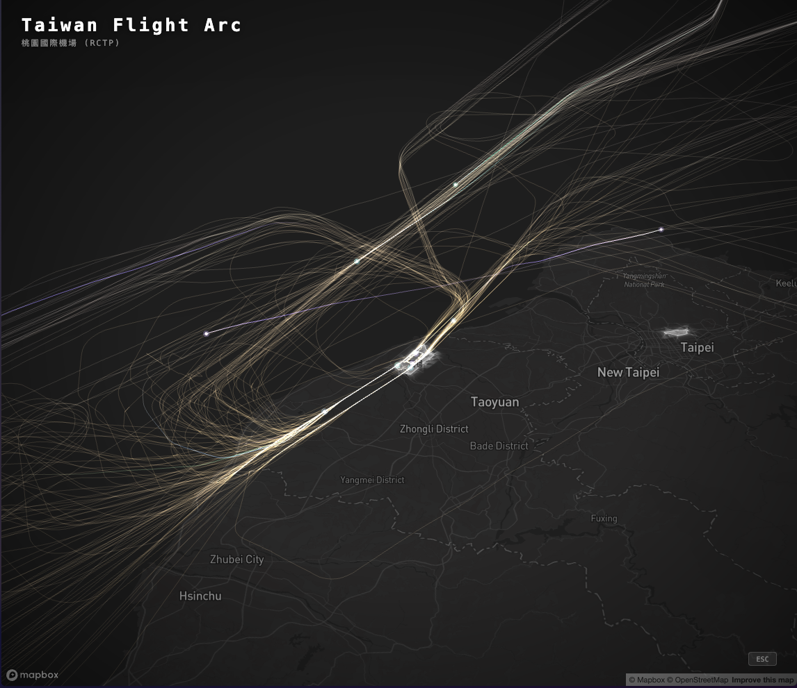
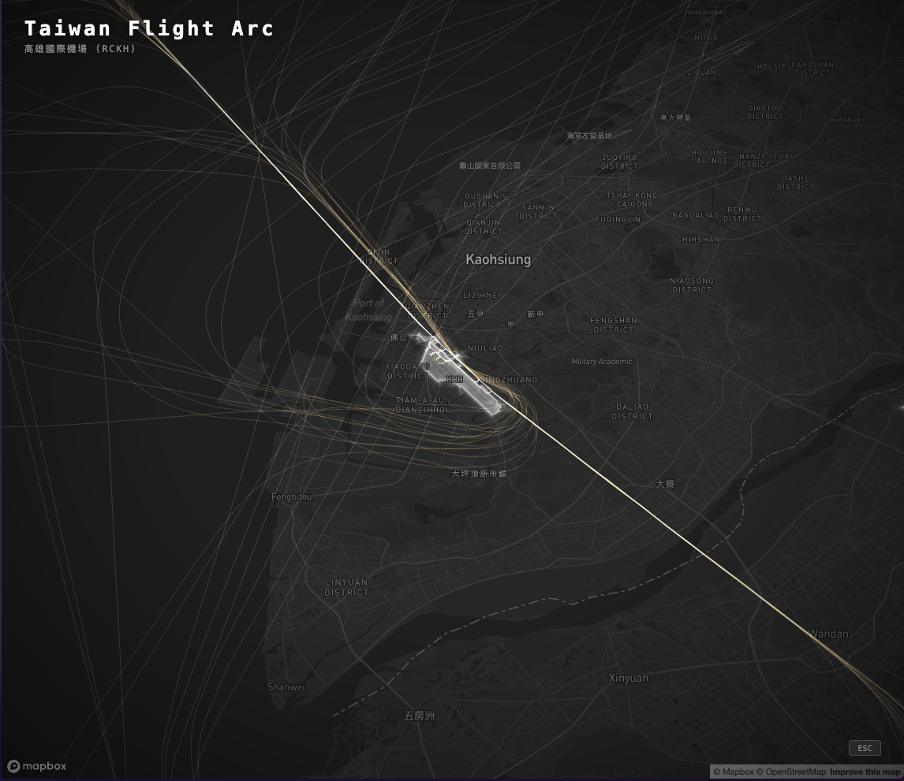

# Taiwan Flight Arc

航班軌跡生成式藝術（Generative Art）視覺化。以台灣機場為中心，將航班起降軌跡轉化為光軌藝術作品。

## Screenshots




## 視覺概念

- **光軌**：航班軌跡以彗尾狀漸層光軌呈現，additive blending 疊加自然增亮
- **光球**：每架飛機以多層發光球體標示當前位置，搭配呼吸動畫
- **閃爍燈**：紅色雙閃警示燈，模擬真實防撞燈號
- **靜態軌跡**：全部航班路徑同時顯示，3D 模式依高度著色（暖橘→冷藍），2D 模式每航班隨機配色
- **機場邊界**：OSM 機場多邊形，暗色主題白色填充 + 光暈，亮色主題金黃色填充 + 光暈
- **主題適應**：所有 UI 元件與視覺效果自動適應底圖明暗，亮色底圖使用深色 UI、Normal blending 軌跡
- **拍攝模式**：一鍵隱藏 UI，暗角 vignette 效果，適合截圖輸出

## 功能

### 檢視模式

| 模式 | 說明 |
|------|------|
| This Airport | 選定機場相關航班 |
| All Taiwan | 全台 1,500+ 航班 |
| ±12h Window | 當前時間前後 12 小時 |
| Track Single | 追蹤單一航班 |

### 渲染模式

| 模式 | 靜態軌跡 | 特色 |
|------|---------|------|
| 3D Altitude | Three.js LineSegments | 航線有高度，依海拔著色漸變 |
| 2D Flat | Mapbox 原生 line layer | 平面俯瞰，每航班獨立配色 |

### 即時參數調整

| 控制項 | 說明 |
|--------|------|
| Alt ×1.0~5.0 | 高度誇張倍率 |
| Z +0~200m | 基準高度偏移（避免被地形遮擋） |
| Opacity | 靜態軌跡不透明度 |
| Orb | 光球大小 |
| APT | 機場填充不透明度 |
| Glow | 機場光暈強度 |

### 其他

- 6 種 Mapbox 底圖樣式（Dark / Light / Satellite / Navigation Night 等），切換底圖自動重建所有圖層
- 11 座台灣機場預設視角，選單顯示中文名稱與 IATA 代碼
- 時間軸播放控制（30x~600x 加速）
- Capture 拍攝模式（暗角 vignette + 機場名稱 + 時間標記，ESC 退出）

## 技術棧

| 層級 | 技術 | 用途 |
|------|------|------|
| 框架 | React 19 + TypeScript + Vite | 應用骨架 |
| 地圖 | Mapbox GL JS v3 | 3D terrain、底圖、相機控制 |
| 3D 渲染 | Three.js r172 | 光軌、光球、閃爍燈、靜態軌跡 |
| Shader | GLSL | 光軌漸層材質 |
| 資料 | FlightRadar24 | `[lat, lng, alt_m, timestamp]` 軌跡格式 |
| 地理 | OpenStreetMap / Overpass API | 機場邊界多邊形 |

## 架構

### Three.js + Mapbox 整合

透過 Mapbox `CustomLayer` 在同一個 WebGL context 中嵌入 Three.js 場景。Mapbox 負責地圖 + 相機，Three.js 負責光軌渲染，座標透過 `MercatorCoordinate` 同步。

```
Mapbox GL JS（底圖 + 3D terrain + 相機控制）
  └── CustomLayer（renderingMode: '3d'）
        └── Three.js Scene
              ├── Static Trails（LineSegments, per-vertex altitude color）
              ├── LightTrail（GLSL gradient shader trail）
              ├── LightOrb（IcosahedronGeometry + AdditiveBlending）
              └── BlinkingLight（red flash mesh）
```

### 專案結構

```
Taiwan Flight Arc/
├── public/
│   ├── aviation_data.json        # FR24 航班軌跡（gitignored，由腳本產生）
│   └── airports.geojson          # OSM 台灣機場邊界（13 座）
├── scripts/
│   ├── fetch-flights.ts          # Step 1: 航班清單擷取
│   └── fetch-tracks.ts           # Step 2: 飛行軌跡擷取
├── screenshots/                   # 截圖展示
├── src/
│   ├── App.tsx                   # 主應用 + 所有狀態管理 + UI
│   ├── types/index.ts            # 型別定義
│   ├── data/
│   │   └── flightLoader.ts       # 資料載入、篩選
│   ├── map/
│   │   ├── MapView.tsx           # Mapbox 容器 + 機場圖層
│   │   ├── customLayer.ts        # CustomLayer ↔ Three.js 橋接
│   │   ├── staticTrails.ts       # 2D Mapbox 原生軌跡圖層
│   │   └── cameraPresets.ts      # 台灣機場視角預設
│   ├── three/
│   │   ├── FlightScene.ts        # 場景管理器（靜態 + 動態軌跡）
│   │   ├── LightOrb.ts           # 多層球體光球
│   │   ├── LightTrail.ts         # GLSL 光軌渲染
│   │   ├── BlinkingLight.ts      # 紅色閃爍燈
│   │   └── shaders/              # GLSL vertex/fragment shaders
│   ├── hooks/
│   │   ├── useFlightData.ts      # 資料載入 hook
│   │   └── useTimeline.ts        # 時間軸播放 hook
│   ├── components/
│   │   ├── AirportSelector.tsx
│   │   ├── FlightPicker.tsx
│   │   ├── TimelineControls.tsx
│   │   └── StyleSelector.tsx
│   └── utils/
│       ├── coordinates.ts        # MercatorCoordinate 轉換 + 動態高度參數
│       └── interpolation.ts      # 軌跡時間插值
├── color-preview.html            # 調色盤獨立預覽
├── .env.example
├── LICENSE
├── package.json
└── vite.config.ts
```

## 航班資料（Flight API）

本專案使用 [FlightRadar24 API](https://fr24api.flightradar24.com/) 作為航班軌跡資料來源。

### 取得 API Token

1. 至 [FlightRadar24](https://fr24api.flightradar24.com/) 註冊帳號並訂閱方案（Explorer 以上）
2. 進入 [Key Management](https://fr24api.flightradar24.com/key-management) 建立 API Token
3. 將 Token 寫入 `.env`：

```bash
cp .env.example .env
# 編輯 .env，填入 FR24_API_TOKEN
```

### 資料擷取腳本

專案提供兩支腳本，自動從 FR24 API 擷取台灣 11 座機場的航班軌跡：

```bash
# Step 1: 取得航班清單（過去 3 天，11 座台灣機場）
npm run fetch:flights

# Step 2: 逐一撈取飛行軌跡（可指定日期）
npm run fetch:tracks -- --date 2026-02-18

# 或撈取全部日期的軌跡
npm run fetch:tracks
```

腳本支援**中斷續接**：如果因 rate limit 或網路中斷，重新執行即可自動接續。

> **Explorer 方案限制**：每次回傳 20 筆、10 次/分鐘。Step 1 約需 15 分鐘，Step 2 每 100 筆約需 12 分鐘。

### 涵蓋機場

| ICAO | 機場 |
|------|------|
| RCTP | 桃園國際機場 |
| RCSS | 台北松山機場 |
| RCKH | 高雄國際機場 |
| RCMQ | 台中清泉崗機場 |
| RCYU | 花蓮機場 |
| RCBS | 金門尚義機場 |
| RCFG | 馬祖南竿機場 |
| RCFN | 台南機場 |
| RCKU | 嘉義機場 |
| RCNN | 台東豐年機場 |
| RCQC | 澎湖馬公機場 |

### 資料格式

最終產出 `public/aviation_data.json`，每筆航班包含完整路徑點：

```json
{
  "fr24_id": "3e617f8a",
  "callsign": "CPA408",
  "registration": "B-HLM",
  "aircraft_type": "A333",
  "origin_icao": "VHHH",
  "dest_icao": "RCTP",
  "dep_time": 1771371753,
  "arr_time": 1771399200,
  "status": "landed",
  "trail_points": 150,
  "path": [
    [25.245, 55.371, 0, 1771371753],
    [25.300, 56.100, 10058, 1771373000]
  ]
}
```

`path` 每個點：`[緯度, 經度, 高度(m), Unix timestamp]`

## 開發

### 1. 安裝相依套件

```bash
npm install
```

### 2. 設定 Mapbox Token

本專案使用 [Mapbox GL JS](https://www.mapbox.com/) 作為地圖引擎，需要一組免費的 Access Token：

1. 前往 [Mapbox 官網](https://account.mapbox.com/auth/signup/) 註冊帳號（免費方案即可）
2. 進入 [Access Tokens 頁面](https://account.mapbox.com/access-tokens/) 複製 Default public token
3. 設定環境變數：

```bash
cp .env.example .env
# 編輯 .env，將 your_mapbox_access_token_here 替換為你的 token
```

### 3. 設定 FlightRadar24 Token

```bash
# 在 .env 中加入（與 Mapbox Token 同一檔案）
FR24_API_TOKEN=your_flightradar24_api_token_here
```

### 4. 擷取航班資料

```bash
npm run fetch:flights          # Step 1: 航班清單
npm run fetch:tracks -- --date 2026-02-18  # Step 2: 軌跡（指定日期）
```

詳見上方「航班資料」章節。

### 5. 啟動

```bash
npm run dev     # 開發模式
npm run build   # 正式建置
```

## 調色盤預覽

專案包含獨立的色彩方案預覽頁面 `color-preview.html`，提供 8 種光軌配色方案（Arctic Blue / Warm Amber / Neon Cyber / Ocean Deep / Aurora / Monochrome White / Sunset Gradient / Emerald Forest），使用 Additive Blending 模擬實際光軌疊加效果。

直接用瀏覽器開啟即可預覽：

```bash
open color-preview.html
```

## License

MIT License. 詳見 [LICENSE](LICENSE)。
