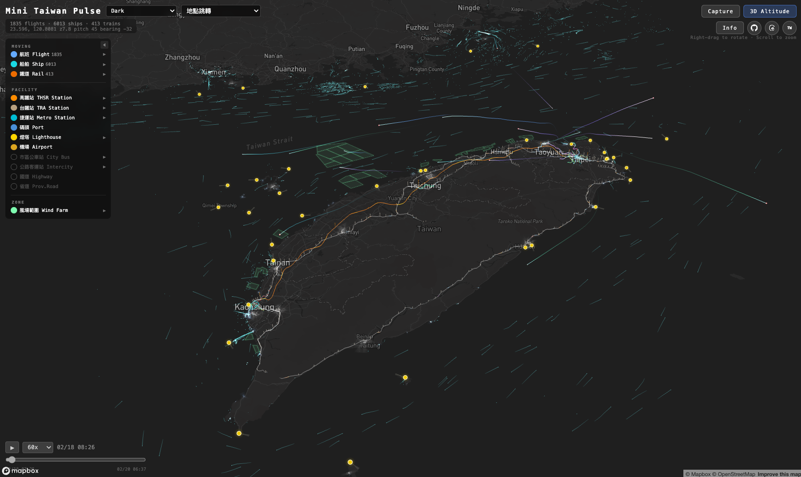
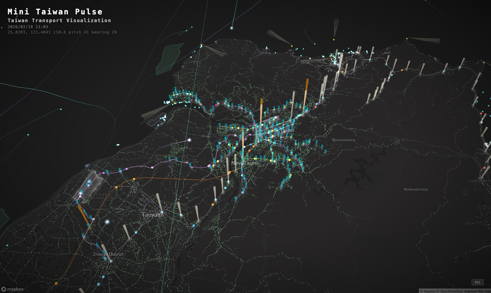

# Mini Taiwan Pulse

**用開放資料，把台灣畫成一張會呼吸的地圖。**

🌏 **線上版：[mini-taiwan-pulse.itsmigu.com](https://mini-taiwan-pulse.itsmigu.com)**

天空的航班、海面的船舶、軌道上的列車、街上的公車——這些會動的東西是這個專案的起點。
後來它長成了別的東西：能源、農業、水資源、廢棄物、社福長照、林業、衛星……
**28 個主題、366 個可開關的圖層**，疊在同一張 3D 地圖與同一條時間軸上。

> 統計時點 2026-08。數字會隨圖層增加而變動，以 `src/data/layerManifest.ts` 為準。

---

## 截圖






> ⚠️ 現有截圖攝於專案的「交通時代」，尚未反映後來擴充的能源／農業／水資源等主題。

---

## 能看到什麼

圖層登記在單一 SSOT [`src/data/layerManifest.ts`](src/data/layerManifest.ts)：**376 個 layer key**，
其中 366 個有 sidebar toggle，10 個是沒有 toggle 的內部 key。

主題前段班：

| 主題 | 層數 | 舉例 |
|---|---:|---|
| 能源 Energy | 41 | 發電廠、機組即時出力、變電所、輸電線與鐵塔、加油站、離岸風場 |
| 交通 Move | 33 | 航班、船舶、6 個軌道系統、公車即時、國道壅塞 |
| 農業 Agriculture | 29 | 農田範圍 FTW、畜禽飼養場、養殖魚塭、土壤肥力、作物適栽 |
| 水資源 Water | 23 | 水庫、河川、堤防、即時雨量、河川水位、淹水潛勢 |
| 環境氣候 Environment | 20 | 氣象站、溫度場、衛星雲圖、空品、都市熱島、行道樹 |
| 執法治安 Law & Order | 20 | 警察機關、測速照相、法院、鄉鎮犯罪統計、海巡 |
| 廢棄物 Waste | 18 | 垃圾車即時位置與路線、清運點、焚化爐、掩埋場 |
| 教育 Education | 17 | 各級學校、校地範圍、學區、幼兒園、補習班 |
| 林業 Forestry | 16 | 林班、保安林、步道、樹冠高度、山屋營地 |
| 太空 Space | 16 | 衛星即時軌跡（SGP4 推算）、未來軌跡、覆蓋足跡 |

<details>
<summary>完整 28 主題清單</summary>

| 主題 | 層數 |
|---|---:|
| 能源 Energy | 41 |
| 交通 Move | 33 |
| 農業 Agriculture | 29 |
| 水資源 Water | 23 |
| 環境氣候 Environment | 20 |
| 執法治安 Law & Order | 20 |
| 廢棄物 Waste | 18 |
| 教育 Education | 17 |
| 林業 Forestry | 16 |
| 太空 Space | 16 |
| 底圖 Base Map | 14 |
| 災害 Hazard | 12 |
| 基礎建設 Infrastructure | 11 |
| 觀光 Tourism | 11 |
| 社福長照 Welfare | 9 |
| 醫療 Medical | 8 |
| 房地產 Real Estate | 7 |
| 宗教 Religion | 6 |
| 運動休閒 Sports & Leisure | 6 |
| 人口社經 People | 6 |
| 殯葬 Funeral | 5 |
| 文化 Culture | 5 |
| 消防 Fire & Rescue | 5 |
| 全球氣候 Global Climate | 5 |
| 情勢 Situation | 3 |
| 都市分析 Urban Analysis | 1 |
| 民防避難 Civil Defense | 1 |
| 世界 World | 1 |

（不含 10 個無 sidebar toggle 的 key）

</details>

### 幾個值得一看的

- **會動的東西**：航班 3D 光軌、船舶 InstancedMesh 光球、6 個軌道系統（台鐵／高鐵／北捷／高捷／高雄輕軌／中捷）依真實時刻表跑、公車 GPS snap 到路線幾何上移動
- **時間軸**：所有動態圖層共用同一條時間軸，可回放歷史日期、加速播放、切換 1d/3d/7d 範圍
- **衛星**：從 TLE 以 SGP4 逐秒推算即時位置 + 未來軌跡 + 覆蓋足跡
- **統計面**：H3 六角格人口／人流，2D 填色與 3D 柱狀可切換
- **BYOK 對話**：自帶 API key 的地圖 agent（Anthropic／Google／OpenAI），可查圖層、查資料、操作地圖
- **可嵌入版** `/embed`：獨立的 MapLibre + PMTiles 輕量進入點

### 資料量級

隨手抓幾個有代表性的（2026-08 快照，完整盤點見 `.claude/memory/DATA_SCOPE.md`）：

| 圖層 | 量體 |
|---|---|
| 農地田區（FTW） | 386,829 塊 |
| 民防避難所 | 62,695 處 |
| 垃圾車停運點 | 77,125 點 / 2,048 條路線 |
| 淹水潛勢圖徵 | 17,303 |
| 社福長照設施 | 10,004 點（9 類） |
| 發電廠（含再生能源） | 10,665 |
| 衛星 TLE 分類庫 | 約 67,000 顆 |
| 共機動態 | 731 天零缺日紀錄 |

### 覆蓋範圍與已知限制

預設是**全台**，但有幾個誠實的例外要先講：

- **廢棄物**只有 5 個縣市（高雄／新北／宜蘭／台北／基隆），且路線幾何僅高雄與新北完整
- **殯葬都計分區**只有台北與新北
- **都市熱島 LST** 不含澎湖
- 少數縣市級資料（竊盜／交通事故）目前只有單一縣市
- 部分資料的官方來源只保留最新快照，本專案的資料庫是**唯一的歷史紀錄**（例如地震回放）

全球級的則有：衛星、全球氣候場、USGS 地震、颱風路徑。

其他細節（每個主題怎麼來、踩過什麼坑）散在 [`docs/features/`](docs/features/) 的 47 個資料夾裡。

---

## 技術棧

| 層級 | 選型 | 為什麼 |
|---|---|---|
| 框架 | React 19 + TypeScript 5.7 + Vite 6 | — |
| 地圖 | Mapbox GL JS v3 | 3D terrain、相機控制、原生向量圖層 |
| 3D | Three.js r172（Mapbox CustomLayer） | 光軌／光球／光柱／波浪曲面這類 Mapbox 畫不出來的東西，共用同一個 WebGL context 才不會有兩層畫布對不齊的問題 |
| 向量切片 | PMTiles | 大面積靜態圖層（路網、等高線、行政界）走單一檔案 + HTTP Range 按需載入，不需要另外養一台 tile server |
| 動態資料 | Supabase (PostGIS) RPC | 時序資料落 DB，前端只讀薄 RPC |
| 空間索引 | H3 (h3-js) | 六角格統計 |
| 嵌入版底圖 | MapLibre GL + Protomaps | `/embed` 不吃 Mapbox 額度 |
| 部署 | Docker 多階段 build + nginx | — |

---

## 快速開始

### 環境需求

- Node.js 22+（`npm` — 本專案不使用 pnpm）
- Python 3（部分資料預處理腳本）
- Mapbox Access Token
- Supabase 專案（動態圖層需要；只看靜態圖層可略）

### 環境變數

複製 `.env.example` 為 `.env` 後填入。**以下只列變數名與用途，實際值請自行取得。**

| 變數 | 必要性 | 用途 |
|---|---|---|
| `VITE_MAPBOX_TOKEN` | 必填 | Mapbox 底圖。**build time 注入**（Vite 會嵌進靜態檔） |
| `VITE_SUPABASE_URL` | 動態圖層必填 | Supabase 專案 URL |
| `VITE_SUPABASE_ANON_KEY` | 動態圖層必填 | Supabase anon key（只讀 RPC） |
| `VITE_IMAGERY_CDN_BASE` | 選填 | 氣象衛星／雷達影像改走 CDN；未設則回退 base64 RPC |
| `VITE_EMBED_BASEMAP_URL` | 選填 | `/embed` 的 PMTiles 底圖位置；未設用預設路徑 |
| `VITE_WASTE_MATCHED_TRAILS` | 選填 | 垃圾車路線 feature flag |
| `S3_BUCKET` / `S3_ACCESS_KEY` / `S3_SECRET_KEY` / `S3_REGION` | 部署／腳本 | 大型資產的上傳與容器啟動時拉取 |
| `FR24_API_TOKEN` | 選填 | 航班軌跡抓取腳本 |

> ⚠️ `.env.example` 目前缺 `VITE_SUPABASE_*` 兩項，以本表為準。
> `SUPABASE_SERVICE_ROLE_KEY` 只給後端腳本用，**絕不可進 bundle**。

### 安裝與啟動

```bash
npm install
cp .env.example .env      # 依上表填入
npm run dev               # http://localhost:3721
```

大型靜態資產（PMTiles、路網 GeoJSON、軌道時刻表）不進 git。本機若沒有這些檔案，
對應圖層會靜默沒東西——那是預期行為，不是壞掉。要完整體驗請看 [部署](#部署) 一節的資產同步機制。

```bash
npm run build             # tsc -b && vite build
npm test                  # vitest run
npx tsc -b                # 型別檢查（commit 前必跑，禁用 --noEmit）
```

---

## 架構概覽

### 資料從哪來

本專案是一個 GIS 生態系的**消費端**，自己不做資料收集：

```
data-collectors/           30+ 收集器，24hr 運行，抓即時資料
        │
taipei-gis-analytics/      資料引擎：開放資料目錄 + 清理 pipeline + 產 PMTiles
        │
gis-platform/              Supabase / PostGIS —— 時空資料 SSOT
        │
        ▼
mini-taiwan-pulse          ← 你在這裡（只讀，負責渲染）
```

跨 repo 有資料契約變動時**上游先動、下游後動**，順序見 [`CLAUDE.md`](CLAUDE.md)。

### 資料怎麼進到前端：四條路

每個圖層在 manifest 標一個 `dataClass`，決定它走哪條路：

| 級別 | 路徑 | 層數 | 說明 |
|---|---|---:|---|
| **A** | `public/*.geojson` 全量 fetch | 126 | 最單純。體積上限約 5MB，超過要改切 PMTiles |
| **B** | PMTiles + HTTP Range | 80 | 大面積靜態圖層。**必須同步 nginx.conf 與部署腳本清單**，漏掉會整批 404 |
| **C** | Supabase RPC / 即時 API | 52 | 動態資料。必須註冊 loadingRegistry，時間相依一律走 timeStore 訂閱 |
| **D** | 自行接線 | 118 | Three.js / WebGL CustomLayer，或 hook 自己 addSource/addLayer |

### 前端怎麼渲染

```
Mapbox GL JS（底圖 + 3D terrain + 相機）
  ├── Three.js CustomLayer ×16      航班光軌／船舶／列車／公車／燈塔光束／車站光柱／溫度波浪…
  ├── Mapbox 原生 fill / line / circle / fill-extrusion   多數 POI 與面圖層
  └── PMTiles source                大面積靜態切片
```

Three.js 場景在 `src/three/`（22 個 Scene），與 Mapbox 的橋接在 `src/map/*CustomLayer.ts`。

### 時間軸

Replay 模式下時間每秒更新約 60 次。若 `currentTime` 進了 React deps，每個 tick 都會
重算整棵樹，成本是 `O(圖層數 × 60Hz)`——單開一層感覺不出來，多層同開就卡死。

所以 `currentTime` 放在 React 之外的 store（`src/state/timeStore.ts`），動態圖層
**禁止**把它放進 `useEffect` / `useMemo` / `useCallback` 的 deps，一律改為訂閱，
並依資料特性選節流粒度（UI 顯示 250ms、路況快照 1000ms）。
規則見 [`docs/development-rules.md`](docs/development-rules.md) §8，
成因與盤點見 [`docs/perf-external-time-store.md`](docs/perf-external-time-store.md)。

### 資料庫契約

Supabase 分五個 schema，前端**只能**打 `public.*` RPC 或直讀 `reference.*` / `spatial.*`；
高頻時序的 `realtime.*` 一律不對前端開放，要用就包一層 RPC。

RPC 超過 1s 或 10k rows 一律套 pre-aggregate pattern（普通 table + per-day refresh function +
pg_cron + 薄 SELECT RPC），避開 Supabase pooler 的 statement timeout。
見 [`docs/supabase-optimization.md`](docs/supabase-optimization.md)、盤點表在
[`docs/supabase_rpc_audit.md`](docs/supabase_rpc_audit.md)。

---

## 新增一個圖層

這是本專案最刻意設計的部分。過去新增一層要碰 14 個檔案約 21 處，其中**大約一半是純登記**
——同一份事實（這層叫什麼、什麼顏色、哪顆 icon、資料從哪來、屬於哪個主題）被抄進五、六張表，
抄漏就漂移，而且多半 `tsc` 擋不住（值錯不是型別錯）。

現在那份事實收在一處：

```
src/data/layerManifest.ts     一筆 entry  ─┐
src/data/layerParamsSpec.ts   一筆規格    ─┴→ 派生 6 張登記表
                                             LAYER_COLORS / LAYER_ICONS /
                                             LAYER_LABELS / THEMES 的 LayerDef /
                                             UPSTREAM_REGISTRY / 參數控件

你只需要自己寫「實質邏輯」：
  src/data/*Loader.ts          資料載入
  src/hooks/use*Layer.ts       圖層 hook
  src/map/overlayRegistry.ts   paint 表達式（或自己的 CustomLayer）
```

接線兩處：

- **掛載** → [`src/layers/layerHookRegistry.tsx`](src/layers/layerHookRegistry.tsx)
- **點擊** → [`src/map/gisClickRegistry.ts`](src/map/gisClickRegistry.ts)
  （**first-hit-wins，陣列順序是 load-bearing**：點層排前段、大面積面層刻意排末段，重排會靜默改掉命中的那一層）

### 守門機制

| 機制 | 擋什麼 |
|---|---|
| `layerConsistency` 測試 | 沒 entry／欄位空殼／用 `null` 靜默豁免鐵則 |
| `deployContract` 測試 | 靜態檔沒被列進部署腳本（B 級圖層 404 的根因） |
| `layerGoldenSnapshot` 測試 | 搬移期的等價證明——派生前後畫面必須零失真 |
| TypeScript 判別聯集 | 沒有 sidebar 位置的 key 若手癢填 `label`，直接紅 |

### UX 四鐵則（缺一不可，違反退件）

1. **透明度 slider 必備** — 每一層都要，不分 fill / line / circle / 3D
2. **同層出現 ≥2 種分類 → 必寫圖例**，且配色走同一份 `xxxTypes.ts` SSOT（paint / popup / 圖例三邊共用）
3. **可選取的物件 → 必接 click popup**，polygon 與 line 不是豁免條件
4. **Sidebar 控件不得橫向溢出** — 參數區只有約 240px，選項 ≤3 用 button row、≥4 用原生 `<select>`

完整定義見 [`docs/development-rules.md`](docs/development-rules.md) §4a。

建議走 `/new-layer` 產骨架，再用 `layer-onboarding` 驗收，可以少漏很多步。

---

## 專案結構

```
mini-taiwan-pulse/
├── src/
│   ├── data/            資料載入器（57 個 *Loader.ts）+ layerManifest / layerParamsSpec
│   ├── hooks/           圖層 hook（use*Layer.ts）與共用 hook
│   ├── layers/          layerHookRegistry —— 圖層掛載總表
│   ├── map/             Mapbox 容器、overlayRegistry、gisClickRegistry、*CustomLayer.ts
│   ├── three/           Three.js 場景（22 個 Scene）
│   ├── engines/         列車運動插值引擎
│   ├── components/      UI（IconRailSidebar 桌機 / LayerSidebar 手機 / 時間軸 / 圖例 / popup）
│   ├── chat/            BYOK 地圖 agent（AI SDK + tools）
│   ├── embed/           /embed 嵌入版（MapLibre + PMTiles）
│   ├── state/           timeStore 等外部 store
│   └── lib/             loadingRegistry 等基礎設施
├── public/              靜態 GeoJSON（扁平）+ PMTiles 目錄
├── scripts/
│   ├── fetch/           外部 API 抓取
│   ├── preprocess/      預處理
│   ├── export/          DB 匯出
│   └── deploy/          S3 上傳 / 容器啟動拉取 / entrypoint
└── docs/                規則、架構、47 個 feature 資料夾
```

目錄規則（什麼東西該放哪）以 [`CLAUDE.md`](CLAUDE.md) 為準。

---

## 測試

```bash
npm test        # vitest run —— 43 檔 588 tests
npx tsc -b      # project references；禁用 --noEmit
```

測試不只測邏輯，很大一部分在**守登記簿的一致性**（見上面「守門機制」）——
這類 bug 在執行期不會炸、只會讓某層安靜地不見，所以用測試釘住。

---

## 部署

Zeabur 綁 GitHub `master` 自動部署。

**Build**（Dockerfile 多階段）：

```
node:22-alpine    npm ci → npm run build（VITE_MAPBOX_TOKEN 以 build ARG 注入）
      ↓
nginx:alpine      dist → /usr/share/nginx/html，監聽 8080
```

**容器啟動時**（`scripts/deploy/entrypoint.sh`）：

1. 若 S3 憑證存在 → **背景**執行 `pull-deploy-assets.sh`，把約 30 類資產
   （PMTiles、GeoJSON、H3 JSON、軌道 tarball、pre-render RPC 快照）同步進 `/data`
2. 背景起一個氣候貼圖定時重整迴圈（預設 6 小時）
3. `exec nginx`

資產拉取刻意放背景：nginx 立刻綁 port，健康檢查不必等首次同步（首拉數百 MB）跑完。
之後每次重啟走 `aws s3 sync`，未變更的物件會跳過。

nginx 用 `root /data` 覆寫約 30 個 location，其中一部分再 `try_files` 回退到 build 產物，
所以本機沒同步資產時仍跑得起來。PMTiles **刻意不進 `gzip_types`**——
它內部已壓縮，再走一次 gzip 會破壞 Range 請求。

本機 Docker：

```bash
docker compose up -d      # http://localhost:3721 （host 3721 → container 8080）
```

本機 compose 不帶 S3 憑證，改用 bind mount 掛 `./public`，因此只覆蓋部分圖層。

---

## 資料來源與授權

本專案的資料**幾乎全部來自政府開放資料與公開資料源**，
包含（但不限於）內政部、交通部（含 TDX 運輸資料流通服務）、經濟部、
中央氣象署、農業部、環境部、衛生福利部、教育部、各縣市政府開放資料平台，
以及 OpenStreetMap、AIS 船舶訊號、FlightRadar24、Space-Track TLE 與 UCS 衛星資料庫。

每個圖層的上游血緣登記在 manifest 的 `upstream` 欄位（**217 個不同的上游 dataset**，
其中 322 層已與上游目錄對帳驗證），可在站上的「資料來源」面板逐層查看。

感謝所有開放資料的維護者——沒有這些，這張地圖不會存在。

程式碼採 MIT License，見 [LICENSE](LICENSE)。**資料本身的授權依各來源規定**，
與本專案的程式碼授權無關。

---

## 相關文件

| 文件 | 內容 |
|---|---|
| [`CLAUDE.md`](CLAUDE.md) | 開發規則摘要、目錄規則、git workflow |
| [`docs/development-rules.md`](docs/development-rules.md) | 完整規則 + 範例（資料契約、圖層接線、UX 四鐵則） |
| [`docs/perf-external-time-store.md`](docs/perf-external-time-store.md) | timeStore：為什麼 `currentTime` 不能進 React |
| [`docs/TIMELINE_ARCHITECTURE.md`](docs/TIMELINE_ARCHITECTURE.md) | 時間軸 UI 的三層結構設計提案 |
| [`docs/supabase-optimization.md`](docs/supabase-optimization.md) | pre-aggregate pattern 完整指南 |
| [`docs/known-issues.md`](docs/known-issues.md) | 歷史 bug + 診斷指令 |
| [`docs/features/`](docs/features/) | 47 個功能領域各自的脈絡與交接文件 |
