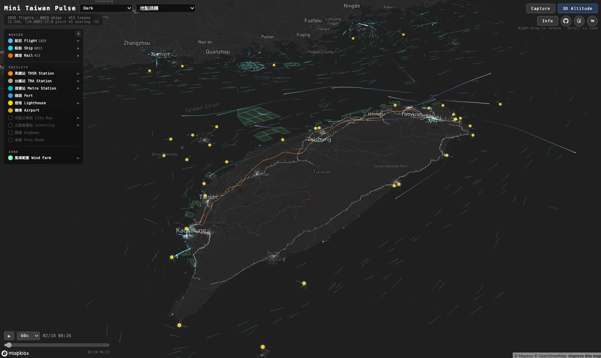
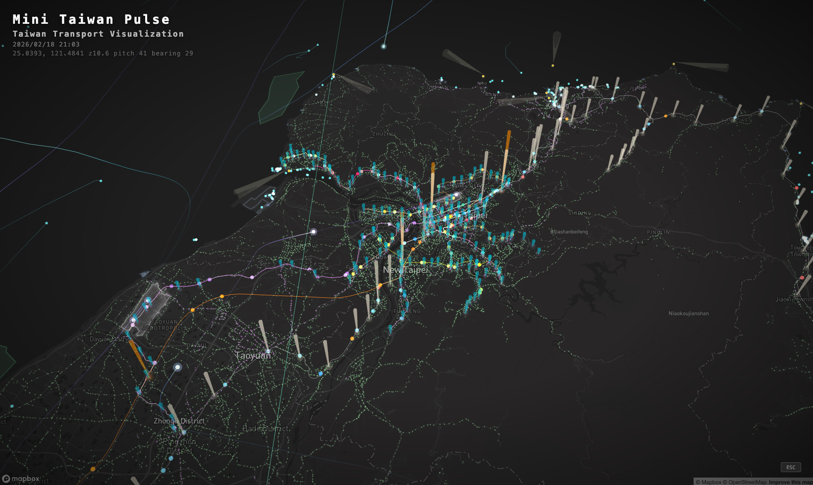
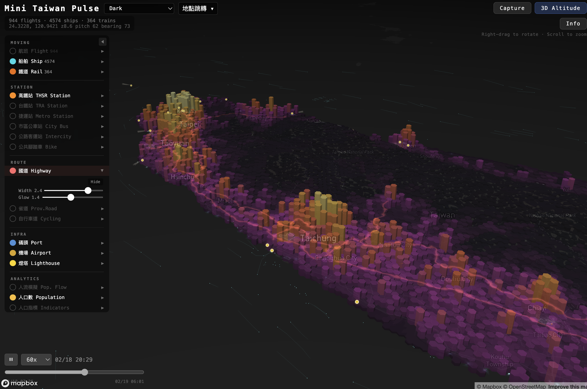

# Mini Taiwan Pulse

**用開放資料，把台灣畫成一張會呼吸的地圖。**

🌏 **線上版：[mini-taiwan-pulse.itsmigu.com](https://mini-taiwan-pulse.itsmigu.com)**　·　目前版本 **v3.0.0**（2026-10-04）→ [CHANGELOG](CHANGELOG.md)

天空的航班、海面的船舶、軌道上的列車、街上的公車——這些會動的東西是這個專案的起點。
後來它長成了別的東西：能源、農業、水資源、廢棄物、社福長照、林業、衛星、區域統計……
全部疊在同一張 3D 地圖與同一條時間軸上，並可以讓本機的 AI Agent 直接操作地圖做空間分析。

> 數字統計時點 2026-10-04。圖層登記以 [`src/data/layerManifest.ts`](src/data/layerManifest.ts) 為準，側欄主題以 [`src/components/sidebar/layerCatalog.ts`](src/components/sidebar/layerCatalog.ts) 的 `THEMES` 為準。

---

## 截圖







> ⚠️ 截圖攝於 2026-09 介面改版（v2.0.0）之前，尚未反映新的面板、圖例、色盤與監看模式。新介面可看[活的設計系統頁](tools/design-system.html)（需 dev server）或其靜態快照 [`docs/design-system/reference.html`](docs/design-system/reference.html)。

---

## 功能總覽

### 圖層規模

| 項目 | 數量 | 來源 |
|---|---:|---|
| manifest 登記的 layer key | 864（資料路徑 A 139／B 112／C 56／D 557） | `LAYER_MANIFEST` |
| 側欄主題 | 68 個，分 6 大分類 | `THEMES` + `LAYER_MACRO_GROUPS` |
| 側欄圖層開關（不重複 key） | 854 | `THEMES` 內的圖層 |
| 站主限定圖層 | 54 | `GATED_LAYERS` |
| Agent 倉庫可分析（L2） | 660／864 | [`layer-status-summary.md`](docs/features/general-analysis/layer-status-summary.md)（腳本產生） |

六大分類（主題數／圖層開關數）：基準 2／17、移動與城市 12／147、公共生活 16／329、安全與治理 8／63、環境與資源 26／272、情報 4／26。
側欄目錄的登記不等於正式站全部可見：統計比較由 build flag `VITE_STATISTICS_COMPARISONS_ENABLED` 控制，站主限定圖層對一般訪客顯示鎖頭、不下載資料。

### 主站各區

| 區塊 | 內容 |
|---|---|
| **地圖**（台灣／日本／統計／世界分頁） | R8 起所有面板共用同一套列與主題列、中英雙語圖層名、大分類＋主題預設收合；手機版同一套 |
| **動態圖層＋時間軸** | 航班光軌、船舶、6 個軌道系統依真實時刻表跑、全台公車；共用時間軸可回放歷史、加速、切 1d/3d/7d |
| **監看模式 Monitor** | dock／wall／split 三種呈現的戰情卡（新聞、警訊、地震、颱風、加權指數、機場、急診…），暗／淡雙主題 |
| **統計** | 區域統計 choropleth（一律走 R2 snapshot）、統計比較、連動選單 |
| **站主限定** | `profiles.tier = 'owner'` 才解鎖的敏感圖層（後端 RPC 同步檢查）與 Agent 面板 → [`owner-gated-layers`](docs/features/owner-gated-layers/README.md) |
| **會員專區** | Google 登入、收藏、場景、地點 → [`member-area`](docs/features/member-area/handoff.md) |
| **BYOK 對話** | 自帶 API key（Anthropic／Google／OpenAI）的站內地圖助手，瀏覽器直連 → [`byok-chat`](docs/features/byok-chat/README.md)。與下方 Agent 分析是兩條不同路線 |

### 其他入口（vite 多入口）

| 路徑 | 用途 |
|---|---|
| `/embed` | 可嵌入的輕量地圖（MapLibre + Protomaps + PMTiles，不吃 Mapbox 額度）→ [`embeddable-map`](docs/features/embeddable-map/README.md) |
| `/card/<slug>` | 分析卡：Agent 產草稿、使用者在畫面按發布，30 天、可撤銷（`src/card/`、`card.html`） |
| `/lab/` | 隔離的研究畫布（`lab/index.html`） |
| `/tools/…` | 開發／POC 頁面（設計系統元件頁、bbox 框選、JEV 篩選等）→ [`tools/README.md`](tools/README.md) |

### 覆蓋範圍與已知限制

預設是**全台**，但有幾個誠實的例外要先講：

- **廢棄物**只有 5 個縣市（高雄／新北／宜蘭／台北／基隆），且路線幾何僅高雄與新北完整
- **殯葬都計分區**只有台北與新北
- **都市熱島 LST** 不含澎湖
- 少數縣市級資料（竊盜／交通事故）目前只有單一縣市
- 部分資料的官方來源只保留最新快照，本專案的資料庫是**唯一的歷史紀錄**（例如地震回放）

全球級的有：衛星、全球氣候場、USGS 地震、颱風路徑、全球海事。各主題的來龍去脈在 [`docs/features/`](docs/features/README.md)。

---

## Agent 分析（MCP）

讓本機的 Claude Code 或 Codex 用自然語言問地理問題，Agent 會**移動鏡頭、開圖層、把計算結果畫在你開著的地圖分頁上**。計算在本機做，瀏覽器只負責呈現。

```
本機 Claude Code／Codex
   │  stdio
   ▼
pulse-research MCP（本機；內含 DuckDB 分析倉庫、等時圈、地理編碼）
   │  HTTPS 長輪詢
   ▼
Zeabur research-gateway（正式站 nginx /api/research/v1/ 走內網轉送）
   │
   ▼
已登入的瀏覽器分頁（站主的 Agent 面板）→ 地圖
```

| 元件 | 在哪 |
|---|---|
| MCP server、倉庫引擎、回歸測試、skills | 另一個 repo `mini-pulse-gis-mcp`（工作區 `../mini-pulse-gis-mcp`）|
| research-gateway（配對、轉送指令與結果、分析卡資料表） | `gis-platform` repo 的 `services/research-gateway/`（以 `zeabur deploy` 部署，不隨本 repo 的 master 自動部署） |
| 前端：Agent 面板、token 產生、地圖執行端、分析卡頁 | 本 repo `src/research/`、`src/card/` |

**倉庫**：DuckDB + 版本化 GeoParquet，正本在 R2，由 `taipei-gis-analytics` 的 manifest 自動建置；新圖層只要有 manifest 並能入倉庫，就是 L2 可分析。

**工具**（預設 `PULSE_TOOLSET=core` 共 22 個，分五類）：

| 類別 | 做什麼 |
|---|---|
| 地圖控制 | 配對分頁、讀地圖狀態、移鏡頭、開關圖層、切時間、改單一圖層設定 |
| 找圖層與資料 | 搜尋圖層、圖層說明、跨資料集找資料、描述倉庫資料集、分頁讀回結果 |
| 分析與計算 | 唯讀 SQL、周邊生活機能、縣市／鄉鎮排名、等時圈（Valhalla）、找地點、地址轉座標 |
| 呈現 | 周邊一步上圖、結果上圖（區域深淺、熱力、泡泡、流向、格點、立體柱、等時圈、時間序列等樣式） |
| 發布 | 產分析卡草稿（發布必須由使用者在畫面上按） |

**Skills**（Agent v2，四個）：`pulse-conductor`（主指揮、回答格式唯一出處）→ 分派給 `pulse-layers`（圖層與鏡頭）、`pulse-overlay`（附近、計數、比較、排名、等時圈）、`pulse-insight`（為什麼、相關、熱點、變化）。唯一來源在 mcp repo 的 `plugins/pulse-analyst/skills/`。

**配對流程**（2026-10-03 起）：

1. 瀏覽器開正式站並以站主登入 → Agent 面板產生 agent token（30 天、可撤銷）
2. 在 mcp 目錄 `pbpaste | npm run token:save` 存到本機
3. 分頁保持開著；Agent 第一次動地圖時自動接上，多分頁時會請你選
4. mcp 更新後在 Claude Code 用 `/mcp` 重連

本機測試用 `npm run research:local:start|stop|status`（本機 gateway + vite）與 `npm run dev:exploration`。

**文件**：入口與現況 [`general-analysis/README.md`](docs/features/general-analysis/README.md)、[`STATUS.md`](docs/features/general-analysis/STATUS.md)；本機正式環境 [`PROD-HOME.md`](docs/features/general-analysis/PROD-HOME.md)；正式站連線 [`PLAN-prod-connect-20261003.md`](docs/features/general-analysis/PLAN-prod-connect-20261003.md)；系統圖 [`pulse-research-system-map.html`](docs/features/agent-research-workbench/pulse-research-system-map.html)；視覺化 [`viz-library`](docs/features/viz-library/README.md)。
架構決策在 GIS 工作區 `.gis-agent-system/decisions/`：0014 分析倉庫、0015 分析專案家、0016 Agent v2 skill plugin、0017 正式站連線。

---

## 介面改版紀錄（2026-09～10）

v2.0.0 起整站外觀以設計系統重做。**各工作線的 PR 與現況總表在 [`docs/design-system/README.md`](docs/design-system/README.md)「目前進度」**，這裡只列對照：

| 工作線 | 內容 | 版本 | 文件 |
|---|---|---|---|
| UI 統一 Phase A–R | 字型、popup、工具列、時間軸、控制項、z-index；載入提示與 Agent 光暈 | v2.0.0 | [`ui-consistency-audit-20260927`](docs/features/ui-consistency-audit-20260927/handoff.md)、[`spec.md`](docs/design-system/spec.md) |
| 地圖 R1–R2 | 共用數值、統計圖細縫、圖例 kit、點圖層三階 | v2.1.0 | [`map-layer-restyle/PLAN.md`](docs/features/map-layer-restyle/PLAN.md)、[`map-layers.md`](docs/design-system/map-layers.md) |
| 地圖 R3–R4 | 線面分階（registry／hook）、圖例對齊 | v2.2.0 | [`R3b-report.md`](docs/features/map-layer-restyle/R3b-report.md)、[`R4-report.md`](docs/features/map-layer-restyle/R4-report.md) |
| 地圖 R5、R7 | 密集點改熱區、熱區／網格可換色盤 | v3.0.0 | [`layer-color-picker`](docs/features/layer-color-picker/PROPOSAL.md) |
| R8 圖層面板統一 | 共用列、雙語結構化名稱、大分類、統計連動選單 | v3.0.0 | [`layer-panel-unify/PLAN.md`](docs/features/layer-panel-unify/PLAN.md) |
| 監看模式 P1–P5 | 卡片殼、字級、數值列與走勢、多指標卡、資料新鮮度、淡色版 | v3.0.0 | [`monitor-restyle`](docs/features/monitor-restyle/README.md) |
| 地圖 R6 | Three.js 圖層的「基本點線面」模式 | ⏳ 未開始 | [`handoff-r6.md`](docs/features/map-layer-restyle/handoff-r6.md) |

UI 改動必須遵守 [`spec.md`](docs/design-system/spec.md)（PR 前照 §8 checklist），守門測試 `src/styles/__tests__/designSystemGuard.test.ts` 紅燈要修程式碼，不可用改基準繞過。

---

## 技術棧

| 層級 | 選型 | 為什麼 |
|---|---|---|
| 框架 | React 19 + TypeScript + Vite | — |
| 地圖 | Mapbox GL JS v3 | 3D terrain、相機控制、原生向量圖層 |
| 3D | Three.js（Mapbox CustomLayer） | 光軌／光球／光柱這類 Mapbox 畫不出來的東西；共用同一個 WebGL context，圖層打開才建 |
| 向量切片 | PMTiles（CDN） | 大面積靜態圖層單檔 + HTTP Range，不養 tile server |
| 動態資料 | Supabase（PostGIS）RPC、Auth | 時序資料落 DB，前端只讀薄 RPC；會員與站主身分 |
| 統計 | Cloudflare R2 snapshot | 區域統計一律走預先發布的 snapshot |
| 空間索引 | H3（h3-js） | 六角格統計 |
| 嵌入版／分析卡 | MapLibre GL + Protomaps | 不吃 Mapbox 額度 |
| Agent 分析 | MCP（stdio）+ DuckDB + GeoParquet + Valhalla | 計算在本機，瀏覽器只呈現 |
| 私有研究服務 | Node（`server/coral-private`） | 站主限定的私人圖層 API |
| 部署 | Docker 三階段 + nginx，Zeabur | — |

---

## 快速開始

### 環境需求

- Node.js 22+（`npm`，不使用 pnpm）
- Python 3（部分預處理腳本）
- Mapbox Access Token；Supabase 專案（動態圖層需要，只看靜態圖層可略）

### 環境變數

複製 `.env.example` 為 `.env` 後填入。**以下只列變數名與用途。**

| 變數 | 必要性 | 用途 |
|---|---|---|
| `VITE_MAPBOX_TOKEN` | 必填 | Mapbox 底圖，build time 注入 |
| `VITE_SUPABASE_URL` / `VITE_SUPABASE_ANON_KEY` | 動態圖層必填 | Supabase 專案與 anon key（只讀 RPC） |
| `VITE_WASTE_MATCHED_TRAILS` | 選填 | 設 `0` 強制垃圾車路線走 GPS fallback |
| `VITE_IMAGERY_CDN_BASE` | 選填 | 氣象衛星／雷達影像改走 CDN |
| `VITE_EMBED_BASEMAP_URL` | 選填 | `/embed` 的 PMTiles 底圖位置 |
| `VITE_STATISTICS_COMPARISONS_ENABLED` | 選填 | 開啟統計比較（Dockerfile build ARG，預設 `false`） |
| `PULSE_RESEARCH_GATEWAY_ORIGIN` | 本機 Agent 測試 | dev server 把 `/api/research/v1` 代理到哪個 gateway |
| `VITE_RESEARCH_TEST_IDENTITY` | 本機 Agent 測試 | 只在 DEV 有效的測試身分 |
| `S3_BUCKET` / `S3_ACCESS_KEY` / `S3_SECRET_KEY` / `S3_REGION` | 部署／腳本 | 大型資產上傳與容器啟動時拉取 |
| `FR24_API_TOKEN` | 選填 | 航班軌跡抓取腳本 |

> `SUPABASE_SERVICE_ROLE_KEY` 只給後端腳本用，**絕不可進 bundle**。Agent 分析的金鑰在 mcp 端，不在本 repo。

### 常用指令

```bash
npm install
cp .env.example .env
npm run dev               # http://localhost:3721
npm run build             # tsc -b && vite build
npm test                  # vitest run（含 layerConsistency、design-system guard）
npx tsc -b                # 型別檢查（commit 前必跑，禁用 --noEmit）
```

| 指令 | 用途 |
|---|---|
| `npm run design:snapshot` / `design:baseline` / `design:audit-layers` | 設計系統快照、guard 基準、圖層樣式盤點 |
| `npm run research:local:start` / `dev:exploration` / `research:layer-status` | 本機 Agent 測試環境、可分析圖層總表 |
| `npm run dev:private-research` | 本機起私有研究服務 |
| `npm run fetch:flights` / `fetch:tracks` / `s3:upload*` / `rail:bundle` | 資料抓取、資產上傳、軌道打包 |

大型靜態資產（PMTiles、路網 GeoJSON、軌道時刻表）不進 git。本機未同步時對應圖層會無資料；正式環境則必須通過部署契約，不得把缺資產當成正常。

---

## 專案結構

```
mini-taiwan-pulse/
├── src/
│   ├── data/          *Loader.ts（84 個）＋ layerManifest / layerParamsSpec
│   ├── hooks/         use*Layer.ts 圖層 hook
│   ├── layers/        layerHookRegistry —— 圖層掛載總表
│   ├── map/           Mapbox 容器、overlayRegistry、gisClickRegistry、*CustomLayer.ts（19 個）、樣式分階
│   ├── three/         Three.js 場景（20 個 *Scene.ts）
│   ├── components/    側欄、時間軸、圖例、popup、監看模式（intel/monitor）
│   ├── research/      Agent 面板與地圖執行端
│   ├── card/ embed/   分析卡、嵌入版
│   ├── chat/          BYOK 對話
│   ├── design-system/ 活的設計系統元件頁
│   └── state/ lib/ styles/   timeStore、loadingRegistry、design tokens
├── server/coral-private/   私有研究服務
├── lab/ tools/        研究畫布、開發／POC 頁面
├── public/            按資料域分類的靜態資產
├── scripts/           fetch / preprocess / export / deploy / research / design
└── docs/
```

目錄規則以 [`CLAUDE.md`](CLAUDE.md) 為準。`docs/` 地圖：

| 位置 | 內容 |
|---|---|
| [`docs/development-rules.md`](docs/development-rules.md) | 完整開發規則（資料契約、圖層接線、UX 四鐵則、時間訂閱） |
| [`docs/design-system/`](docs/design-system/README.md) | UI 與地圖圖層視覺規格 |
| [`docs/features/<slug>/`](docs/features/README.md) | 各功能領域的脈絡、交接與 changelog |
| [`docs/launch/`](docs/launch/03_DEPLOY_RUNBOOK.md) | 上線與部署 runbook |
| [`docs/archive/`](docs/archive/README.md) | 已完成或被取代的文件 |

---

## 資料架構

本專案是 GIS 生態系的**消費端**，自己不做資料收集：`data-collectors`（收集器）→ `taipei-gis-analytics`（目錄、pipeline、PMTiles）→ `gis-platform`（Supabase／PostGIS SSOT）→ 本 repo（只讀、負責渲染）。跨 repo 有資料契約變動時**上游先動、下游後動**，見 [`CLAUDE.md`](CLAUDE.md)。

| 資料型態 | 走哪條路 |
|---|---|
| 動態、時序 | Supabase `public.*` RPC；禁止前端直打 `realtime.*`；>1s 或 >10k rows 套 pre-aggregate → [`supabase-optimization.md`](docs/supabase-optimization.md) |
| 區域統計 | 一律 R2 snapshot → [`statistics-layer-guidelines.md`](docs/statistics-layer-guidelines.md) |
| 大面積靜態 | PMTiles／GeoJSON 走 CDN 或容器 `/data`；URL 是契約，不可任意搬路徑 |

每個圖層在 manifest 標 `dataClass`（A GeoJSON 全量／B PMTiles／C RPC 或即時 API／D 自行接線）。新增圖層只寫一筆 `layerManifest.ts` entry ＋ 一筆 `layerParamsSpec.ts` 規格，登記表自動派生；建議走 `/new-layer` 產骨架、`layer-onboarding` 驗收，並遵守 UX 四鐵則（透明度、圖例、popup、select）與點線面分階登記 → [`development-rules.md`](docs/development-rules.md) §4、§4a。

**時間軸**：`currentTime` 放在 React 之外的 [`timeStore`](src/state/timeStore.ts)，動態圖層禁止放進 hook deps，一律訂閱 → [`perf-external-time-store.md`](docs/perf-external-time-store.md)、[`TIMELINE_ARCHITECTURE.md`](docs/TIMELINE_ARCHITECTURE.md)。

---

## 開發流程與版本

- **分支**：`develop`／`master` 雙主幹。功能分支從 `develop` 開，PR `--base develop`；`master` 只收發布合併與 `hotfix/*` → [`docs/git-workflow.md`](docs/git-workflow.md)
- **合併**：一律一般 merge commit（`gh pr merge --merge`），禁止 squash／rebase
- **CHANGELOG**：每個 user-facing PR 在 [`CHANGELOG.md`](CHANGELOG.md) 的 `## [Unreleased]` 加一行
- **版號**：SemVer，`package.json` 為唯一來源，網站「資訊 → 關於」顯示；發布與 hotfix 步驟 → [`docs/RELEASING.md`](docs/RELEASING.md)
- **commit**：Conventional Commits；`memory:` 用於 `.claude/memory` 更新

---

## 部署

Zeabur 服務綁 GitHub `master` 自動部署：**merge 進 `master` ＝ 直接上線**。`develop` 的部署環境需另行設定。

**Dockerfile 三階段**：

1. `node:22-alpine` build：`npm ci` → `npm run build`（`VITE_MAPBOX_TOKEN`、`VITE_STATISTICS_COMPARISONS_ENABLED` 為 build ARG）
2. `node:22-alpine` coral-server：安裝 `server/coral-private` 的相依
3. `nginx:alpine` runtime：裝 aws-cli、nodejs、python3；放入 dist、私有研究服務與部署腳本，監聽 8080

**容器啟動**（[`scripts/deploy/entrypoint.sh`](scripts/deploy/entrypoint.sh)）：有 S3 憑證時背景執行 `pull-deploy-assets.sh` 同步資產到 `/data`，背景重整氣候貼圖，然後 `exec nginx`。資產拉取放背景，健康檢查不必等首次同步。

nginx 另外負責 `/api/research/v1/`（轉送 research-gateway）、`/api/private-research/`、`/card/`、`/lab/`。PMTiles 刻意不進 `gzip_types`（再壓會破壞 Range 請求）。新增大檔要同步部署腳本與 nginx，否則正式站 404。

本機 Docker：`docker compose up -d`（http://localhost:3721），不帶 S3 憑證，只覆蓋部分圖層。

---

## 相關 repo

| repo | 角色 |
|---|---|
| `gis-platform` | Supabase migrations、research-gateway |
| `data-collectors` | 持續收集即時資料 |
| `taipei-gis-analytics` | 開放資料目錄、pipeline、跨 repo handoff／ADR |
| `mini-pulse-gis-mcp` | pulse-research MCP server 與 Agent skills |
| `pulse-api` | FastAPI 備援 |
| `mini-taipei-v3` | 鐵道資料來源 |

---

## 資料來源與授權

本專案的資料**幾乎全部來自政府開放資料與公開資料源**，
包含（但不限於）內政部、交通部（含 TDX 運輸資料流通服務）、經濟部、
中央氣象署、農業部、環境部、衛生福利部、教育部、各縣市政府開放資料平台，
以及 OpenStreetMap、AIS 船舶訊號、FlightRadar24、Space-Track TLE 與 UCS 衛星資料庫。

每個圖層的上游血緣登記在 manifest 的 `upstream` 欄位，可在站上的「資料來源」面板逐層查看。

感謝所有開放資料的維護者——沒有這些，這張地圖不會存在。

程式碼採 MIT License，見 [LICENSE](LICENSE)。**資料本身的授權依各來源規定**，與本專案的程式碼授權無關。
