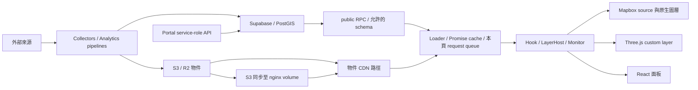

# Mini Taiwan Pulse 基礎架構審計

日期：2026-09-06。審查基準：本地 HEAD `484f97a7cd024bfd7978a1dbcad33b47683c94b5` 加既有未提交工作；包含相鄰 gis-platform、data-collectors 的相關讀寫路徑。這是架構與代表性資料路徑的深入審查，並非所有圖層逐一驗收，也不是正式容量認證。

## 判斷

目前是已有可用基礎、但跨模組契約尚未收斂的地理資料產品。**可以繼續發展，但不足以直接宣稱能承載大規模多人即時情報分析。** 最先需要補齊的是服務權限、未知資料的語意、更新／卸載的責任，以及可量測的資源上限。

值得保留：Mapbox 的原生圖層、PMTiles、獨立 timeStore、layer manifest／參數 store、loader Promise 去重與 LRU、部分具版本與完整性驗證的 GFW 路徑。沒有證據支持把 React、Mapbox、Three.js 或 Supabase 全部推倒重寫。需要改的是它們之間的責任邊界。

長遠目標應是「目錄能納入大量資料，檢視與分析按區域／時間／解析度有界取用」。全台或全球資料都可查，不代表每個瀏覽器要同時下載與計算全部資料。

## 本次證據與限制

| 驗證 | 結果 | 能證明／不能證明 |
|---|---|---|
| `npx tsc -b` | 通過 | 本地型別成立；不是 runtime 證明 |
| `npm test` | 111 files；1085 passed、2 skipped | 現有回歸通過；未代表多圖層效能合格 |
| Vite production build | 通過，49.80 秒 | `publicDir:false`，輸出 `/tmp`；只驗 bundle，不複製 3.5 GiB public，也不驗 Docker 資料部署 |
| 主頁直接引用／modulepreload JS | 6,030,043 bytes；本地 gzip 1,617,155 bytes | 入口 HTML 明確引用的 5 檔總量；不含後續載入、CSS、底圖、資料；不是網路實測下載量 |
| 正式站瀏覽器 | 主頁與 Monitor 可開，新聞最後呈現 42 則、警訊 63 則 | 代表性可用性；未量測 FPS、heap、p95，未測手機 |
| 正式站初次 Monitor | 資料載入中時先出現 `ALL CLEAR`、`0 平時`，稍後才有警訊 | 已觀察到未知／載入階段誤呈現為正常；未注入 RPC 錯誤 |
| 正式站 HTTP | JS CDN HIT；PMTiles Range 206、127 bytes、CDN HIT | 抽樣讀路徑有效；不等於所有物件與地區 cache 正常 |
| 正式站 GFW v4 同源 manifest | 該 URL 回 404 | 只證明該路徑當時不存在；CDN base 可覆寫且正式版不同，不能直接推斷使用者的 GFW 圖層全部失效 |
| DB／雲端權限／容量 | 未取得現行 ACL、EXPLAIN、資源與流量數據 | 不宣稱可支撐某人數，不以 migration 當現況 |

正式站入口為 `main-D-IecK-4.js`，本地 build 為 `main-DVykWypM.js`，**兩者不同**。正式站觀察與本地缺陷分別列證；不將本地 bundle 大小套到正式版。既有工作區改動已保留，本次只新增審計文件與證據，未改產品程式、資料庫或部署。

原始本地測試／build log、入口大小與精簡 HTTP headers 存在 [evidence](./evidence/)。瀏覽器工具的 read-only scope 未提供 Performance API，因此沒有取得 frame time、long task、heap 曲線；不能用肉眼可開取代這些數據。

## 目前資料怎麼走

點開圖層一般觸發 hook／loader；有的讀公開 GeoJSON／JSON，有的打 RPC，有的交 PMTiles 做 Range 讀取。資料留在模組 Promise cache、hook state、Mapbox worker 或 Three.js 資源中；這些是不同層的保留，不能只看一個 Map cache 就算出記憶體占用。React 與 module cache 可能共用同一陣列引用，也不能直接說複製兩份。

使用者點圖層本身不是把資料存入 S3／Supabase：上游持續採集與發布才負責持久儲存，前端另有 session telemetry 寫入。大量資料不必加入瀏覽器永久儲存；若未來加 IndexedDB，仍須有版本、配額、清除與權限隔離，不能用來掩蓋全量下載問題。

## 優先問題

優先度：P0 = 若對外公開須立即封鎖的權限風險；P1 = 在擴大用途前處理；P2 = 有證據的效能／維護問題，實際成本仍須量測。

### A1 · P0 條件式：Portal 把 service role 能力代理給未驗證的呼叫者

`gis-platform/portal/src/app/api/distinct/route.ts:10-35` 接受 schema/table/field，用 `supabaseAdmin` 查值；只有 field 字元驗證，沒有身份、資料表與欄位授權。`portal/src/lib/supabase-server.ts:8-11` 證明該 client 使用 service role。`portal/src/middleware.ts:35-37` 僅匹配 schedules，沒有替這些路徑驗證身份。

`portal/src/app/api/rpc/route.ts:11-46` 又允許 `report_collector_heartbeat`；`gis-platform/migrations/006_views_and_functions.sql:86-124` 定義其寫入 collector_status。把金鑰留在 server 並未避免代理路徑放出其權限。

**已證明程式邊界缺失，未證明正式外網可利用或已外洩。** 可存取範圍仍受 PostgREST exposed schemas、現行 grant、部署與外部身份閘門限制。本次未讀私有資料、未呼叫 heartbeat 寫入。

根本解：管理面與公開讀取面拆開；公開讀路徑使用受 RLS／最小權限控制的角色與固定資源契約。移除公開 heartbeat 代理；管理動作需 server-side operator 驗證。優先確認 Portal 是否公開，若公開先封鎖上述路徑，再做權限矩陣測試。

### A2 · P1：通用資料 API 與匿名 telemetry 缺少服務端流量邊界

`gis-platform/portal/src/app/api/data/route.ts:29-123` 從 metadata 動態擴增表清單，允許 select／filters／未封頂 limit，仍用 service role。未來新增 dataset 可能同時擴大公開面；實際回傳可能受 PostgREST 上限限制，但這不等於該 route 有自己的成本與權限契約。

`gis-platform/migrations/280_security_hardening_shared.sql:50-108` 的 session events 雖限制單次 500 筆與 512 KiB，但原始碼未證明跨請求限流。前端限制與 CORS 不能阻擋外部客戶端直接呼叫。

根本解：固定允許資源／欄位／filter，驗證並封頂參數；公開 expensive read 與 telemetry 入口加配額、速率限制、去重及 retention。不要為所有靜態瓦片加一層需要查 DB 的 BFF；只為需要授權、限流、聚合的服務設邊界。

### D1 · P1：Monitor 缺值／錯誤可變成「正常」

`src/data/intelLoaders.ts:141-168` 將未設定、RPC error、無 row 全部回 `composite:0`；市場也有同類 fallback（`:220-256`）。錯誤被當作成功值 resolve 後，也會進成功 TTL，cache 自動清 rejected promise 的機制救不到它。

`src/components/intel/alerts/AlertBoard.tsx:349-377` 僅憑 tally=0 顯示「目前全國無 active 警報／ALL CLEAR」。正式站已觀察初始誤呈現，後續實際載入警訊，並非當時確實無事件。

根本解：把資料健康與情勢等級分開。統一結果包含 `data/status/asOf/source/coverage/errorKind`；未知值為 null，loading/error/denied 不計成零。要顯示「無警訊」，必須同時確認查詢成功、時間有效、覆蓋足夠且結果確實為零。沿用 RIPE、ER 等已正確呈現缺口的模式。

### D2 · P1：即時摘要與事件列表更新責任不同

`IntelPanel.tsx:140-169,200-250`、`monitor/MonitorPanel.tsx:312-334,425-460`：摘要有 60 秒輪詢，新聞列表主要由開啟、日期／filter 改變觸發。面板持續開啟時，新摘要可能對應舊列表。日期級訂閱對歷史查詢合理，不能取代「今天持續新增」的刷新。此項是本地程式路徑證據，正式站未另做跨 cron 的列表新鮮度實測。

根本解：一個共享現況 query owner 管理刷新、取消、可見性與版本；Monitor、Intel、地圖讀同一份有時間標記的結果。跨來源時間可不同，但要明列各 source 的 asOf 與 freshness，不用一個假共同時間包裝。歷史資料另以日期／版本快取。

共用 `cachedOnce` 已在 `src/lib/loaderCache.ts:27-48` 共享 in-flight Promise，`cachedByKey` 也有 TTL／LRU；**不是缺少去重，更不能宣稱兩面板必然產生兩倍 RPC**。問題在排程 owner 與一致性契約。

### R1 · P1：入口仍綁住非首屏功能，LayerHost 尚未完成渲染隔離

`src/App.tsx:58-97` 靜態引用 Intel、Monitor、Satellite、Admin、Chat 與 Legend；`:92` 直接 import chat/agent，後者在 `src/chat/agent.ts:4-15` 引入 AI SDK／provider／tools。歷史文件曾提到 lazy 改善，但在本次 checkout 不成立。

本地 build 的 main、crosshair、LegendPanel 等合計約 6.03 MB 原始 JS、1.62 MB gzip，HTML 全部直接引用或 modulepreload。chunk 名稱只是 Rollup 命名，不能說 LegendPanel 元件本身就有 1.96 MB。

`src/layers/LayerHost.tsx:41-47` 仍 map 所有 Host；App 相機 move 每次 `setCameraInfo`（`:898-908`）。模組拆檔與 per-key store 已有價值，但不自動等於 parent 更新隔離。

根本解：以功能邊界動態載入面板及 AI；將相機 HUD 訂閱移到實際消費元件。LayerHost 的 deps 收斂成穩定能力與局部 subscription，再以 profiler 證明拖鏡頭、改單層參數不重跑無關 Host。不要直接大量加 memo 或只調高 chunk warning 閾值。

### R2 · P2：重建底圖會累積 map instance listener

`src/map/MapView.tsx:222-285,342-365` 在 style.load 再呼叫 ready；`src/App.tsx:890-956` 每次新增 move、zoomend、匿名 click listener，無對應移除。N 次底圖切換後，同事件的 handler 執行次數成長；React 可能批次 state，但重複 handler 工作仍存在。

根本解：區分 map instance lifetime 與 style lifetime。前者註冊一次並 cleanup，後者只重建 source/layer。驗收要切換底圖 20 次，確認 handler 數不增、單次互動不重複。

### R3 · P2：多個 Three.js custom layer 在停止播放時仍持續要求下一幀

`src/map/customLayer.ts:120,203`、`busCustomLayer.ts:56`、`lighthouseCustomLayer.ts:38-46`、`temperatureWaveCustomLayer.ts:34-57` 等可見層每 render 呼叫 triggerRepaint。只要一個層自循環，地圖就不能休眠；疊層增加每幀工作，**不是每層各自增加一個獨立瀏覽器 FPS**。

根本解：統一 invalidation／動畫排程責任，分辨資料更新、相機移動、播放動畫及刻意持續的裝飾效果。靜止狀態不再要求下一幀；對需要動畫者配置目標更新率。優先保留 instancing、共享資源與既有 dispose；尚無證據須立即合併所有 renderer 或更換引擎。

### R4 · P2：衛星與 H3 在主執行緒做超出變動需要的工作

衛星：`src/hooks/useSatellitesLayer.ts:296-399,431-442`，100ms 重建點與兩個 49 座標 footprint，1 秒重算每顆 61 個 SGP4 軌跡位置。工作量按啟用衛星集合成長，缺少自適應更新／細節預算。

統計格網：`src/map/h3LayerFactory.ts:61-101,145-160`、`demographicsLayerFactory.ts:182-203,276-311,326-385` 與 `src/layers/hosts/gridHosts.tsx:86-194` 把 paint-only 變更與 geometry 重建串在一起。代表性 res8 有約 4.8–5.6 萬 cells；透明度操作也可重算 cell boundary 並 setData。H3 loader 仍有完整 JSON parse 與常駐多版本引用，沒有共同 byte budget。

根本解：幾何、數值、樣式分離。透明度只 setPaintProperty，年份只換值／版本，幾何按 resolution cache。衛星 propagation／重型轉換放 Worker，以 transferable buffer 減少複製；軌跡分時間 bucket、footprint 按 zoom 簡化。大量靜態格網轉 PMTiles/MVT，查詢與統計另走完整且有界的分析接口。不能從畫面 tile 的抽稀 features 推導全量統計。

### R5 · P2：關閉所有衛星分類仍可能留下機動紅環

`src/hooks/useSatellitesLayer.ts:252-268` 建 `sat-maneuver-ring`，但 `:480-494` 的 visibility 清單未包含它。已有 maneuver feature 時關閉全部分類，其他層隱藏、紅環仍保留；本次為程式路徑確認，未在正式站重現。

根本解：圖層 family 統一擁有其 source、子層、visibility、pick 與 dispose，避免手寫多份 ID 清單。這個小缺陷也說明為何需完整 lifecycle 契約。

### D3 · P1：資料供應路徑有 fallback，缺少共同發布與降級契約

`src/data/staticRpc.ts:23-32` 在靜態檔失敗時回退 Supabase。平時能維持可用；CDN／volume 故障且使用者增加時，會把流量推回 DB。原始碼沒有證明一定洩漏資料，也不應把 fallback 本身一概刪掉。

S3 在此大量扮演 origin／發布來源，再同步至 nginx volume，並不是每筆資料由 S3 直接送到前端。CWA 的 R2/CDN 模式在 `src/data/cwaImageryLoader.ts:14-19,83-120` 由 build flag 決定；無 flag 時仍回 base64 batch。**R2 已配置不等於該讀取路徑已啟用，也不等於 CDN cache 已命中。**

根本解：每個 dataset 明定 canonical origin、可變指標、immutable 版本、hash、時間／空間範圍、fallback policy。先完整上傳並驗證新 release，再原子切 manifest；未成功不能宣稱新版本可用。公開輕查詢可有受控 fallback；重快照失敗應顯示 stale/degraded、限流，不讓所有使用者各自重打昂貴 RPC。

快取抽查：`/static-rpc/get_osm_wind_turbines.json` 回 200/MISS、max-age 86400；Last-Modified 是 7/3，僅檔案時間，不能據此判定來源過期。氣候 manifest 回 200、max-age 86400，但前端 `climateFrames.ts:129` 使用 no-cache revalidation，**不能宣稱瀏覽器必被迫舊一天**；仍應把可變指標短 TTL 寫成端到端契約。GFW v4 同源 manifest 的 404 則需對照正式 bundle 選用的 CDN base 與發布版本，列為未閉合的發布驗證。

### D4 · P1：collector buffer 是有界恢復，不是永久原始資料保證

`data-collectors/storage/supabase_writer.py:223-280`／`config.py:195-198` 的故障緩衝會按三天／檔數上限淘汰。這是有意的保護，卻意味長故障期間可能失去資料；log 存在不等於事故時有人收到通知。

根本解：依 ingestion rate 設定 recovery window 與磁碟預算；超限前將原始 receipt 轉入 durable object archive，保存可重播 checkpoint、去重鍵與拒收原因。以 oldest-buffer-age、eviction-count、replay lag 警報驗證，而非只看 collector process alive。備份還需 restore drill，現有腳本不足以證明可復原。

### S1 · P1 防禦缺口：正式站 BYOK 的 CSP 尚未 enforcing

正式 HTTP 只 enforcing `frame-ancestors *`；script/connect 等在 report-only。`src/lib/keyVault.ts:54-72` 可使用 session/localStorage，故 report-only 不會阻止受注入腳本外傳金鑰。這不是本次發現 XSS 或已外洩；是現有保護宣稱與實際 enforcement 不一致。

根本解：盤點實際連線後收斂 enforcing CSP，主站與 embed 分開 framing policy；BYOK 預設盡量縮短保存時間，讓持久化是明確選擇。正式 AI 服務若採 server credential，需配額／授權／審計，不能再用 generic service-role proxy。

## 多人容量：現在不能合理報一個人數

前端 `src/lib/supabase.ts:51-77` 的 8 concurrent／30 秒 timeout 是**每個 JS instance**的保護，不是全站 DB 限流；FIFO 等待也在 request timeout 開始之前，排隊體感可能超過 30 秒。collector pool 是每 process，replica 會再乘上去。

用流量模型建立測試，不猜容量：若每使用者有 q 個互不共享請求、每 T 秒更新，平均需求約 `U × q / T` RPC/s；假設 1000 人、20 請求、60 秒，是約 333 RPC/s，**僅情境，不是目前流量或實測上限**。快照型資料經共享 CDN 命中後不必每人執行 DB query。平均值也不含首次開啟突發、cache miss、retry 與重新連線。

首次基準需取得：現行 RPC 定義／ACL、pg_stat_statements、row/byte 分佈、DB CPU／I/O／pooler、CDN hit ratio／origin bytes、collector replicas／buffer、前端 p95 latency／long task／frame time。EXPLAIN ANALYZE 只對已確認唯讀、限範圍的 SELECT，在 staging 或受控條件執行；本次沒對 production 施壓。

## 根本改造目標

保留四個主要責任域，而非每加一層就再包一個框架：

1. **資料發布**：collectors／analytics 產生具版本資料與品質 receipt；Supabase 放可查詢狀態、權限、索引與聚合；S3/R2 放原始歸檔、immutable 切片／影像／軌跡。
2. **查詢與訂閱**：一份 dataset contract，依 dataset/version/AOI/time/resolution/filters/permission 建 key；共享去重、取消、freshness、max bytes、重試與受控降級。整合既有 loaderCache，不先引入第二套競爭 cache。
3. **渲染 runtime**：Layer module 擁有 activate/update/deactivate/dispose；分 map/style lifetime；metadata 可先載，重 code/data 按需載。共享 frame budget、worker budget、LRU byte budget，並有低階裝置降級。
4. **分析與證據**：手動 UI 和 AI 調用同一 typed analysis API。輸出 runId、資料／方法版本、來源、有效時間、AOI、單位、coverage、excluded reasons、truncation 與 status。AI 做解釋與協調，不自行把 sample、代理點或未定位事件當完整空間事實。

AIS：廣域看聚合／密度，近域看有上限的 current positions，選中船舶再取時間窗軌跡。衛星：全局軌道目錄與局部可見／分析集合分開，過境計算可預算或排程。統計：低 zoom 用較粗 resolution，zoom-in 漸進細化；年份數值與幾何版本獨立。所有降級都揭露範圍與解析度，不能悄悄少點卻維持「全量」標示。

現有 Point-only nearest helper 合理，不支援 Polygon 本身不是 bug；但它不能直接升格成全域 AOI 分析引擎。AI 的「附近沒有」必須區別「可分析資料裡沒有」、「無 geometry」、「資料未覆蓋」與「查詢失敗」。

## 交付順序與驗收

| 階段 | 範圍 | 完成條件 |
|---|---|---|
| 0：權限與狀態 | A1/A2、D1；正式部署讀回 | 公開／會員／operator／collector 各角色允許與拒絕測試；錯誤／未知不呈正常；確認真正在運行的權限與版本 |
| 1：測量與低耦合邊界 | R1/R2、D2 | 面板 code 按需；20 次 style 切換 handler 不增；Monitor 今日列表隨 refresh 更新，與來源時間可追溯 |
| 2：代表性重圖層 | R3/R4/R5 | 選 AIS＋衛星＋H3＋Monitor 場景；paint-only 不 setData；暫停無動畫時無持續 repaint；反覆開關記憶體無單調增長 |
| 3：讀取與發布擴展 | D3/D4、服務端限流 | cache hit/miss/fallback 可觀測；manifest atomic publish；資料限額有效；故障緩衝重播與restore實測 |
| 4：分析服務 | 有界 AOI／時間查詢 | 手動與 AI 同參數同結果；資料不完整、截斷、無 geometry 全有契約；重任務可取消且有配額 |

效能驗收先提目標再測基準：指定桌機／手機及資料 fixtures，記錄首屏可互動、冷／熱載入、單層／組合、移鏡頭／播放／靜止、20 次 toggle／style、長時間 Monitor。可先用桌機互動 p95 frame ≤33ms、手機 ≥30 FPS 作**候選目標**，但必須與裝置、畫質及資料量綁定；目前沒有達標證據。容量在 staging 以 10→50→100 等虛擬使用者分段測，依 DB queue／error／latency 中止門檻升壓，切勿直接以 production 壓測補缺證據。

每階段取一條垂直路徑完成，成功後淘汰舊責任；不要同時保留兩套 scheduler／cache／manifest 作永久兼容。單層小 bug 可修，但不應拿來代替上述責任收斂。

## 外部依據

- Mapbox 官方把成本拆為 sources、layers、vertices 與 source/layer 更新；支持先減少不必要 setData、用 tiles 與分離靜動資料的方向：[效能指南](https://docs.mapbox.com/help/troubleshooting/mapbox-gl-js-performance/)。
- Supabase 官方說明 function 權限與 SECURITY DEFINER 的 search_path；server-only key 不等於代理 route 已授權：[Database Functions](https://supabase.com/docs/guides/database/functions)。
- R2 物件經自訂網域才能接 Cloudflare cache，仍需設定並驗證 cache 行為：[R2 cache](https://developers.cloudflare.com/cache/interaction-cloudflare-products/r2/)。

這些來源用於設計方向，不用來替代本專案 runtime 證據。
