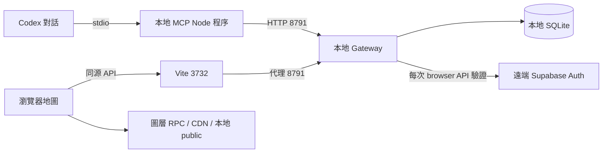

# 本地探索連線盤點

檢查時間：2026-09-17 17:29 Asia/Taipei。本次為唯讀診斷與報告；未重啟服務、撤銷配對或修改連線程式。

## 實際運行位置

共同工作區：`/Users/migu/.codex/worktrees/c92d/research-recovery/`。不是舊的 `c92d/mini-taiwan-pulse` baseline。

| 元件 | 實際入口 | 運行方式 |
|---|---|---|
| Codex MCP | `mini-pulse-gis-mcp/dist/research/index.js` | Codex 子程序，stdio；不監聽 HTTP port |
| Gateway | `gis-platform/services/research-gateway/server.mjs` | PID 31284，127.0.0.1:8791；launcher PID 31267 |
| 網站 | `mini-taiwan-pulse` 的 Vite | PID 89565，127.0.0.1:3732 |
| 配對／研究狀態 | `runtime/map-exploration.sqlite` | Gateway 本地 SQLite；不是 Supabase table |
| Story Skill | `mini-taiwan-pulse/.agents/skills/pulse-map-story` | 個人 skills 目錄 symlink；只是 Agent 工作指引，不是常駐服務 |

`~/.codex/config.toml` 的 `mcp_servers.pulse-research` command=node，args 指向上述 dist entry；PULSE_RESEARCH_ORIGIN=http://127.0.0.1:8791，允許 loopback。沒有讀取或記錄憑證值。

MCP 程序記憶體保留自身 claim/active credential；不同 Codex task 的 MCP 程序不自動共享配對。這次看到 17 個同入口程序（約 1 小時至 17 小時）；可能來自多個對話。未逐 task 映射，不能據此認定程序洩漏。未配對的程序沒有 active heartbeat；不能直接把17乘上心跳流量。已啟動程序不因重建 dist 就重新載入全部模組，舊對話可能仍跑舊版邏輯。

## 本次觀察

- 3732、8791 均 LISTEN，連續運行數小時。
- 對 proxy 與直連 Gateway 的唯讀 GET 均回 JSON METHOD_NOT_ALLOWED / 405（API設計只接受POST），證明路由抵達 Gateway，不代表完成登入驗證或配對。
- SQLite 唯讀快照：6個 study、0個 session；最新 study revision0、瀏覽器心跳約1秒前。
- 另一近期 study revision21、paused=true、2次command、12次query，保留 VIEWPORT_OCCLUDED。未達32次上限。該study不可單憑截圖對應到使用者當時revision15。
- 到期 session 會由 store cleanup 刪除；目前0 session不能反推每個已消失session何時或為何結束，但目前確無有效Agent配對。
- 沒有可對應截圖當刻的逐請求 status/error/timing log，無法證明那次就是429、Auth逾時或TTL到期。

## 程式確認的問題與限制

1. **固定30分鐘配對TTL**：pairing-service.mjs:121 建立1800000ms session；relayClient.ts:246起每15秒心跳只更新agentSeenAt，不續expiresAt；到期清除active。長導覽會中斷。這不同於Google登入是否仍有效。
2. **兩條browser輪詢**：ResearchConnection每2秒sync；QueryResponder每2秒query。理想正常下單頁空閒即約60 requests/min，加active MCP heartbeat4/min；每次工具還會增加session/state/query-status/ack/report等請求。
3. **同IP共用120/min**：server.mjs:53-57 rate bucket只依callerIp，loopback的瀏覽器代理與MCP共用；兩個持續輪詢頁面已可能超額。固定輪詢沒有429 Retry-After退避。這是結構風險，本次未保留實際429證據。
4. **每次browser請求都遠端驗證**：server.mjs owner()進auth.mjs，對Supabase `/auth/v1/user` fetch，最多5秒，沒有驗證快取。browser timeout8秒；網路/Auth抖動會表現為本地連線錯誤。不可直接關掉驗證作為修法。
5. **32次終身上限**：relay-service.mjs history/queryHistory length>=32後拒絕STUDY_COMMAND_LIMIT或STUDY_QUERY_LIMIT；query保留4份完整result但保留tombstone仍計數，故不是最近32筆循環記錄。導覽多章容易接近上限；目前近期study12queries不是本次直接原因。
6. **UI混合多種狀態**：ResearchConnection catch無分code，任何失敗就online=false與泛稱連線無法更新；成功sync不清掉舊message。connected則同時要求有效session、agent heartbeat<45秒、browser heartbeat<45秒。跟隨Agent只是鏡頭權限；VIEWPORT_OCCLUDED只是取景失敗，均不同於網路斷線。
7. **重載狀態持久化不足**：ResearchConnection的study/pairing在React state；網站reload不自動恢復配對上下文。Gateway可持有舊study，而網站已回初始狀態。

## 建議修正順序

1. 先統一連線狀態模型與錯誤顯示：驗證到期、session到期、429、網路逾時、使用者pause、follow=false、scene error分開；成功恢復清除舊錯誤。加入不含token/地址/payload的request status、code、latency、correlation記錄。
2. 合併瀏覽器兩條輪詢或使用長輪詢；背景頁與錯誤時退避。區分已驗證工作階段的操作預算與未驗證配對濫用防護，不只粗暴提高IP上限。
3. 明確設計持續使用時續租與閒置／硬性到期，讓前端和MCP同步expiresAt；瀏覽器reload提供同tab安全恢復，不跨task共用憑證。
4. 將32次限制改成有界回執保存與長工作階段預算，保留commandId去重、revision與資料大小限制；不可單純清空history而破壞重放保護。
5. 以單頁／雙頁、30分鐘以上導覽、人工429/5xx、Auth慢回應、斷線重連、手動拖動、reload做獨立驗收。
