# Mini Taiwan Pulse 研究與 GIS 分析系統導覽

> 更新日期：2026-09-21
> 讀者：想直接使用系統的人，不要求先懂 MCP、GIS 或程式碼
> 互動式全圖：[打開系統架構圖](./pulse-research-system-map.html)

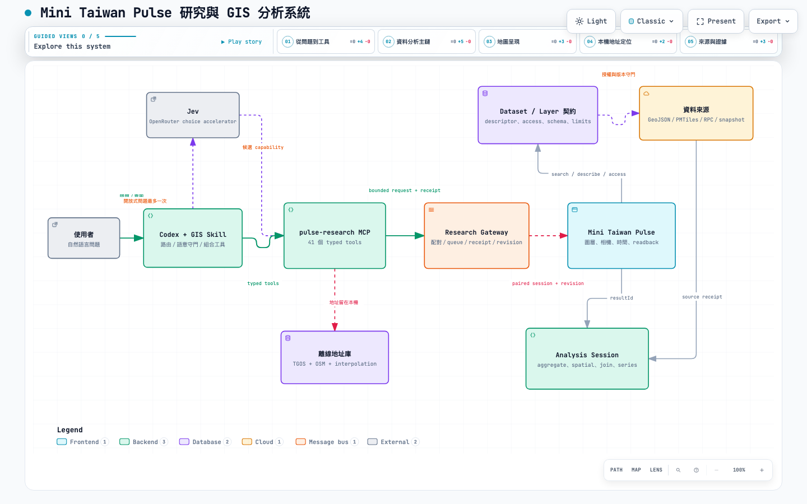

## 一句話說明

這套系統現在可以把自然語言問題，轉成「找圖層／找資料 → 確認來源與權限 → 有界查詢 → 基礎 GIS 分析 → 控制地圖呈現」的可驗證流程。

它已經不只是開關圖層，但也還不是完整的桌面 GIS。現在最成熟的是資料探索、基本統計、點位距離、結果證據與地圖控制；行政區套疊、面積密度、路網可達性、raster 分析與通用結果 overlay，仍是後續 roadmap。

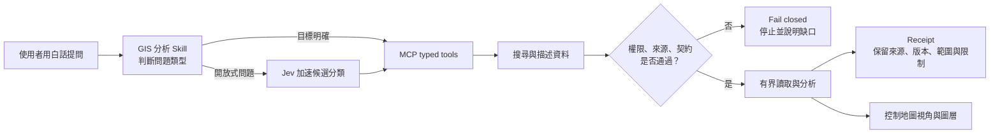

## 這套系統由哪些部分組成？

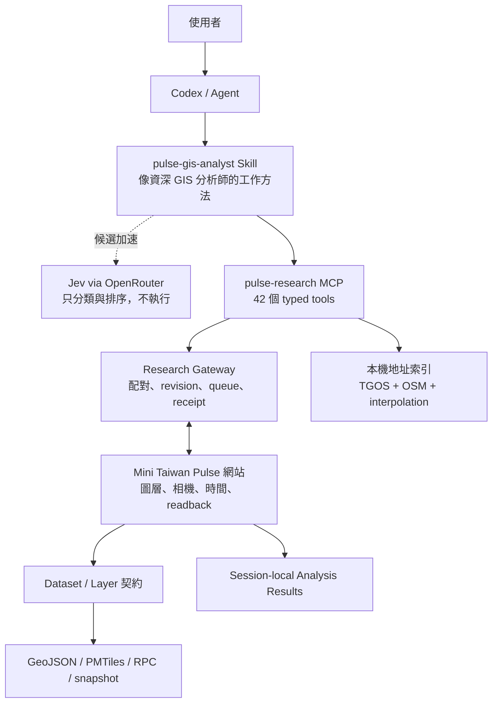

白話來看，各層的分工是：

| 元件 | 像什麼 | 負責什麼 | 不負責什麼 |
|---|---|---|---|
| GIS Skill | 資深分析師的 SOP | 決定先查什麼、怎麼驗證、何時停止 | 不直接繞過權限或資料契約 |
| Jev | 快速分流員 | 從很多工具／圖層中縮小候選 | 不執行工具、不授權、不替結果背書 |
| MCP tools | 有型別的工具箱 | 搜尋、描述、查詢、分析、控制網站 | 不接受任意 SQL、URL、路徑或程式碼 |
| Research Gateway | 安全櫃台 | 配對網站、排命令、檢查 revision、回 receipt | 不代表 production 一定健康 |
| Mini Taiwan Pulse | 研究畫布 | 顯示圖層、時間、相機並保存 session 結果 | catalog 有項目不代表資料可讀 |
| Dataset / Access 契約 | 資料使用說明書 | 定義來源、geometry、時間、缺值、權限與限制 | 不用預設值猜未知資訊 |

## 42 個 tools 到底在做什麼？

重點不是把 42 個名字全部塞給模型，而是先依工作階段分成六組。Skill 會依問題挑最短、最安全的鏈。


### 1. 路由加速（1 個）

| Tool | 白話用途 |
|---|---|
| `pulse_route_request` | 對開放式問題只呼叫一次 Jev，選出適合的能力與候選 tools；它永遠不自動執行 |

### 2. 配對與研究狀態（4 個）

| Tools | 白話用途 |
|---|---|
| `pulse_pair_session`、`pulse_get_session` | 把 Codex 與使用者正在看的網站安全配對，讀取目前連線狀態 |
| `pulse_disconnect_session` | 主動解除配對 |
| `pulse_get_study_state` | 讀取研究畫布、命令 revision 與目前狀態 |

### 3. 圖層與資料探索（11 個）

| Tools | 白話用途 |
|---|---|
| `pulse_search_layers`、`pulse_describe_layer`、`pulse_get_layer_details` | 找圖層、看圖層用途、來源與限制 |
| `pulse_list_layer_capabilities`、`pulse_search_layer_records` | 確認圖層是否真的有 reader，以及可搜尋的紀錄 |
| `pulse_describe_layer_statistics`、`pulse_summarize_layer` | 看欄位統計與完整來源快照摘要，不以畫面點數冒充總數 |
| `pulse_get_layer_controls`、`pulse_set_layer_control` | 讀取或調整圖層允許的控制項，例如透明度 |
| `pulse_search_datasets`、`pulse_describe_dataset` | 找「可分析資料集」並讀完整 Dataset / Access 契約 |

### 4. 有界資料讀取（4 個）

| Tools | 白話用途 |
|---|---|
| `pulse_query_records` | 用 limit、cursor、bbox、時間與欄位投影讀資料 |
| `pulse_plan_data_access` | 先規劃允許的讀取方式與預估限制 |
| `pulse_materialize_data` | 把受控結果存進目前配對 session，供後續分析使用 |
| `pulse_get_query_result` | 讀取非同步查詢的結果或失敗 receipt |

### 5. 分析、品質與證據（12 個）

| Tools | 白話用途 |
|---|---|
| `pulse_spatial_query` | 對已驗證 Point 做最近點或直線距離範圍查詢 |
| `pulse_aggregate_records` | 分組、筆數、加總、平均、最大與最小 |
| `pulse_join_records` | 依共同 key 合併兩份結果，並檢查 join cardinality |
| `pulse_calculate_metric` | 計算比率或差值，保留 null 與除數限制 |
| `pulse_read_series`、`pulse_compare_series` | 讀時間序列並比較不同期間 |
| `pulse_get_data_quality` | 查缺值、重複、範圍、時間與品質警告 |
| `pulse_get_record_evidence` | 回到單筆紀錄的來源證據 |
| `pulse_get_analysis_result`、`pulse_get_result_bounds` | 分頁讀分析結果、取得取景範圍 |
| `pulse_list_results`、`pulse_remove_result` | 管理目前 session 的暫存分析結果 |

### 6. 地址、地圖與時間（10 個）

| Tools | 白話用途 |
|---|---|
| `pulse_geocode_address` | 優先查本機 TGOS／OSM 地址索引，分清 exact、interpolated 與 no match |
| `pulse_find_places` | 找系統已知的地名或鏡位 |
| `pulse_get_map_context` | 讀目前地圖中心、zoom、已開圖層與時間 |
| `pulse_set_layers` | 開關已授權圖層 |
| `pulse_set_camera`、`pulse_fit_bounds` | 移到指定中心／zoom，或依結果範圍取景 |
| `pulse_present_result` | 只以目前 session 的 result IDs 建立暫時 overlay；空陣列清除，不接受任意 GeoJSON／style |
| `pulse_get_time_context`、`pulse_set_time` | 讀取或設定時間狀態 |
| `pulse_wait_scene_ready` | 等待瀏覽器完成命令；accepted 不等於畫面已 ready |

## Layer、Dataset 與 Result 有什麼不同？


- **Layer** 是地圖呈現入口，例如「學校點位」。
- **Dataset** 是可分析的資料契約，例如一列是一個校址、欄位有哪些、座標代表什麼。
- **Access** 說明 guest／owner 權限、讀取方法、分頁與 rows／bytes 上限。
- **Result** 是某次有範圍的實際資料，不是整個資料庫。
- **Receipt** 讓答案可以追溯，也讓「不知道」維持不知道。

因此，「搜尋得到圖層」不等於「有權讀資料」；「讀得到資料」不等於「資料最新」；「算完結果」也不等於「畫面已經呈現」。

## 公開與私人資料如何守門？

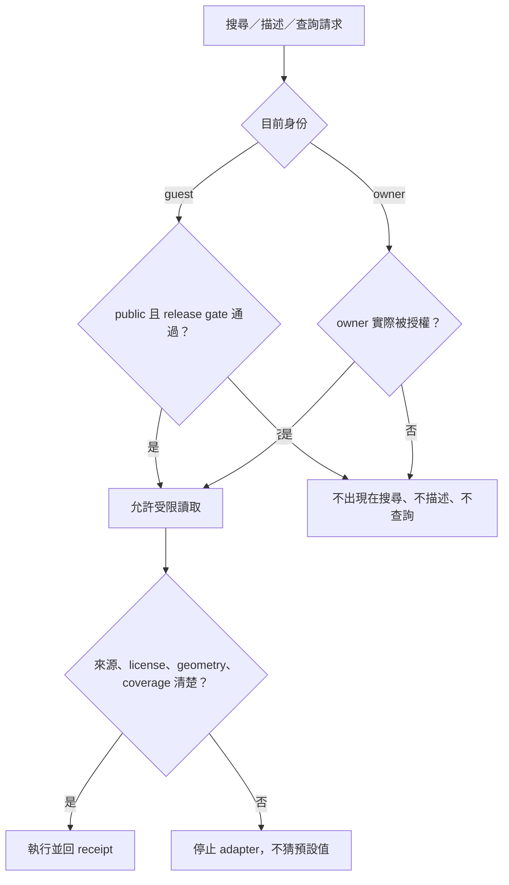

目前你的認知是對的：主要分為「公開給所有人」與「只有實際 owner 能看」。系統採 fail-closed；MCP 不會因為 catalog 有 entry，就順便解鎖 private loader、visibility 或發布路徑。

## Jev 在這裡扮演什麼角色？

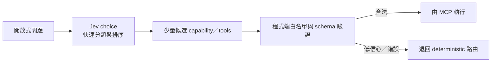

Jev 是「加速器」，不是 agent，也不是執行器：

- 問題已指定 dataset、layer、result 或確切 tool 時，直接走 deterministic 路徑，不浪費一次模型呼叫。
- 問題很開放、可能跨搜尋／查詢／分析／呈現時，才先用一次 Jev。
- Jev 只回候選；權限、參數與資料契約仍由本機程式驗證。
- 低信心、provider error 或非法候選時立即 fallback，同一題不反覆呼叫 Jev。

## 現在有哪些 Skills？

Skills 不是另一批資料 tools，而是「怎麼把 tools 串成可靠工作流程」的說明書。

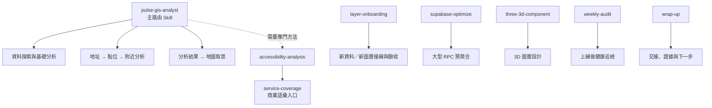

| Skill | 何時使用 | 能帶來什麼 |
|---|---|---|
| `pulse-gis-analyst` | 找資料、附近有什麼、行政區統計、比較、品質與來源 | 本系統主入口；負責路由 Jev、MCP tools 與 fail-closed 決策 |
| `accessibility-analysis` | 最近服務、服務範圍、服務沙漠、等時圈 | 定義可達性分析的正確方法；目前部分進階能力仍待 roadmap 實作 |
| `service-coverage` | 開店、服務缺口、競爭範圍等商業問題 | 將商業語言導向 accessibility 方法 |
| `layer-onboarding` | 新資料要接成圖層、點位變少、popup／透明度怎麼設 | 守住來源、manifest、loader、UX、browser 與 release gate |
| `supabase-optimize` | RPC 太慢、rows 很多、需要 pre-aggregate | 產生符合專案慣例的有界優化方案 |
| `three-3d-component` | 新增 Three.js／Mapbox 立體圖層 | 從語意選元件並檢查座標、效能與 dispose |
| `weekly-audit` | 上線一段時間後檢查資料與系統健康 | 唯讀巡檢資料活性、成本、效能、文件與 repo hygiene |
| `wrap-up` | 長 session 收尾或交接 | 整理證據、dirty worktree、release 狀態與下一個可執行步驟 |

`pulse-map-story` 目前依你的決定暫停啟用，不列入主要分析路由。

## 現在最能感受到的使用方式

### A. 從地址找附近設施

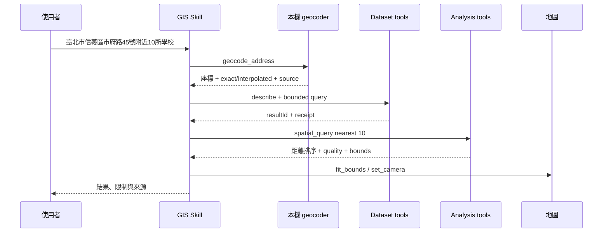

### B. 依行政區做基本比較


### C. 比較兩份資料

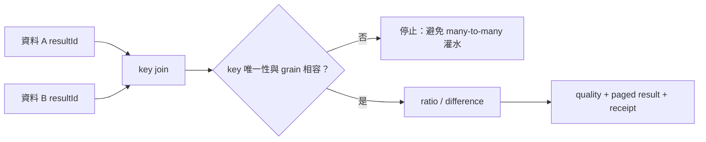

你現在可以直接這樣問：

- 「找出市府路 45 號最近的 10 所學校，告訴我地址定位精度、直線距離與資料限制，並把地圖移到結果範圍。」
- 「找出能回答臺北市教育情形的 datasets，先說明每份資料的年份、粒度與缺值，再按行政區做目前確實支援的統計。」
- 「比較兩份有共同行政區 key 的結果，先檢查 grain 與 join 是否安全，再計算比率。」
- 「搜尋醫療相關圖層，分開告訴我哪些只是可顯示、哪些真的可讀取分析、哪些因契約不明而停止。」
- 「把某個已授權圖層打開、透明度調低，並移到臺中市；等畫面 ready 後再回報。」

## 目前能做與不能做

| 狀態 | 能力 |
|---|---|
| ✅ 可用 | 圖層／dataset 搜尋與描述、來源與權限檢查、有界分頁查詢、基本統計、Point 最近點／直線距離、key join、比率／差值、時間序列、品質與證據、離線地址定位、圖層與相機控制 |
| ✅ 可算且可暫時呈現 | Mini／MCP／Gateway 已有 bounded `present_result`、transient overlay 與 readback contract；paired browser 已驗證 10 筆結果 highlight 與 `ready:true` readback |
| 🟡 需擴充 adapter | 更多現有圖層要逐一補齊 dataset／access 契約，不能因「全站有圖層」就宣稱「全圖層都可分析」 |
| ❌ 尚未支援 | point-in-polygon、行政界面積與密度、任意 spatial predicate、raster／zonal statistics、路網距離、步行／車行等時圈、完整 suitability model |
| 🚫 刻意禁止 | 任意 SQL、任意 URL、任意檔案路徑、全量 GeoJSON context、用未知 license／geometry／coverage 猜答案、繞過 owner／release gate |

## 本輪驗收與已知缺口

### 已有證據

- MCP working tree 暴露 42 個 typed tools，並由真正的 stdio MCP client 驗證 schema 與 structured output；Gateway command contract 與 paired-browser result presentation 已通過。
- MCP focused tests：47/47 通過。
- TypeScript 與 build 通過。
- Jev live routing 與 fallback 已驗證；Jev 不自動執行。
- 本機地址查詢已能命中 TGOS／OSM 衍生索引，並保留定位精度。
- 實際流程已完成「地址 → 臺北學校 query → 最近 10 筆直線距離 → receipt」。
- `npm test` 大部分通過（1,767 passed）；剩 1 個既有 Japan dataset catalog／upstream registry 對照失敗，與本輪核心流程不同，但正式整合前仍需處理。

### 尚待收斂

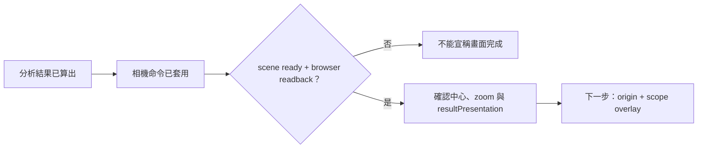

最近一次 live E2E 已完成「地址 → 最近 10 所學校 → result overlay → fit bounds → ready → browser readback」。地圖讀回 10 features、source/layer IDs 與 `ready:true`，popup 的 dark/light theme 也已目視驗證；live clear／expiry／revoke 仍需補回歸。

## Roadmap：從堪用走向真正 GIS 分析


### 階段 0：先把現在的能力變穩

1. ✅ 修正 `wait_scene_ready`／browser readback，讓相機與圖層命令能確認真的呈現完成。
2. ✅ Mini／MCP／Gateway 已新增受控 `present_result`，並完成 paired browser highlight／readback。
3. 補 live clear／expiry／revoke；新增地址 origin 與分析 scope 的獨立 overlay/readback。
4. 解決或明確隔離既有 Japan dataset catalog 測試失敗。

### 階段 1：最有感的真正空間分析

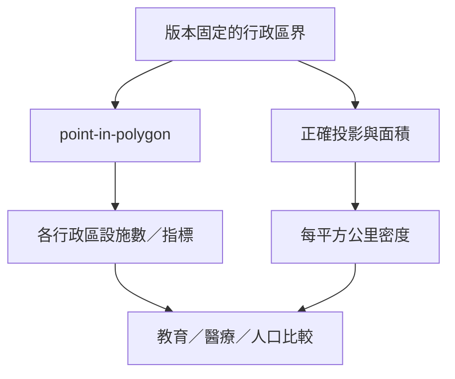

- 建立版本固定、來源明確的縣市／鄉鎮市區 boundary adapter。
- 支援 point-in-polygon、行政區分組、面積與密度，明示 CRS 與單位。
- 逐一擴充教育、醫療、Statistics snapshot 與 owner-only pilot；每個 adapter 都必須有契約與負向測試。

### 階段 2：可達性與複雜分析

- 導入版本化 OSM 路網與 routing engine，區分直線距離、路網距離與旅行時間；OSM 資料本身不等於可查詢的步行服務。
- 先做單一地址 5／10／15 分鐘 walking isochrone vertical slice，再擴大來源與地區。
- 建立步行／開車等時圈、服務覆蓋、服務沙漠與補點分析。
- 支援多圖層 suitability／trade-off，但每個指標的標準化、權重與不確定性必須可見。
- 增加 raster／zonal statistics，並保留 resolution、NoData、時間與 coverage 語意。

### 階段 3：讓地圖自己判斷「怎麼呈現更好」

- 依分析範圍建議合適 zoom／bounds，而不是只把目標塞滿畫面。
- 根據點位密度與重疊程度，建議 clustering、抽樣、透明度與標籤層級。
- 將這些做成「建議 → 驗證 → 使用者可覆寫」的 presentation policy，不讓模型任意操控畫面。
- 做效能 cache、索引、成本監控與更完整的 guest／owner／revocation E2E。

## 下一個 session 的直接起點

```text
Repo A: mini-taiwan-pulse
Branch: feat/layer-discovery-mcp-contract
Base: 6464004ad3c55b805de817fd51810dd49844467b

Repo B: mini-pulse-gis-mcp-layer-discovery
Branch: feat/layer-discovery-mcp-contract
Upstream: origin/main
HEAD: cd23db5b25f06856f85e73b91fc72d434ba61b7f

第一步：重現並定位 pulse_wait_scene_ready 在 set_camera / fit_bounds 後的 error。
驗收：命令 accepted → applied → ready，並由 browser readback 確認中心、zoom 與目標圖層；
      不以 camera state 更新冒充視覺完成。
後續：新增 origin／scope overlay，並驗證清除與過期撤銷；再做外部 geocode fallback 與 walking isochrone pilot。
```

## 本次收尾的 Git 與發布邊界

- 三個 repo 的本輪改動依 ownership 分開提交；沒有 reset、clean、stash、squash 或 rebase，也不納入其他 session 的 Japan water 改動。
- 本次沒有 push、PR、merge、部署、production 啟用或 Supabase 寫入。
- 目前證據只支持 local build、stdio MCP、local gateway／browser 測試；不能宣稱已發布到 production。
- 若要把本輪正式整合，應先依檔案 ownership review，再做精確 staging 與普通 merge commit；禁止 squash、rebase merge 或改寫歷史。

## 最重要的判斷原則

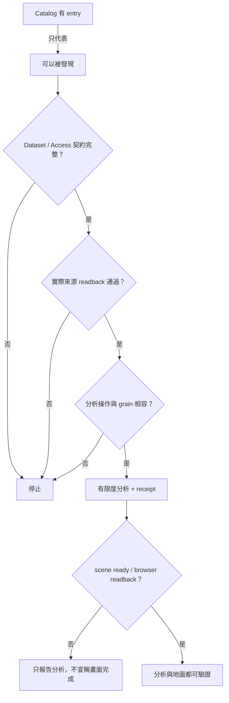

這也是整套系統真正的價值：不是「什麼都敢算」，而是能清楚知道資料從哪裡來、誰能用、能算到哪裡，以及何時必須停下來。
