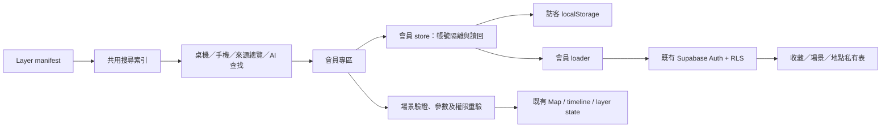

# 會員專區、共用搜尋與私人保存 v1

2026-09-06。主站＋未來 App 共用的收藏／場景／地點基礎。總計畫：[foundation review](../../audit/foundation-2026-09-06/README.md)。

## 交付狀態

| 項目 | 狀態 |
|---|---|
| 桌機側邊會員 icon、手機會員入口／緊湊 header | 已實作、browser 驗收 |
| 圖層共用搜尋、訪客收藏、已開啟清單 | 已實作、重整及手機驗收 |
| 登入收藏匯入、雲端 CRUD、場景／地點重開 | 已實作；合成帳號＋隔離 PG 的 browser 寫入／讀回通過 |
| DB schema／RLS／quota／CAS | migration 408 已在隔離 PostgreSQL 17 驗證 |
| 正式 Supabase migration | **408 已套用**；三表 RLS／policy／indexes 回讀；anon REST 401／42501，service role limit=0 回讀 200 |
| Google OAuth 真實帳號、多實體裝置、正式 browser | 尚未驗收；合成 Auth 不替代這些證據 |
| 原子 commit | 前端 6 筆、上游 1 筆；見 [提交對照](../../audit/foundation-2026-09-06/evidence/atomic-commits.md) |
| push／merge／部署 | 上游 [PR #98](https://github.com/ianlkl11234s/gis-platform/pull/98)；前端整合 release 進行中，正式部署需獨立驗收 |

## 使用流程

1. 桌機點 Layers 搜尋；手機點底部「圖層與搜尋」。名稱、別名、主題、世界／日本與來源索引共用排序。只顯示有 sidebar action 的圖層，孤立登記項目不提供假開啟按鈕。
2. 搜尋結果按星號，會員專區「收藏」可開／關／取消收藏。「已開啟」直接反映現有 visibility。
3. 訪客收藏保存於目前瀏覽器。登入不自動匯入；使用者按「匯入本機收藏」才複製至帳號，本機原本的收藏仍保留。
4. 「場景」保存名稱、camera、basemap、圖層／允許參數、時間模式／區間；可重新命名、另存副本、更新目前畫面、刪除。重開時重新檢查權限及版本，略過或改用預設的項目會顯示。
5. 「地點」可存地圖中心、使用者點選位置、視野外接矩形或自行輸入 WGS84 Point／Polygon。保存原 geometry；查看 Polygon 顯示實際範圍，不只移至中心。跨換日線的視野外接矩形先拒絕，避免保存錯誤區域。
6. 關閉／切換帳號清除私人清單；換帳號清除已載入私人 geometry 並移回預設 camera。讀回失敗不標「已同步」，使用者先重新整理再重試。沒有離線寫入佇列。

場景保存的是「如何重開地圖」，不是當時資料內容或 Capture 圖片。全站主時間模式／範圍與歷史年月日可保存；獨立 console 的內部播放狀態、Monitor 排版、AI 對話不在 v1 快照。重開私有內容後停止自動 URL／map-view telemetry 更新；使用者明確按 Share 才產生可分享的地圖狀態，不分享私人 row id／名稱／geometry payload。

## 檔案與依賴

- `src/lib/layerSearch.ts`：manifest 衍生索引，NFKC／AND terms／deterministic ranking。收藏只作同分排序，內部 source 備註只用於查找，不直接顯示於清單。
- `src/components/member/`：會員面板。資料來源與權限均沿用主站；tier 不代表付費方案。
- `src/lib/memberSchema.ts`：可攜快照 v1；`memberSceneAdapter.ts` 只接受 `layerParamsSpec` 宣告的控制值，dynamic select 依驗證後 parent 還原。
- `src/state/memberLibraryStore.ts`：`useSyncExternalStore`、auth epoch、online-first、每次成功寫入後讀回；私人 rows 只留記憶體。
- `src/data/memberLibraryLoader.ts`：唯一會員 I/O，所有讀取均有限額及 owner filter；錯誤 row 隔離，未存在 table 顯示未就緒。
- `src/lib/auth.ts`：tier 綁目前 user id，避免帳號切換短暫沿用舊權限。
- `src/lib/supabase.ts`：REST/Auth 寫入不自動重送；既有 read RPC 可重試，寫入 RPC denylist 保留。
- `src/data/temperatureWavePalette.ts`／`src/state/gfwHourlyGridDataWindowStore.ts`：純資料模組，避免 Legend／Timeline 反向載入 renderer。

## 上游契約與發佈順序

上游 SSOT：`gis-platform/migrations/408_member_private_storage.sql`、`gis-platform/docs/handoff/member-private-storage.md`。本次上游 worktree 為 `/private/tmp/pulse-foundation-review-20260906/platform-member`，分支 `codex/member-private-storage-20260906`。前端 worktree 為 `/private/tmp/pulse-foundation-review-20260906/mini-taiwan-pulse`。

| 表 | 配額／唯一性 | 值與權限 |
|---|---|---|
| `user_layer_favorites` | 每人 500；PK(user_id, layer_key) | `auth.uid() = user_id` 的 CRUD；anon/PUBLIC 無權限 |
| `user_places` | 每人 100；UUID | Point／Polygon、WGS84 範圍、環閉合／positions 上限／64 KB；source_kind、user_selected precision |
| `user_scenes` | 每人 50；UUID | snapshot_version=1；snapshot JSON number version=1；64 KB、camera/time/params bounds |

新表 FK 參照 `auth.users`、刪帳號 cascade。quota trigger 用 transaction advisory lock；滿額重送同一收藏不算新名額。scene/place UPDATE/DELETE 帶原 `updated_at` 做 CAS；0 rows 為衝突，不覆寫新版。更新時間使用 clock_timestamp 並保持單調遞增。JSON 必填值、數值型別與 null 明確驗證；DB 不複製會持續變動的前端 layer allowlist。

1. 確認正式 migration 408，套用前再次檢查遠端 migration 編號及物件碰撞。
2. 在交易內套用，readback 三表 RLS、grants、policy、indexes，重新載入 PostgREST schema。不得以 migration 檔案存在當已建表。
3. 以真實登入做本人 CRUD／第二帳號隔離、失效 session、回讀與同步驗收；不要把 local mock JWT 當 Supabase JWT 驗證。
4. 依專案流程整合上游，再發佈前端及 production browser。
5. 回退先停新功能寫入並回退前端，**保留私人表與資料**；不以 DROP TABLE 當一般回退。

這是使用者自行保存的資料，不需 analytics pipeline 或 collector，不新增 TABLE_MAP、cron、AI 分析 job 或 Storage bucket。GIS 運算、會員計費、通知規則、Capture 圖片雲端保存屬後續批次。

驗收詳見 [批次 1–2 evidence](../../audit/foundation-2026-09-06/evidence/batch-1-2-validation.md)。

## 與統計圖層整合（2026-09-06）

保留統計 PR #219（482b45a）的入口、8 指標與犯罪 PMTiles 修正；會員入口與統計入口同時存在，統計搜尋也支援收藏。統計 All Off 仍只關閉其範圍。統計 releaseId 目前由 regionalStatisticsStore 存在此瀏覽器，**不包含於會員場景快照／URL／跨裝置同步**；保存場景不保證重現統計期別。批次 3 前應擴充並驗證版本化快照，不能把目前的本機期別保存描述為雲端同步。

正式會員證據：[member408-production.json](../../audit/foundation-2026-09-06/evidence/member408-production.json)。初次 REST 404 為 schema cache 尚未刷新；後續權限拒絕與管理角色空查詢均已確認。未讀取或改動既有會員 rows。
