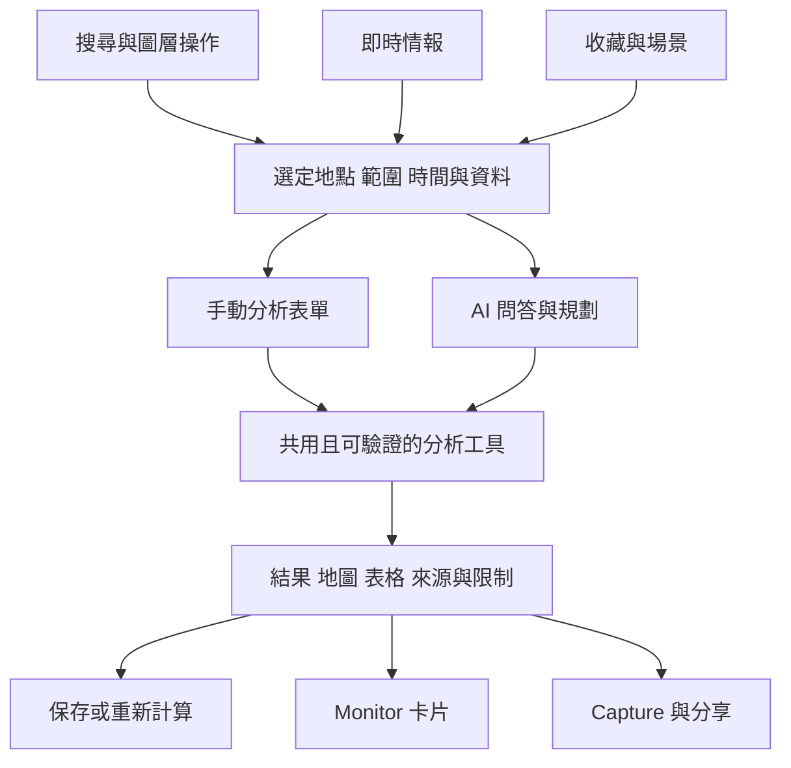

# 主站共用能力、AI 與 GIS 分析開發規劃

日期：2026-09-05；2026-09-06 補接整體底層審計。狀態：功能規劃為主，G0 已在隔離 worktree 修正，尚未部署。

2026-09-06 續作已實作至批次 2 的程式與隔離 DB 驗收；正式 migration 待具體確認，未部署。參見 [會員 handoff](../features/member-area/handoff.md)。

後續總入口：[重整優化專案底層運作＋會員新功能](../audit/foundation-2026-09-06/README.md)。它補上最新 source、Supabase metadata、build 與開發排序；本文原始盤點日期仍為 9/5，現況以後續審計為準。

原始規劃階段確認：先完成文件與開發順序；「補起來」指網站功能規劃。本文承接 [手機 App 可行性研究](../research/mobile-app-assessment-2026-09-05.md)，先定義主站與未來 App 共用的能力。

## 1. 決策摘要

**主站應先補搜尋、收藏與可保存的分析流程；會員身份基礎可以沿用。GIS 分析與 AI 應共用同一組可驗證工具。**

建議第一條完整使用流程：

> 找到圖層／地點 → 選定一點或範圍 → 看周邊設施與事件 → 查看來源及限制 → 保存場景／結果 → 下次重開。

搜尋與基礎分析不需要等完整會員中心、付費訂閱或 AI 規劃全部完成。先讓使用者不靠 AI 也能完成操作，再讓 AI 代為找到正確工具、組合步驟及解釋結果。App 共用這些能力；動態路網與視域等進階分析不必成為 App 發布前提。

優先順序：**分析語意修正＋搜尋 → 收藏與場景 → 單點／範圍分析 → AI 結果問答與規劃 → 情報交互分析 → 路網／地形進階能力**。可以平行準備共用契約；交付仍以完整使用流程驗收。

## 2. 證據範圍與已存在的基礎

本輪唯讀檢查目前主站工作目錄，並參考直接相關上游 handoff；未查資料庫、未讀金鑰、未驗證模型直連、RPC runtime 或 production 資料新鮮度。程式中存在的能力與線上可用證據分開記錄。舊文件的 13 個 AI datasets、收藏規劃等不能直接視為目前實作真值。

| 領域 | 目前可沿用 | 還缺什麼 |
|---|---|---|
| 身份與權限 | Supabase Google OAuth、session 訂閱、free/member/insider/owner 圖層 gate | 一般使用者的收藏／關注／保存項目入口；權限 tier 不代表已有付費訂閱 |
| 收藏 | BC-2 已有圖層狀態快照的 backlog 與舊提案 | 前端收藏、命名場景、跨裝置同步尚未實作；本輪未查 DB，不能斷言表是否存在 |
| 場景分享 | URL 可恢復 camera、圖層、底圖、日期與小時 | 不是完整快照；主站目前未保存透明度及其他 filter/slider params；缺名稱、版本、保存與同步 |
| 圖層搜尋 | 桌面側欄依 key／名稱搜尋；另有資料來源瀏覽器 | 搜尋分散；手機圖層選擇器缺搜尋；來源瀏覽器不能直接切換圖層 |
| Metadata | manifest 有 description、topics、source、upstream；來源 catalog 有授權、頻率；已有衍生血緣 | 需補 alias、覆蓋與分析能力對應；catalog 更新日期不等於最新有效觀測時間 |
| AI | BYOK ChatPanel、最多 10 步 agent loop、11 個 callable tools、地圖操作與資料查詢 | 缺可驗證 AnalysisPlan、結果引用卡、完整分析上下文及保存的計算結果 |
| AI 資料 | 22 個靜態 Point dataset 白名單；call_rpc 內另限 10 支 RPC | 不是所有可視圖層都能算；一般 PMTiles／動態圖層未通用接入 |
| 基礎空間計算 | 白名單 Point 有 Haversine nearest-k；有點所在 H3 格人口排名 | 最近點不等於半徑總數或路網可達；人口工具有語意缺口，詳見下一節 |
| 等時圈 | 已有部分消防／醫療／警察等服務的預先計算圖層 | 不能把開啟這些圖層當作任意點即時計算服務區 |
| Raster 讀值 | 都市熱島／樹冠等值編碼 raster 有點取值工具；部分圖層有視覺 heatmap | 預上色圖不能逆推完整數值；視覺 heatmap 不等於已做 KDE 分析服務 |
| 情報位置 | Global Events 有位置精度、locationKind、isProxy、lineage | 需要依位置可信度決定可做哪一種空間分析 |

目前 AI 的計數口徑：catalog 3＋map 5＋data 3＝11 個 LLM callable tools；10 支 whitelist RPC 是 `call_rpc` 內部可呼叫的項目。22 個 dataset 是白名單頂層 key 數，與全站圖層數不同。

主要程式與既有規劃證據：

- `src/lib/auth.ts:12`、`:31`、`:67`：登入、session、tier；`src/lib/layerGates.ts:17`、`:97`：權限。
- `src/components/auth/UserAvatar.tsx:89`、`:181`、`:208`：登入、owner 入口、登出。
- `docs/features/byok-chat/backlog.md:11`：BC-2 收藏／跨裝置歷史；`docs/proposal/member-byok-chat-plan.md:211`：舊快照規劃。
- `src/App.tsx:1225`；`src/lib/urlState.ts:41`；`src/state/layerParamsStore.ts:124`：URL 與現有參數快照基礎。
- `src/components/IconRailSidebar.tsx:991`；`src/components/LayerSidebar.tsx:231`：桌面搜尋及手機選擇器。
- `src/data/layerManifest.ts:204`；`src/data/dataCatalogLoader.ts:19`；`src/data/upstreamRegistry.ts:39`：metadata、來源與血緣。
- `src/chat/agent.ts:95`；`src/chat/tools/registry.ts:8`；`src/chat/tools/datasets.ts:15`；`src/chat/tools/rpcTools.ts:17`：AI 執行底座。
- `src/chat/systemPrompt.ts:43`；`src/chat/types.ts:12`：現有地圖上下文與工具摘要。
- `src/data/rasterProbeSampler.ts:96`；`src/map/fireIsochroneLayerFactory.ts:1`；`src/data/globalEventsLoader.ts:13`：raster、預算等時圈及事件精度。

### 2.1 承接既有提案與上游能力

[既有 GIS MCP 提案](./pulse-gis-mcp-plan.md) 已規劃 MapScene、proximity／overlap／accessibility、結果呈現，以及 browser／PostGIS 的分工。本文補上主站產品優先順序，沿用這些契約方向，不再建立平行的場景格式。外部 MCP 是後續同一工具能力的 adapter，無須等獨立 MCP 專案完成，才能開發網站表單及現有 BYOK 功能。該提案中的工具名稱仍是規劃，不能視為目前 callable tools。

[上游 terrain-vector handoff](../../../taipei-gis-analytics/docs/handoff/terrain-vector.md) 已記載 NLSC 20m DTM 2024 衍生工具 `terrain_zonal`，可對 AOI 算坡度／坡向統計。它目前是 on-demand 工具，未形成網站分析 API 契約；顯示用 PMTiles 已降採樣到 100m 並分級，不能代替原始 20m raster 做精細計算。handoff 記載 H3 地形 migration 未 apply，本輪沒有查 DB 更新此狀態。地形階段應先評估把既有 zonal 工具服務化，再安排 viewshed。

歷史 Place Lens 與 Network Structures 本機驗收只用於追溯方向；本輪目前 checkout 未找到相應完整元件，不能因此宣稱主站已具備地點分析或該次 worktree 已發布。

## 3. 擴充分析前，先處理三個語意缺口

2026-09-06 更新：下表是修正前證據；三項已於新 worktree 修正並補測試，詳見總入口 G0，尚未部署。

| 項目 | 現況證據 | 規劃修正與驗收 |
|---|---|---|
| 缺人口資料變成 0 | `src/chat/tools/h3Population.ts:64`–`:67`，缺 H3 cell 給 0；數值欄位也未完整驗證 null | missing／null／無覆蓋保留未知，只有有效數值 0 才是零人口；fixture 要區分這幾種狀態 |
| 單格人口被稱為附近人口密度 | `h3Population.ts:64`–`:69` 僅取所在 res7 格；`src/chat/tools/dataTools.ts:121`、`:153` 卻用人口密度描述 | 先改成「所在 H3 格人口」，附解析度與資料時點；附近人口需另做範圍聚合，密度另有面積分母 |
| 截斷樣本被當完整資料 | `src/chat/tools/truncate.ts:16` 預設最多 20 筆／4000 字；`rpcTools.ts:116` 截斷回傳 | 標記 total／returned／truncated，統計先由工具在完整授權資料上計算；模型不能拿顯示的前 20 筆估計全體比例 |

另需避免把畫面上已載入的 tiles 或 `queryRenderedFeatures` 當成全範圍資料。地圖可視化可依縮放裁切，統計查詢必須有自己的完整性契約。

## 4. 會員與收藏：先做哪些網站能力

### 4.1 保存能力的目標分類

| 對象 | 使用者用途 | 保存範圍 |
|---|---|---|
| 圖層收藏 | 下次快速找到常看圖層 | 穩定 layer key；顯示名稱由 manifest 取得 |
| 收藏地點／範圍 | 常看住家附近、車站或自選區域 | 名稱、Point／Polygon、來源與位置精度；手動指定與 geocode 結果可追溯 |
| 保存場景 | 重開同樣的地圖組合 | camera、底圖、visible layer keys、允許保存的 params、時間模式與範圍 |
| 保存分析／事件 | 重看計算結果、追蹤事件 | analysis run ID／event ID；保留計算時間與版本，事件更新另顯示，不改寫原結果 |

功能逐步交付：F1 先圖層收藏，F2 加地點與命名場景，A1 加分析保存，E1 再加事件收藏。入口可先收在同一個「我的」面板，只有已交付功能才顯示，不在首包放空殼分頁。事件收藏與通知訂閱分開：收藏不會自動開推播。

### 4.2 不必先做完整商業會員系統

沿用現有登入與權限。搜尋公共 metadata、操作已授權圖層與基礎分析，不因新增個人化功能而額外強制登入。先不把計費、多人協作或團隊權限列為前置需求。

訪客圖層收藏可先在本機保存。會員再支援雲端同步；將本機場景／精確地點匯入帳號時，提供明確的匯入操作與範圍。API key 不屬於收藏內容，也不進場景、結果或分享連結。

### 4.3 場景快照要比現有 URL 完整

需要 schema version、stable ID、名稱、修改時間、允許保存欄位清單及套用順序。重開時先檢查圖層是否存在、目前權限及參數版本，再恢復 camera／time／layers／params。缺失或失去權限的圖層提示並跳過；不能因舊收藏繞過 gate。

跨裝置同步需定義衝突、刪除與登出處理：圖層收藏可按 key 合併；場景內容衝突保留兩版或讓使用者選擇；刪除要有同步標記，避免離線裝置把它復活。帳號資料快取需按 user 隔離，登出清除私有快取。

「保存查詢配方」與「保存計算結果」分開。即時模式的場景重開後會讀新資料；歷史分析結果要有固定資料版本或明確標示無法完整重現。分享預設保留必要資訊；私有來源與受限圖層須重新驗權，不能藉分享把資料公開。

驗收：收藏切換可逆；重整後仍在；會員可跨裝置讀回；透明度／篩選能 round-trip；logout 後其他帳號看不到前一人的私有保存內容。

## 5. 更好的圖層搜尋：先解決確定性查找

### 5.1 共用一個搜尋核心

桌面、手機與 AI `search_layers` 共用由 manifest／catalog 派生的搜尋索引，避免三套排名漂移。沿用來源詳情與 upstream 血緣；不要另造一份手工複製的圖層目錄。

第一階段索引包含 key、中文／英文名稱、description、topics、人工維護 alias。做空白／大小寫／全半形等正規化，並處理常見繁簡與地名寫法；穩定代碼採精確優先，不能用模糊比對把另一個代碼當成同一實體。

排序先採可解釋規則：名稱／key 精確命中 → alias 命中 → 前綴與詞彙命中 → description/topics。收藏作為同相關度下的偏好，不能壓過明確查詢意圖。先建立代表性查詢測試集，再依證據決定是否需要 embedding。

### 5.2 搜尋結果帶出下一步

一個入口可以回傳不同類型，但分區呈現：**圖層、地點、事件、分析工具**。點圖層可開啟、看圖例／來源或收藏；點地點先選候選結果；點事件進詳情；點分析工具開有預填條件的表單。

圖層結果顯示「它能回答什麼」、覆蓋地區、時間性、權限及可執行分析。來源未知要顯示未知。沒有即時健康證據時，不以 catalog 的 lastUpdated 當作資料正常的證明。

為現有 metadata 補充 coverage、temporal support、geometry type、可查資料映射及支援操作。分析能力可以派生為 capability view；它與 canonical layer key／dataset ID 對接，不成為另一套 layer SSOT。

### 5.3 情境與語意查詢逐步加入

| 輸入例子 | 預期行為 |
|---|---|
| 「醫院」「急診」 | 依能力區分一般醫療院所、急診服務、急診壅塞；不互相替代 |
| 「噪音」 | 同時找官方監測、公民採樣、管制區等，但標明不同資料語意與覆蓋 |
| 「台北車站附近」 | 提供地點候選與位置精度，再進周邊分析；不能只飛到字串猜測的座標 |
| 「走路十分鐘有什麼」 | 解析交通模式、時間與起點，檢查可用路網；缺引擎時明示，不畫半徑冒充等時圈 |
| 找不到任何圖層 | 提供相關主題／可回答的分析，不靜默開不相關圖層 |

自然語言／AI 擴寫必須回到現有 layer IDs 與工具能力校驗。搜尋結果有顯示上限時提供總數／更多，不讓前 10 筆看起來就是全目錄。

驗收：同一查詢在桌機、手機與 AI 找到一致候選；常用別名命中；跨世界／台灣分類能找到；空結果可理解；開層後有 loading、圖例與既有控制。

## 6. 從使用者的 GIS 圖解轉成產品功能

已讀取使用者提供的 [Threads 文章](https://www.threads.com/@easy.ref/post/Dc0f_0JEwFF) 及七張附件。文章由 easy.ref 發布，內文註明取自 urbandesignlab；這是概念參考，沒有把示意圖當成可用資料或演算法規格。附件 Photo 1／4 都是視域，Photo 2 是 DEM、3 是網路、5 是等時圈、6 是 KDE、7 是熱力圖；文章亦提到 geocoding 與 hillshade。

| 能力／使用問題 | 輸入與輸出 | 先後安排與限制 |
|---|---|---|
| 地理編碼：這個地址在哪裡？ | 文字 → 可選地點、座標、匹配精度、來源 | 基礎；模糊結果先選實體，取得供應商及保存條件後才決定服務 |
| 周邊／Buffer：這點 500m 或 1km 內有什麼？ | Point＋半徑＋類別 → 範圍、數量、最近設施、明細 | 第一批分析；標示直線／大地距離，不能稱步行範圍 |
| 區域疊合：警戒區內有哪些設施？ | Polygon＋設施資料 → 相交清單與統計 | 第一批分析；處理邊界、去重、覆蓋；相交表示空間關係，不等於實際受災 |
| 熱力圖：哪裡紀錄較集中？ | 指定時間的點／格網值 → 分布圖 | 可先做；固定指標、單位、色階與時間。地圖渲染強度不能冒充可比密度值 |
| 核密度 KDE：事件分布如何平滑？ | 去重事件＋權重＋bandwidth＋cell size → 密度 raster | 在時間／去重／覆蓋可解釋後做；新聞篇數不等於事件數，也不等於風險率 |
| 等時圈：走路／開車 5、10、15 分鐘可達哪裡？ | 起點＋路網版本＋模式＋成本 → 可達範圍及設施統計 | 先提供既有服務區解讀；任意點求解另建能力，不以直線圈替代 |
| 網路分析：哪條路可走、需多久？ | 起終點＋可通行圖＋交通模式 → 路徑／時間矩陣 | 需檢查單行、橋梁／隧道、轉向、snap 距離；即時交通需可對應到路段的資料 |
| DEM／坡度／高程統計：這裡地形如何？ | 可運算高程 raster＋範圍 → 高程／坡度／剖面等 | DEM 是基礎資料；地圖看得到 terrain 不代表已具分析端點；記錄解析度、垂直基準與 NoData |
| Hillshade：如何閱讀地形？ | DEM＋光源方位／高度 → 陰影影像 | 視覺輔助；陰影本身不是災害、坡度或風險分析 |
| 視域：從這裡看得到哪裡？ | DEM／DSM＋觀測／目標高度＋範圍 → 可見、不可見與未知區 | 後續進階；地面 DEM 不包含完整建物與樹冠遮擋，不能宣稱精準城市視線 |

半徑查詢可由 PostGIS 的索引友善距離查詢承接；geography 距離單位為公尺，geometry 則依其 CRS 單位。[PostGIS ST_DWithin](https://postgis.net/docs/ST_DWithin.html)

KDE 的 bandwidth、權重與輸出解析度會影響結果，跨時段比較需固定定義與邊界處理。[ArcGIS KDE 方法文件](https://pro.arcgis.com/en/pro-app/3.6/tool-reference/spatial-analyst/how-kernel-density-works.htm)

OSRM 官方列有 route、nearest、table、match、trip、tile；現有 OSRM 部署不能僅憑名稱推定已有等時圈端點，路網 profile 亦需實際確認。[OSRM API](https://project-osrm.org/docs/v26.4.0/http)

GDAL viewshed 需適當投影、觀測高度等參數，且官方指出輸入 NoData 可能造成錯誤結果。因此資料遮罩與可分析範圍是必要前置。[GDAL viewshed](https://gdal.org/en/stable/programs/gdal_viewshed.html)

## 7. 第一個 GIS 產品：地點分析面板

使用者可以搜尋地址、點地圖，或從情報的「分析周邊」進入。同一個面板顯示目前選定地點／AOI，避免每個圖層各自生一個分析頁。

第一版先提供「周邊設施、所在區域、近期事件」三種結果，再逐步加入「可達性、地形」。半徑、時間、類別都可見；結果至少有地圖、摘要、可查明細與來源。

例：選一個車站 → 查 1km 內醫療與避難設施 → 列出距離及資料時間 → 看相同範圍近 24 小時的已定位事件 → 保存這個場景。這是建議測試情境，不是此輪已計算結果。

設施數量依可用資料及完整範圍計算，不代表設施當下開放或有容量；若另有即時開放／壅塞資料，須對齊實體 ID 及時間後才合併。人口以格網計算時，點落格人口、相交格總人口及面積加權估計分開；部分格面積加權需標為均勻分布假設，不能當精確居民數。

桌面可用側欄，手機用可展開面板；分析結果作為可選取的結果圖層／表格，沿用可見性、圖例、popup 與來源規範。只有形成正式可重用圖層時，才按專案 layer-onboarding 完整接線；不為每次臨時計算手工新增 manifest entry。

## 8. AI 分三層建設

### 8.1 找資料與解釋

沿用目前 catalog tools、ChatPanel 與 BYOK。先讓 AI 能準確說明圖層差異、來源、時間與可用分析。結果問答引用具 ID 的工具結果，支持點開地圖／表格／來源；資料不足時指出缺項。

現有上下文只有已開圖層、全域時間及 camera。需補目前選取實體、AOI、viewport、filter、各資料時間、可用能力與 analysis run。送模型的是必要、已授權的上下文；金鑰不進入上下文，私有地點與資料的外部模型傳送需遵循使用者設定。

### 8.2 規劃可執行步驟

把「建議疊圖」升級成可檢查的計畫卡：問題、地點／範圍、時段、資料集、操作、輸出、假設與缺項。每一步要能對應現有白名單工具；資料不足或工具不存在就顯示未支援，不能臆造結果。

例如「找這附近步行 10 分鐘內的急診」：先確認起點 → 確認急診資料 → 檢查步行路網 → 算服務區 → 疊合急診 → 列出結果。如果只有靜態醫院資料與直線距離，就只提供已能計算的查詢，清楚標示範圍。

簡單可逆的查詢／開層可在使用者請求內直接執行。模糊地點、欠缺核心條件或超出預設計算／費用預算時才要求補充或確認；不要每一步都彈確認。

### 8.3 工具計算與結果解讀

AI 不負責自行算幾何、捏造統計、執行任意 SQL 或把網頁／新聞文字當成工具指令。前端表單與 AI 都呼叫同一組 typed analysis APIs，輸出由工具產生，模型負責解釋與下一步建議。

目前聊天跨輪主要保留摘要，不能當作可復用的原始分析結果；需增加可查詢的 run/result store。後續「改成 2km」或「和昨天比較」從已保存參數建立新 run，不覆寫舊結果。

## 9. 共用分析契約與執行責任

以下是介面需求，並非已建資料表或 SQL migration：

| 契約 | 必要內容 |
|---|---|
| Analysis context | 選取實體／AOI、位置精度、時間模式、篩選、已授權資料能力 |
| Analysis plan | 目標、操作與相依步驟、參數、資料需求、假設、預期輸出與工作量限制 |
| Analysis run | run ID、plan 版本、實際輸入、狀態、開始／完成時間、引擎／方法版本、取消／失敗原因 |
| Analysis result | 指標／單位、geometry／明細／總數、樣本截斷、資料版本與觀測時段、來源、範圍／覆蓋、限制、可重算條件 |

執行狀態（queued/running/completed/failed/cancelled）、資料健康（CURRENT/STALE/PARTIAL/ERROR/DENIED）與指標值分開。無覆蓋、待定位、缺欄位用明確原因；0 只表示在可解釋查詢範圍中得到有效零值。

小型完整 Point 快照可以沿用現有前端計算；大量向量與跨層統計由 PostGIS／分析服務處理；路網由已驗證 routing engine；DEM／KDE／viewshed 重運算由可取消、有限額的背景 job 處理。結果可做快取，但 key 必須包含實際參數與資料／方法版本，不能跨帳號共享私有結果。

| Repo／系統 | 規劃責任 |
|---|---|
| mini-taiwan-pulse | 搜尋、收藏與場景 UX、共用 context、分析表單／結果、AI 工具接線、手機呈現 |
| taipei-gis-analytics | 來源／授權、計算方法、路網／raster 預處理、分析產物與版本契約 |
| gis-platform | 經設計確認後的私人保存資料、權限隔離、型別化 RPC、索引／聚合與 job metadata |
| data-collectors | 動態資料的時間、去重、修訂／撤回及健康狀態，供事件分析與重算判定 |

改資料契約時沿用 analytics → platform → collectors → frontend 的上游順序。搜尋 UI 與本機收藏不必等待跨 repo migration。跨 repo 實作開始前要把範圍與 gate 具體化；本輪只形成規劃。

## 10. 與即時情報及 Monitor 的交互

### 10.1 事件進分析

事件詳情提供「看周邊」「與我的地點比較」「查看這段時間的相關紀錄」。分析可回到原事件，保留選取、篩選與捲動位置。

- 有可靠事件 Point：可作周邊探索；使用者設定的圓形範圍要稱查詢範圍，不能冒充事件影響範圍。
- 有官方／可追溯 Polygon：可計算相交設施及估計暴露量；仍不能把空間相交直接稱為已受災。
- 城市／國家代理點或粗精度位置：使用相應地區層級摘要，不拿中心點算精確 500m 周邊。
- 沒有位置：保留事件閱讀；顯示無法進行空間分析的原因，不造座標。

既有 Global Events 的 `precision`、`locationKind`、`isProxy` 與 `locationLineage` 可作分析資格判定基礎，應在執行端檢查，不能只靠 UI 禁按鈕。

### 10.2 地點進情報

從收藏地點／AOI 看選定時段的相關事件。先去重成事件再統計，列出有幾件待定位／被排除及資料覆蓋；位置關聯不代表因果。新聞紀錄密集只能描述收錄事件的分布，不推論整體發生率或安全程度。

時間契約要區分發生時間、發布時間、首次觀測、更新時間及計算 as-of。全球情勢、新聞及圖層回放各有時間窗，分析使用 scoped 時間，不因全域 timeline 滑動而悄悄改寫保存結果。

### 10.3 分析進 Monitor 與 Capture

可將有穩定定義的分析保存為 Monitor 卡片。第一版是靜態結果卡，標明計算時間；定期重算、條件警報另列排程功能，不能把保存卡片當作已持續監控。

Capture 可輸出地圖、圖例、查詢範圍、指標、來源與資料／計算時間。保存連結可開原結果；若只能重算新結果，須明示。事件修訂／撤回時保留舊 run 與其版本，提示來源已有更新，避免原結果繼續被誤讀為現況。

## 11. 開發順序與可驗收交付

| 階段／工作包 | 依賴與工作 | 完成條件 |
|---|---|---|
| G0 分析語意修正 | 修 missing→0、單格人口命名、樣本截斷；定義結果契約 | 缺值／0／部分覆蓋有不同結果；AI 不把樣本當全體；單位與時間可追溯 |
| S1 共用搜尋 | 用 manifest 派生索引，擴充 alias／topics；桌機／手機／AI 共用 | 代表性查詢可找到正確圖層；可開層、看來源、辨別空結果；不依賴 LLM |
| F1 圖層收藏 | 與 S1 平行；承接 BC-2，先本機收藏與「已開啟」管理 | 重整保留收藏，已開啟可關閉／調參，兩種狀態不混淆 |
| F2 命名場景與會員同步 | 承接 F1、版本化 snapshot；先確認既有 DB 狀態再設計 | camera/time/layers/params round-trip；跨裝置保存可讀回；帳號及權限隔離通過 |
| A1 地點周邊分析 | G0；選點／地理編碼、AOI、少量可靠 dataset 的 radius／nearest／count／intersect；包含 run/result 保存與讀回，雲端同步另依 F2 | 能由地點得到地圖＋完整統計＋明細＋來源／限制，並保存結果；不必等待完整會員中心 |
| Q1 AI 結果問答 | A1 結果契約、既有 BYOK registry；不必等待完整 planner | 問答可引用 run、數值與來源；可定位結果；沒有結果時不生成結論 |
| P1 AI 分析規劃 | S1＋A1＋Q1，逐一接入已完成操作 | 自然語言產生可校驗 plan；與手動表單同參數得到同一結果；可取消、重算、追溯 |
| E1 情報交互／保存卡片 | A1；事件 geometry／時間／去重資格；可先手動操作，不依賴 P1 | 事件↔周邊↔地圖可返回；代理點不精算；撤回／更新可見；Monitor 卡分清靜態或定期更新 |
| A2 路網可達性 | 先核實路網、模式、版本與 runtime，再整合 A1 | 任意點服務區與已預算圖層明確區分；斷路、不可達與 snap 過遠不補假結果 |
| A3 KDE／地形／視域 | 按資料可用性各自排程，不全部綁一大階段 | 固定方法參數、NoData／範圍處理與基準案例；不把渲染效果當分析 |
| M1 手機 App | 在 S1、F1/F2 與手機導覽穩定後即可啟動；A1 可同步納入 | 圖層選擇、Monitor、情報及 Capture／分享均可操作；已交付收藏／場景跨端一致，若納入分析再驗證結果一致；完成封裝、登入回跳與效能驗收 |

**第一個網站交付包建議：G0＋S1＋F1。** 修正已知分析語意、統一搜尋、加入圖層收藏與已開啟管理。接著 F2＋A1，形成可保存的地點分析。會員雲端同步與 geocoder 供應商的選擇屬下一輪具體設計，不阻擋搜尋與本機收藏。

本表的依賴是交付條件，不代表所有工作需串行：搜尋／收藏可平行，E1 手動分析可先於 AI planner，KDE 與地形可依資料狀態獨立開發。沒有在本輪承諾工期，因上游路網／raster／runtime 尚未驗證。

## 12. 驗收與待決策

每個交付保留 source／方法、focused tests、DB/RPC（若有）、真實資料讀回、前端操作、deploy／production 的不同證據。文檔、fixture 或 HTTP 200 不等於分析已可供線上使用。

最小測試矩陣：搜尋名稱／alias／錯字／空結果；收藏重整／刪除／權限改變；場景參數往返；周邊距離邊界／重複資料／缺覆蓋；事件代理點與無位置；截斷樣本；跨時段版本；手動與 AI 同參數一致。重運算另外測取消、timeout、重試與資料版本快取。

後續實作前要確認：地理編碼供應商與地區覆蓋、第一批可完整查詢的分析 dataset、會員同步現有 schema／RLS、路網 runtime 的模式與版本、DEM／DSM 與地形工具部署狀態。這些是待查證項目，不要求使用者一次回答全部。

目前明確延後：付費訂閱、團隊協作、任意自然語言 SQL、全部圖層通用分析、完整離線 GIS、錄影作品庫、用新聞密度生成風險總分。上述不影響先完成搜尋、收藏及地點分析的產品價值。
